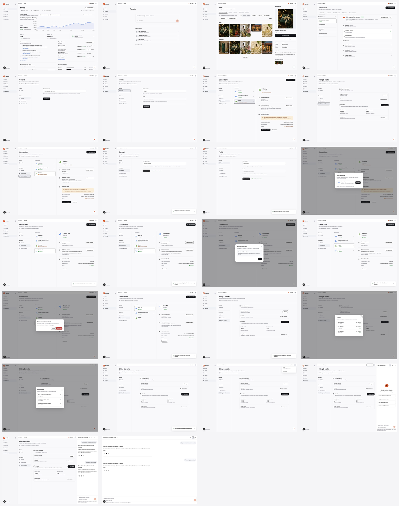

# Product shell + Settings journey audit

> **状态：修正后通过 — 2026-08-31。**  
> **范围：** Home、Create、Library、Brand、Settings review surfaces；Settings 全部 beta actions；desktop 1487 × 1058 viewport。  
> **原则：** audit 判断完整 journey，不以“按钮有反应”代替 URL、画面、history 与 shared state 一致。

## 1. 为什么原 audit 无效

Founder screen recording 证明原 audit 漏掉两个基础问题：

1. Settings 内部用 raw History API 改 URL，但 Next router state 没有跟随；因此地址已是 Billing / General，画面仍停在 Connections。
2. Settings 单页隐藏了 parked destinations，但 Home、Create、Library 与 Brand 各自复制一套 shell props，仍暴露 Campaigns / Schedule，并可进入旧 runtime / auth wall。

原 audit 把第二项错误标成“独立后续”，也没有把 URL、active title、content、Back / Forward 放进同一条验收，因此原 `Pass` 已在 `README.md` change register 撤回。

## 2. 根修复

1. `ProductPatternShellFrame.tsx` 成为五个 review surfaces 的 shared shell：统一消费 frozen `navigation-contract.json`，并集中管理 Home / Create / Library / Brand / Settings review routes、Profile、credits 与 review account menu。
2. Settings destinations 与 connection selection 改为真实 Next links；Add / Disconnect 这类 mutation 后的 route change 使用 Next router。
3. section change 会重新建立 content scroll surface，避免旧 Connections scroll position 留在 General / Billing。
4. Billing fixture 的 monthly、purchased 与 global rail balance 共用同一份 state；Add credits 后 `490` 与 `1,490 credits` 同步。

## 3. Corrected Founder journey

| # | 用户动作 | 可检查结果 | 健康度 | Current-run evidence |
|---|---|---|---|---|
| 1 | 从 Home 依次进入 Create、Library、Brand、Settings | 五页都进入 `/product-patterns/*`；rail 只有 Home / Create / Library / Brand / Settings；无 Campaigns / Schedule、auth wall | Healthy | `01-home.png`–`05-settings-general.png` |
| 2 | Settings 切换 Profile / General / Connections / Billing | URL、H1、content 与 active item 同步；没有残留 Connections content | Healthy | `05-settings-general.png`–`08-billing.png` |
| 3 | Billing 后按 Back，再 Forward | Back 恢复 Connections + Shopify；Forward 恢复 Billing | Healthy | `08-billing.png`, `09-back-restores-shopify.png` |
| 4 | 编辑 General workspace name 并保存 | 输入保持新值，原位显示 `Saved for this session` | Healthy | `10-general-saved.png` |
| 5 | 编辑 Profile display name 并保存 | 输入保持新值；email 诚实 disabled；原位显示保存结果 | Healthy | `11-profile-saved.png` |
| 6 | Add connection | dialog 解释 scope；Connect 后 Google Ads 加入、被选中并更新 URL | Healthy | `12-add-connection.png`, `13-connection-added.png` |
| 7 | Change account / Manage access | identity 更新；workspace access dialog 可读并可关闭 | Healthy | `14-account-changed.png`, `15-workspace-access.png` |
| 8 | Reconnect Shopify | warning 与 recovery CTA 消失；health 与 last sync 变为 Healthy / Just now | Healthy | `16-reconnected.png` |
| 9 | Disconnect Cancel / Confirm | Cancel 保留 row；Confirm 关闭 dialog、移除 row、选择下一 connection 并更新 URL | Healthy | `17-disconnect-confirmation.png`, `18-disconnected.png` |
| 10 | Change payment / View invoices / View usage | payment state 更新；两个 history dialogs 都有真实 fixture content 与关闭路径 | Healthy | `19-payment-method.png`–`21-credit-usage.png` |
| 11 | Add 250 credits | purchased credits `240 → 490`；global rail `1,240 → 1,490 credits` | Healthy | `22-credits-added.png` |
| 12 | Collapse rail / Account menu / Profile / credits shortcut | rail 可收合；menu 不暴露假的 Sign out；Profile 与 credits 进入 canonical Settings sections | Healthy | `23-account-menu.png` + browser semantic checks |
| 13 | Ask Otto / suggestion / send / feedback / new conversation / resize / close | panel 可开关；suggestion 生成 conversation；send 与 Helpful state 工作；new conversation reset；keyboard resize 336 → 351 px | Healthy | `24-otto-panel.png`, `25-otto-conversation.png` |
| 14 | Otto fullscreen / exit | fullscreen 与 panel 使用同一 conversation；exit 可恢复 panel | Healthy | `26-otto-fullscreen.png` |

Evidence files are under `audit-v2/`; every saved current-run screenshot was visually inspected after capture. Browser console errors during the corrected run: none.

## 4. Regression gates

- targeted Vitest: 12 / 12 passed；包含 shared shell consumer、frozen destinations、router-aware Settings links、credits SSOT。
- TypeScript: passed。
- ESLint on changed implementation + tests: passed with zero warnings。
- design-system usage audit: completed；repo-wide adoption report remains 138 / 257 product files，53.7%，不是本 journey 的 compliance percentage。
- production build: passed；本机缺少 Better Auth production env 的既有 warnings 不阻止 build，也不被描述为 auth 验证通过。

## 5. Accessibility boundary

- 本轮验证 semantic links、landmarks、dialog names、form labels、disabled email、destructive confirmation、pressed feedback 与 Otto keyboard resize。
- 没有运行完整 screen reader、automated contrast、Windows/browser matrix，因此本文件不是完整 WCAG compliance 或跨浏览器证明。
