# Creation Beta E2E Release Audit

**测试版本：`main@fe9c70bde07cb4bb433715588cf1f0e3b2cc24b0`（`fe9c70bd`）**  
**测试日期：2026-09-04（Asia/Kuala_Lumpur）**  
**测试范围：登录后 Creation；Create → Canvas → Otto → Image / Video → Library / History / Recovery**

> 本报告记录当前版本的真实行为、截图、数据与修复建议。它不修改产品源码，不改变已冻结规格，也不代表 Founder 批准上线。
>
> 报告对象：负责 Creation 接线与修复的工程师。建议先核对当前 HEAD；如果目标版本已经超过 `fe9c70bd`，先审阅增量 diff，再重跑受影响旅程。

---

## 1. Executive verdict

### Release recommendation: **Not ready for Creation Beta launch**

核心链路已经具备可用基础：真实 text-to-image、text-to-video、Canvas 落点、Library 自动收录、credits reserve / settle / refund、刷新恢复与基础编辑均已跑通。

当前仍有 **2 个 P0 与 6 个 P1 release blockers**：

1. **P0 — `Create variations` 一次点击直接开始付费动作。** 没有先展示一次性 exact-credit confirmation。
2. **P0 — 跨 Canvas 的产品参考被静默移除，但 UI 与 Otto 仍声称会带入生成。** `Choose from Library` 显示全账号历史，发送端却只接受当前 Canvas 的 generation；本轮两次提交都在服务端落成 `sourceGenerationIds: []`。
3. **P1 — 用户要求 4:5，confirmation 明知不符仍降级成 1:1。** 没有让用户修改或明确接受规格差异。
4. **P1 — Canvas Video 没有 Sound 开关。** 用户写 `completely silent`，但 job 仍冻结为 `audio: true`；本次碰巧得到近乎静音音轨，不能证明意图被可靠执行。
5. **P1 — Otto current-turn 会停留在旧阶段。** Generation 已经 Working / Done，左上仍显示较早的 approval 文案，刷新后才收敛。
6. **P1 — Confirmation 文案存在两套批准方式。** Otto 同时要求用户“说 yes”与按 `Generate · N credits`，付费动作的唯一批准点不清楚。
7. **P1 — `New conversation` 会建立无法从 UI 找回的 thread。** 旧 Conversation 只能依赖浏览器 Back，长期使用会产生 orphaned history。
8. **P1 — Canvas history 旧到新、全量渲染，缺少长期容量策略。** 新 Canvas 位于底部；没有 search、cursor 或显式 `Load more`。

建议的上线门槛：先关闭以上 P0 / P1，随后按本报告第 12 节重跑 targeted E2E。P2 不应阻断第一轮 Creation Beta，但需进入明确 backlog，避免被误认为已经完成。

### Release gate summary

| Gate | Result | Evidence |
| --- | --- | --- |
| Create entry and durable Canvas handoff | Pass | New Canvas and Conversation persisted |
| Exact confirmation before direct image/video spend | Pass | Image 1 credit; Video 5 credits |
| Exact confirmation before every paid follow-up | **Fail** | Variation begins immediately |
| Image generation and Library arrival | Pass | Real image generated and indexed |
| Video generation and playback | Partial | Real video works; sound intent not deterministic |
| Canvas drag/edit/reload persistence | Pass | Image and text state persisted |
| Otto state convergence | **Fail** | Current-turn stale until reload |
| Conversation continuity | **Fail** | New conversation has no thread switcher |
| References | **Fail** | Character mention works; cross-Canvas media is silently stripped |
| Long-term Canvas history | **Fail** | Oldest-first, unbounded list |
| Money recovery | Pass | Failed variation refunded exactly once |
| Browser console on tested path | Pass | 0 errors, 0 warnings |

---

## 2. Test manifest

| Field | Tested value |
| --- | --- |
| Repository | `BELCORT-SDN-BHD/FIKIRTIVE` |
| Branch | `main` |
| Full commit | `fe9c70bde07cb4bb433715588cf1f0e3b2cc24b0` |
| Short version | `fe9c70bd` |
| Run mode | Production build through `next start` |
| Test URL | `http://127.0.0.1:3312` |
| Browser | Connected Google Chrome, full desktop browser |
| Captured viewport | 1440 × 720 |
| Test scope | Authenticated Creation only; login flow excluded |
| Test account label | `Judge Al3 8584` |
| Organization | `org_cmtkbumuq00002yrmedgq6szx` |
| Canvas | `canvas_a977eb01-50a5-4970-995f-fa8c20a36f2a` |
| Conversation | `thread_a977eb01-50a5-4970-995f-fa8c20a36f2a` |
| Complex reference Canvas | `canvas_b1cbd403-0349-4915-8223-0279ed3b4700` |
| Complex reference Conversation | `thread_b1cbd403-0349-4915-8223-0279ed3b4700` |
| Source policy | Read-only application audit; no source changes |
| Founder-authorized provider budget | US$10 |
| Actual provider spend | **US$0.175616** |

### Sources of truth checked

- `apps/web/design-system/governance/frontend-integration-handoff.md`
- `apps/web/design-system/information-architecture/frontend-convergence-phase-3-create-canvas-spec.md`
- `apps/web/design-system/information-architecture/frontend-convergence-phase-3-create-canvas-acceptance.md`
- `apps/web/design-system/patterns/canvas/README.md`
- `apps/web/design-system/patterns/canvas/stitch-image-video-parity-spec.md`
- `apps/web/design-system/information-architecture/reference-picker-contract.md`
- `docs/specs/creation-engine.md`

Phase 3 acceptance 仍要求 authenticated Founder acceptance 与 DB-backed money evidence。本轮已经补上真实 authenticated journey 与账务证据，但发现新的 blockers，因此 **不能把 Phase 3 标记为 closure-ready**。

---

## 3. Journey map and health

| Stage | User intent | Result | Health |
| --- | --- | --- | --- |
| 1. Create | 输入要制作的内容 | 建立 durable Canvas + Conversation | Healthy |
| 2. Canvas handoff | 保留 prompt 与上下文 | 自动进入 full-screen Canvas | Healthy |
| 3. Otto planning | 理解需求并准备动作 | 可形成 plan / confirmation | Needs work |
| 4. Image confirmation | 生成前看到规格与 credits | 2048×2048、1:1、1 image、1 credit | Healthy |
| 5. Image generation | 完成真实付费生成 | 成功落 Canvas 与 Library | Healthy |
| 6. Canvas edit | 选择、拖动、文字、缩放 | 主要行为通过并能刷新恢复 | Healthy with manual retest |
| 7. Video confirmation | 选择时长、品质、比例、费用 | 缺 Sound 控制 | Blocked |
| 8. Video generation | 完成真实视频并播放 | 成功，但音频意图不可靠 | Needs work |
| 9. Reference | `@` 人物 + Library 产品图 | 人物可见；跨 Canvas 产品参考被静默移除 | Blocked |
| 10. Conversation | 继续同一 Canvas 的完整历史 | 新 thread 无法从 UI 找回 | Blocked |
| 11. History / Library | 找回所有 Creation 资产 | 基础 search/filter 通过；长期 IA 不完整 | Needs work |
| 12. Failure recovery | 失败时不误收费并可恢复 | reserve → refund 正确 | Healthy |

---

## 4. Screenshot walkthrough with remarks

### Stage 1 — Create entry

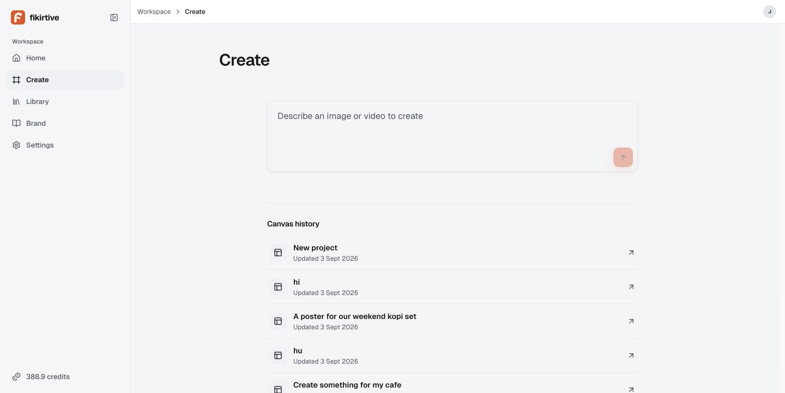

**Observed**

- Create page 保持 minimal：一个 Otto composer + Canvas history，没有再造第二个 Fikirtive Home。
- 页面层级、间距与已批准 Stitch-like composition 基本一致。
- History 已能打开真实 Canvas。

**Remark**

- History 当前按旧到新排列；本轮创建的最新 Canvas 会落在列表底部。对于 50–500 个 Canvas 的账号，可发现性会快速下降。

### Stage 2 — Durable Canvas handoff and Working state

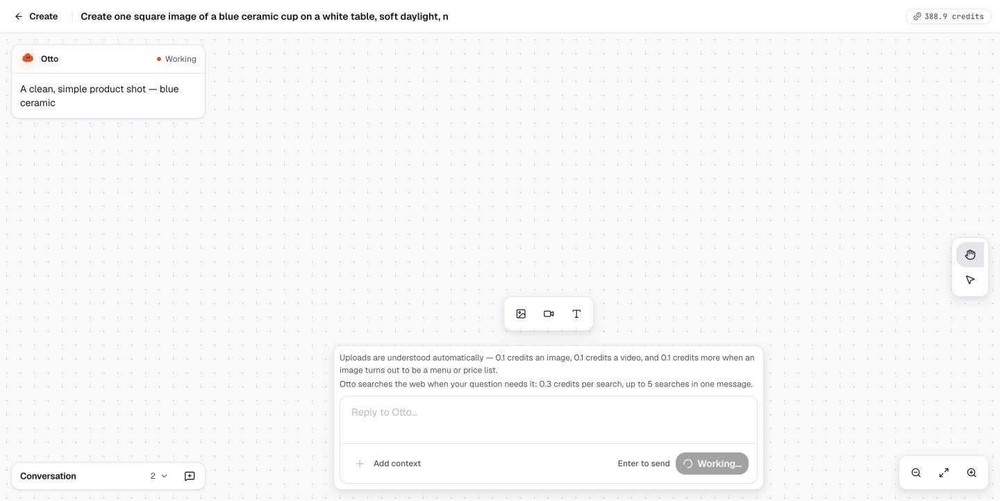

**Observed**

- Create prompt 建立 Canvas 后自动进入 full-screen Canvas。
- Otto current-turn、Conversation dock、bottom composer 与 board 分工清楚。
- Working state 可见，Canvas 没有被 dashboard shell 取代。

**Remark**

- 这个结构符合冻结的三件式 agent structure：current-turn status、Conversation history、omnibox。

### Stage 3 — Exact image confirmation

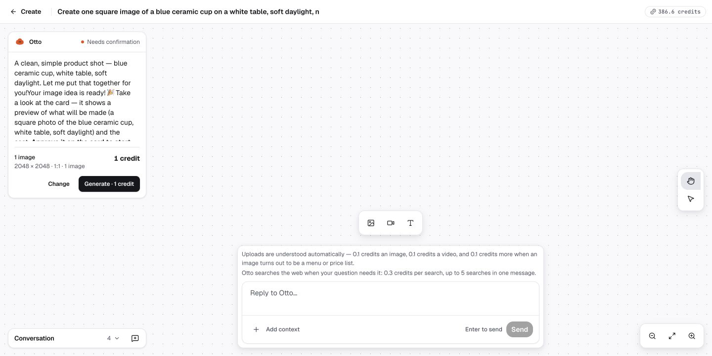

**Observed**

- 付费前可见 2048×2048、1:1、1 image、1 credit。
- `Change` 会把 enhanced prompt 带回 composer。
- `Generate · 1 credit` 是明确付费按钮。

**Remark**

- Direct image 的 money-consent model 是正确基线。Variation、edit、animate 应复用同一模式，而不是另建付费捷径。

### Stage 4 — Image generating and stale current-turn

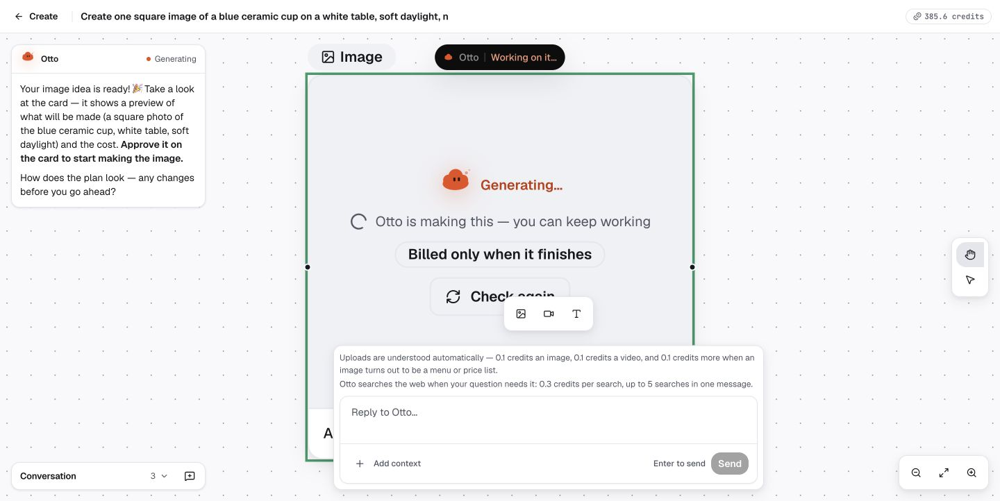

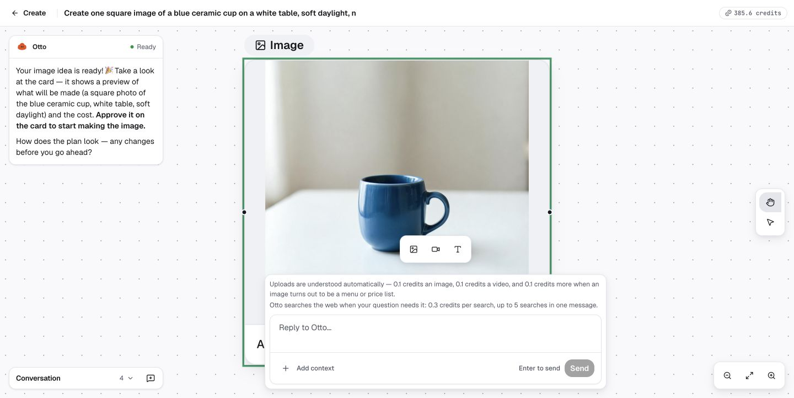

**Observed**

- Image job 能从 queued / generating 进入 done，作品出现在 Canvas。
- 但左上 current-turn 仍停留在较早的 approval 文案，直到 reload 才更新。

**Remark**

- 这不是单纯 copy polish。它破坏了“Otto 现在到底在做什么”的状态权威，容易诱发重复确认或重复生成。

### Stage 5 — Real video generation

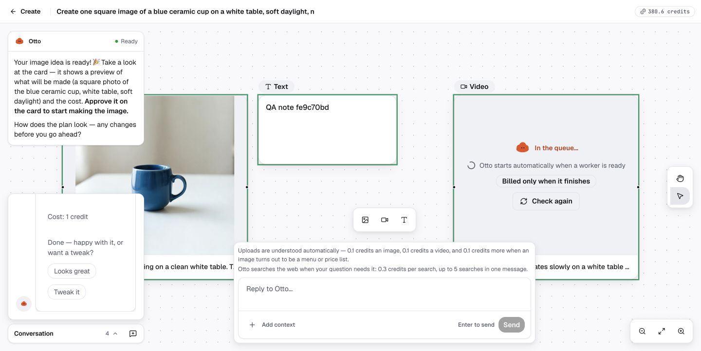

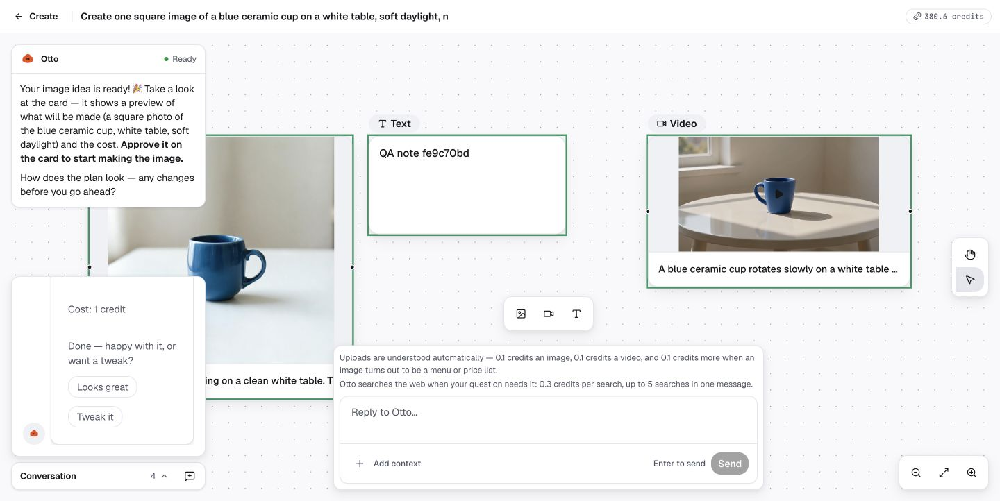

**Observed**

- 4 秒、480p、16:9 的 quote 从 11 credits 动态变为 5 credits。
- 真实 provider job 完成，Canvas 可播放，Library 自动收到同一视频。
- 输出约 4.096 秒、H.264、864×496、24fps；ratio 与 16:9 差约 2.0%，在批准的 ±3% tolerance 内。

**Remark**

- Canvas video dialog 没有 Sound toggle。用户 prompt 明确要求 `completely silent`，但 DB snapshot 是 `audio: true`。这次 AAC 音轨约 -91 dB，几乎静音；这是 provider 结果，不是 UI / contract 的确定性保证。

### Stage 6 — Reference picker

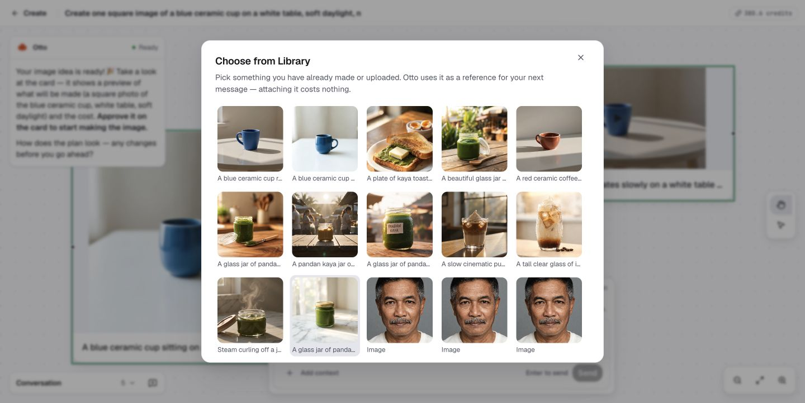

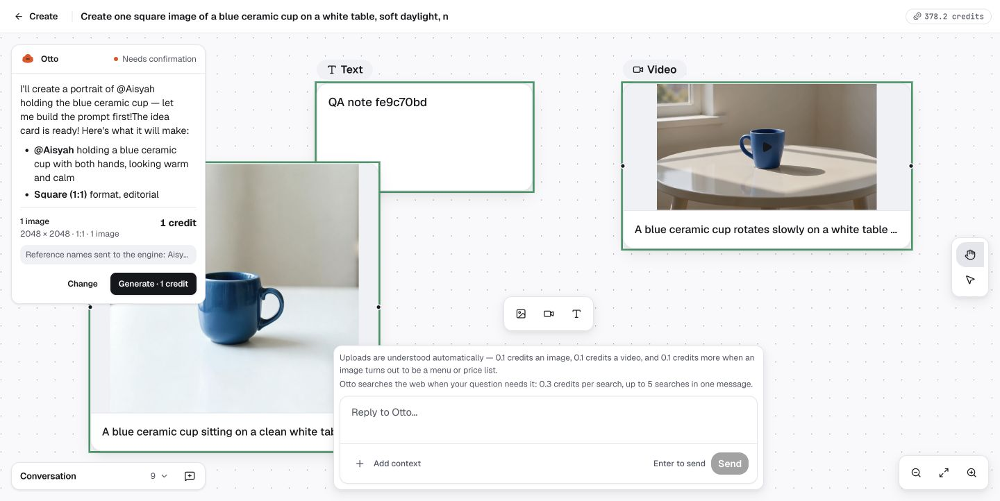

**Observed**

- `@Aisyah` 可以插入 Character reference，计划会显示 typed reference summary。
- Reference chip 可移除。
- `Choose from Library` 能加载最近媒体。

**Remark**

- 目前 direct `@` 只是对 `entities` 做 name filter，并截取 6 条；还不是批准的 Recent + Products / Characters / Official avatars / Locations / Clothes / Media 统一 picker。
- 多选发送给 Otto 时，token 仍使用 `Image ref` / `Video ref`，缺少真实资产名称与来源。

### Stage 7 — Conversation continuity

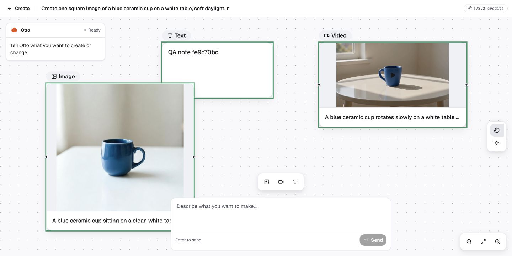

**Observed**

- 点击 `New conversation` 后，当前 Conversation 清空并从 URL 移除 thread。
- UI 没有 thread list 或 switcher；旧 Conversation 只能用浏览器 Back 找回。

**Remark**

- 这会产生可写但不可发现的 history。Beta 最简单的修复不是加复杂 thread manager，而是先保持“一个 Canvas = 一条 chronological Conversation”。

### Stage 8 — Paid variation bypasses confirmation

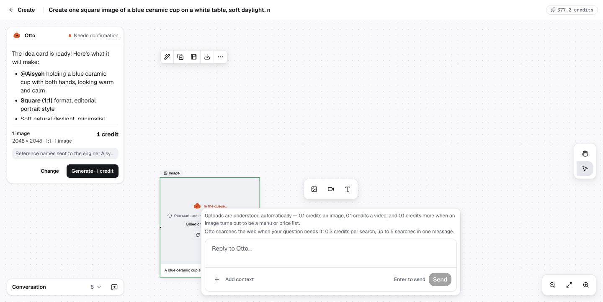

**Observed**

- 点击 `Create variations` 一次后立即建立付费 job 并 reserve 1 credit。
- 只有 hover title 提示 cost；没有 visible exact-credit confirmation。
- 本次 job 之后因 `edit source image unreachable` 失败，并自动退款。

**Remark**

- Refund 正确不能替代 consent。第一击必须只打开 confirmation；只有第二个明确 `Generate · N credits` 才能建立 job / ledger reservation。

### Stage 9 — Cast editor and missing official catalog boundary

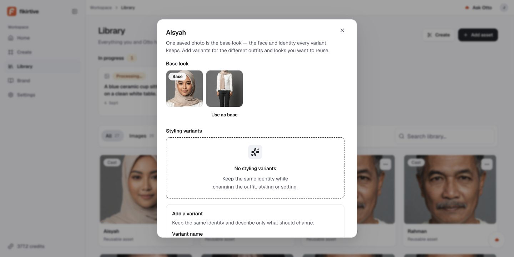

**Observed**

- 当前截图中的 Aisyah 是 Production `Cast`，可设置 base look 与 styling variants。
- 这个编辑行为对 merchant-owned Character 本身并非缺陷。

**Remark**

- 真正的缺口是 Production Library 没有提供已批准的 `Official avatars · Read only` catalog 与 typed provenance。工程师不应把所有 Cast 一刀切成 read-only；需要让 official 与 merchant-owned Character 在数据 contract 上可区分。

### Stage 10 — Library filters and asset details

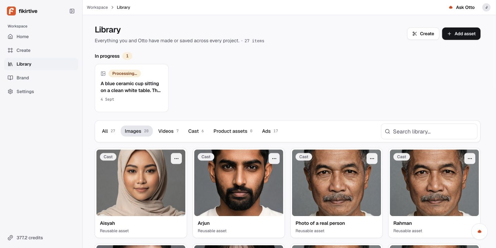

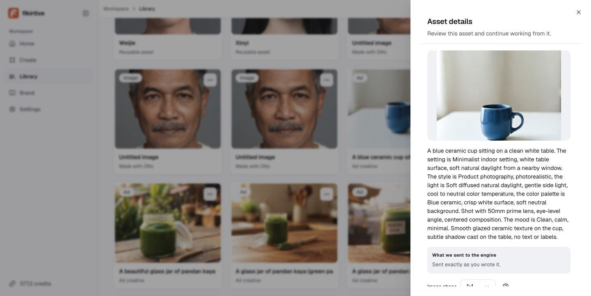

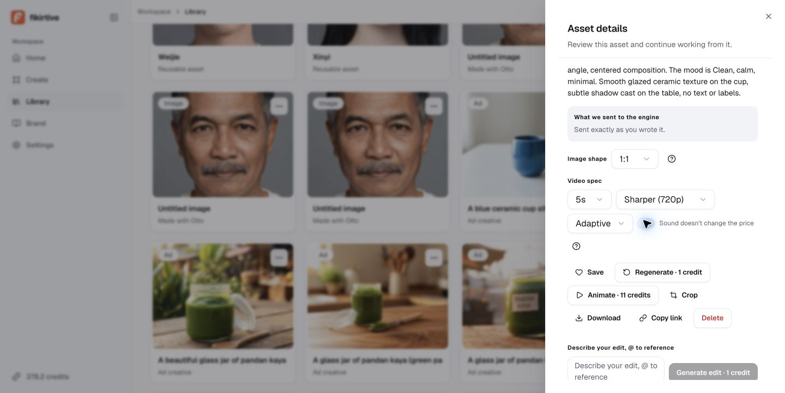

**Observed**

- Library search、All / Images / Videos / Cast / Product assets / Ads filters 可点击且能更新结果。
- Asset detail panel 可打开；Video detail 已经有 Sound toggle，开关可操作，quote 保持 `Animate · 11 credits`。
- 新生成 image / video 自动进入 Library。

**Remark**

- Canvas video 与 Asset detail 的 audio capability 不一致：同一个 Creation domain 有两套 spec UI。
- Production Library 尚未暴露 approved Favorites、Collections、Clothes、Locations、Official avatars 与按 Canvas / Conversation 组织的 general generation history。
- 当前没有 Sort control，未满足 Founder 之前要求的可操作 sorting 能力。

### Stage 11 — Persistence and multi-select

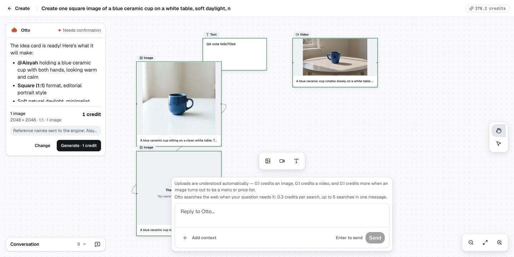

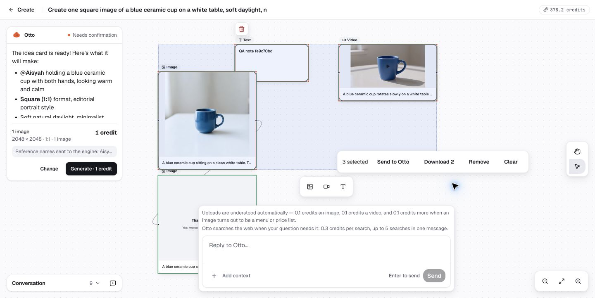

**Observed**

- Image free drag 与 text edit 在 reload 后仍存在。
- Marquee multi-select 成功；3 张卡被选中，batch bar 显示 `Send to Otto`、`Download 2`、`Remove`、`Clear`。
- `Send to Otto` 能把 2 个 media references 带入 composer。

**Remark**

- Shift-click 在这次 CUA session 里没有稳定加选第二张卡；自动测试声称支持。此项标记为 **manual retest required**，不是确认缺陷。
- `Download 2` 没有 console error，但自动化浏览器的 Downloads 目录没有出现新文件；可能是 browser download routing，结论为 **inconclusive**。

### Stage 12 — Canvas history scalability

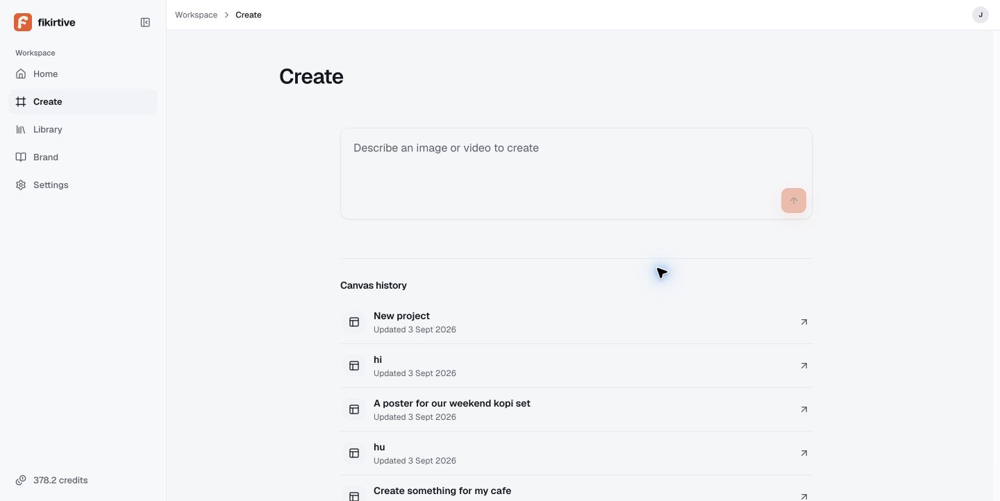

**Observed**

- 所有 Canvas 都直接渲染；最新 E2E Canvas 在底部。
- 没有 search、filter、cursor 或 `Load more`。

**Remark**

- 这是一个 bounded-list 问题：History 应默认最近活动优先，并用 server cursor 控制首次数据量。除非真实数据证明需要，不必先做复杂虚拟列表。

### Stage 13 — Complex person + product reference journey

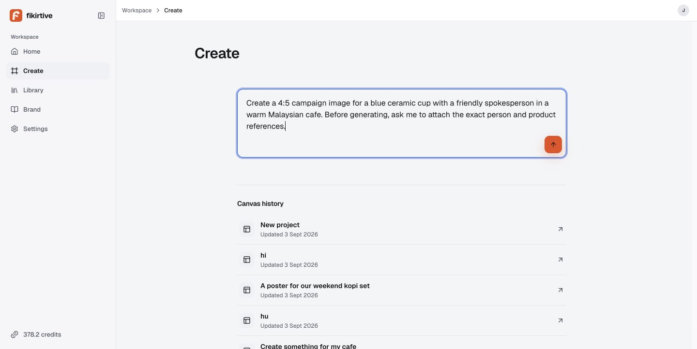

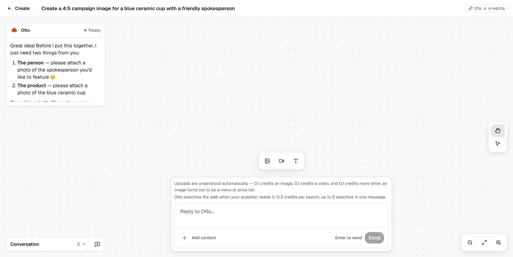

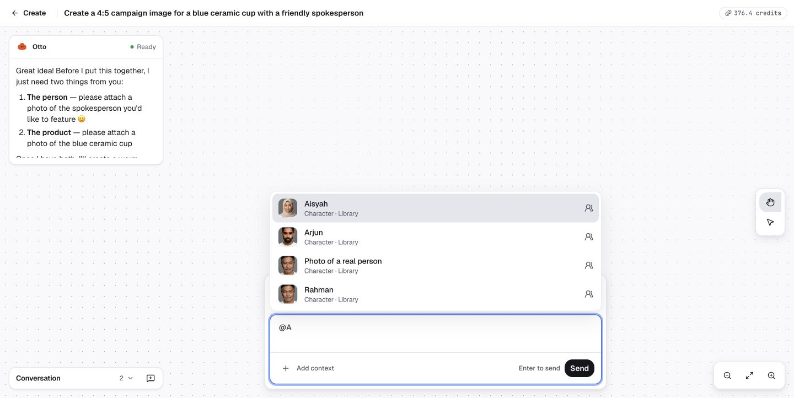

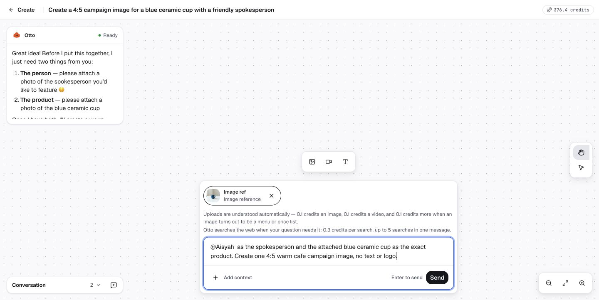

**Observed**

- Otto 正确要求人物与产品两份参考。
- `@Aisyah` 可从 Character menu 选择；产品图只能经 `Choose from Library` 加入。
- Composer 明确显示 `Image ref`，让用户合理相信杯子参考已经随下一条消息送出。

**Remark**

- Direct `@` menu 仍只显示 Characters；产品、Location、Clothes、Official avatar 与 Media 没有进入同一个 typed resolver。
- `Image ref` 没有真实名称、来源 Canvas 或 availability，用户无法在发送前确认它到底是哪一件资产。

### Stage 14 — Visible reference lost after submit

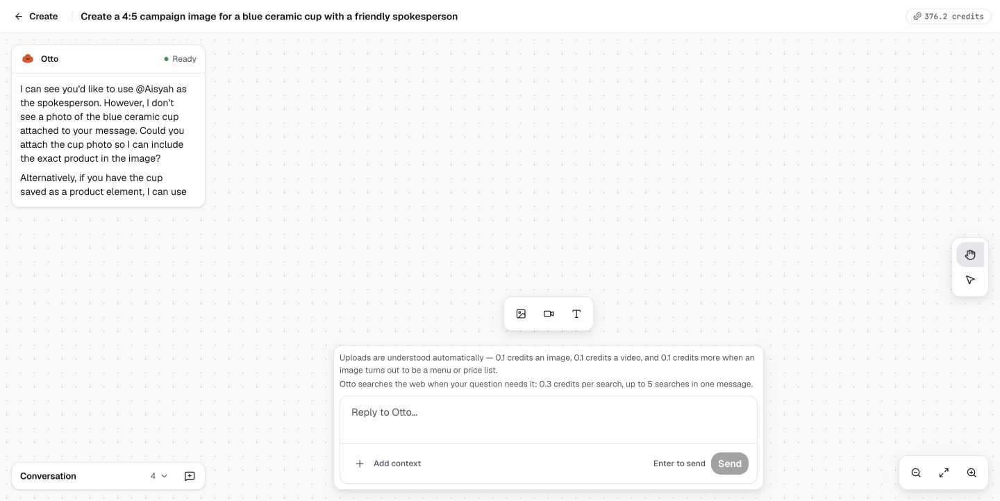

**Observed**

- 用户发送后，Otto 明确回复没有看到蓝色杯子参考。
- DB 对第一条与第二条 attachment turn 都记录 `sourceGenerationIds: []`。

**Root boundary**

- Picker 使用 owner-global `getGenerationHistory`，会展示其他 Canvas 的 generation。
- `validateOwnedGenerationExt` 同时要求 `ownerId + projectId`；被选中的杯子属于 `canvas_a977…`，当前对话属于 `canvas_b1cb…`，因此 reference 被静默过滤。
- 过滤结果没有返回给 composer，也没有阻止 Otto 继续形成计划。

### Stage 15 — Approval material and aspect ratio mismatch

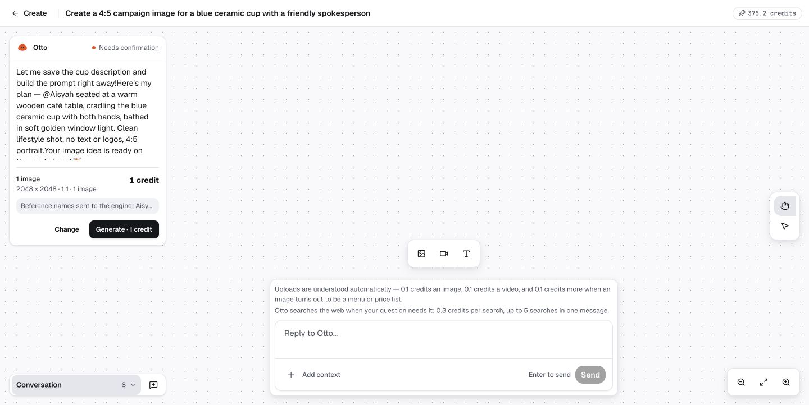

**Observed**

- Confirmation 只列出 `Aisyah (person)`，没有 cup/media reference receipt。
- 用户要求 4:5；card 显示 `2048 × 2048 · 1:1`，并写明这是 downgrade。
- GenJob `01M1MQ26NR9J87SE9Y62H76SEV` 的 `approvedEntities` 只有 Aisyah，`sourceGenerationId` 为 null，`imageOptions` 为 `{"aspectRatio":"1:1"}`。

**Remark**

- 这不是 copy 偏差，而是 approved material 不完整：系统在要求用户确认一个与其明确意图不同、且缺少指定产品参考的付费请求。
- 如果当前引擎不支持 4:5，应在 confirmation 前询问或让用户选择替代规格；不能把 downgrade 当作默认同意。

### Stage 16 — Fail-closed generation and refund

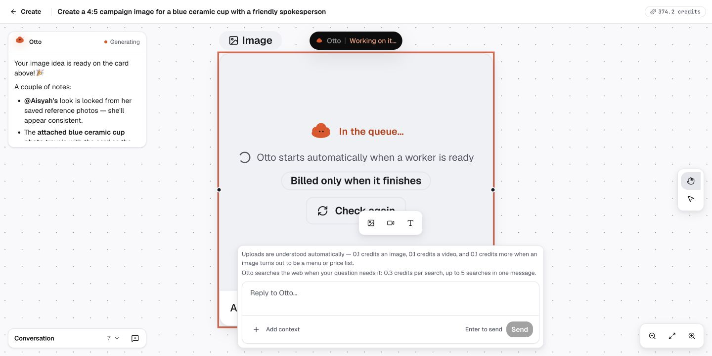

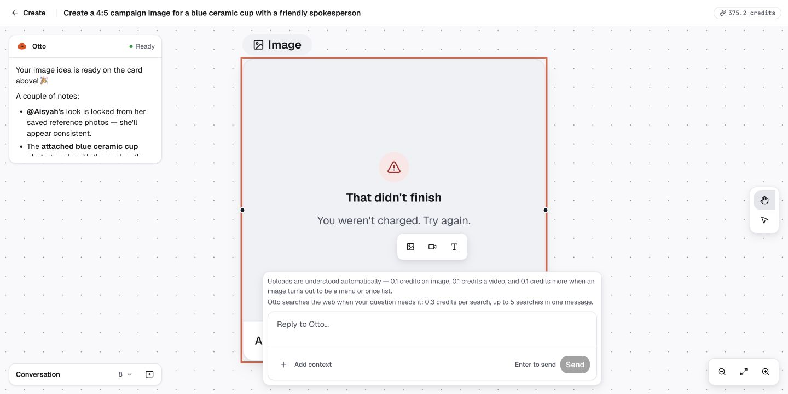

**Observed**

- Job reserve 1 credit 后，因 Aisyah 的两张 conditioning refs 无法签成 provider 可访问 URL 而失败：`conditioning refs unreachable (0/2) — refusing to spend`。
- 3 attempts 后进入 FAILED；ledger 正确 RESERVE → REFUND，余额恢复，provider spend 为 US$0。
- UI 使用诚实的 no-charge recovery 文案。

**Remark**

- Fail-closed 与退款是正确行为，不应绕过。
- 本地真实 provider E2E 需要可由 provider 访问的 reference storage，或在行为级测试使用 mock provider；不能以跳过 reference validation 来“修好”测试。

---

## 5. Detailed issue register

### QA-CRE-FE9-001 — P0 — Paid variation starts before explicit confirmation

**Observed**

- `Create variations` 的第一次点击直接调用 generation，并 reserve 1 credit。
- UI 没有显示 output count、ratio、source、exact credits 与单一 confirm action。

**Expected source of truth**

- Phase 3 / R22 contract 要求每个 paid generation 先显示 server quote；付费按钮统一为 `Generate · N credits`。
- `stitch-image-video-parity-spec.md` 的 variation journey 明确是 `count/range/aspects → confirmation → side-by-side variants`。

**Engineering evidence**

- `apps/web/components/canvas/nodes/ImageNode.tsx:154-166`：toolbar click 直接调用 `onVariant`。
- `apps/web/components/canvas/FlowCanvas.tsx:1027-1035`：`handleVariant` 直接调用 `runImageEvolve`。
- `apps/web/components/canvas/FlowCanvas.tsx:980-1020`：`runImageEvolve` 建立 action id 并调用 `generateImage`。

**Recommended repair**

1. 将 variation 建模为 staged intent，不在 toolbar click 建 job。
2. 第一次点击只打开 current-turn confirmation，展示 source thumbnail、count、ratio、prompt/material 与 exact credits。
3. 只有点击 `Generate · N credits` 后才生成 stable action id、reserve 与 provider job。
4. Double-submit 复用 direct generation 的现有 idempotency boundary。

**Done / retest criteria**

- 第一次点击后 GenJob 与 CreditLedger 都是 0 条新增。
- 点击 `Cancel` 后仍是 0 条新增。
- 点击 `Generate · 1 credit` 只产生一组 reserve → settle 或 reserve → refund。
- 连续 double-click 不产生第二组 ledger。

### QA-CRE-FE9-002 — P1 — Canvas video does not encode Sound intent

**Observed**

- T2V 与 I2V dialogs 只有 duration、quality、aspect 与 motion，没有 Sound。
- 本次 prompt 要求 silent，但 DB job snapshot 为 `audio: true`。
- Provider 输出包含 AAC 音轨；本次近乎静音不等于 contract 正确。

**Engineering evidence**

- `apps/web/components/canvas/FlowCanvas.tsx:2165-2171`：I2V `VideoSpecPicker` 未传 `audioToggle`。
- `apps/web/components/canvas/FlowCanvas.tsx:2268-2273`：T2V `VideoSpecPicker` 未传 `audioToggle`。
- Asset detail 已经有可用的 Sound toggle，证明 visual primitive 存在；Canvas action request 尚未承载 audio field。

**Recommended repair**

1. 把 `audio` 放进 canonical Canvas VideoSpec / approved material，而不是从 prompt 猜。
2. T2V 与 I2V 共用同一 Sound row，默认值需由产品 contract 明确。
3. Quote、idempotency material、job snapshot、provider payload、receipt 与 replay 全部携带相同 audio value。
4. `audio:false` 必须映射到 provider `generate_audio=false` 或等价字段。

**Done / retest criteria**

- T2V 与 I2V 均可在 confirm 前切换 Sound。
- `audio:false` 的 DB snapshot 与 provider payload 均为 false。
- 输出没有 audio stream，或符合团队明确批准的 silent-output policy。
- Reload / retry 不会把 audio 恢复为默认 true。

### QA-CRE-FE9-003 — P1 — Otto current-turn is stale after job phase changes

**Observed**

- Generation 已进入 Working / Done，current-turn 仍显示较早的 approval copy。
- Reload 后 current-turn 才收敛。

**Impact**

- 用户无法知道是否已经批准、是否还在工作、是否需要再次操作。
- 在付费动作附近，这会增加重复提交风险。

**Recommended repair**

- 让 current-turn 从同一个 durable card / action id / GenJob phase 投影，不再由分散 local state 猜测。
- job terminal event 必须同时 invalidate / refresh board node、Conversation receipt 与 current-turn。
- question、confirmation、working、done、failed、cancelled 必须互斥。

**Done / retest criteria**

- 不 reload，confirmation → working → done 在三个 surfaces 同步收敛。
- Failure → retry → success 后，旧 failure 不会重新成为 current-turn。
- Reload 后不得出现倒退阶段。

### QA-CRE-FE9-004 — P1 — Two competing approval instructions

**Observed**

- Otto narration 说 `Just say yes and I’ll submit it — then you’ll confirm on the card to start`。
- 同一画面已经显示 `Generate · 1 credit`。

**Impact**

- 用户不知道“yes”是否会花钱，也不知道 card 是否仍需再确认。

**Recommended repair**

- 固定一个 consent rule：聊天文字不触发付费批准；narration 只说 `Review the card and press Generate`。
- 如果系统收到 `yes`，可以解释并聚焦 confirmation card，但不能 reserve。

**Done / retest criteria**

- 任一 paid plan 页面只出现一条批准指令。
- 输入 `yes` 不产生 ledger；按 `Generate · N credits` 才产生 reserve。

### QA-CRE-FE9-005 — P1 — New conversation creates inaccessible history

**Observed**

- `New conversation` 清除 active thread 与 URL thread state。
- Canvas 内没有 thread list / switcher。

**Engineering evidence**

- `apps/web/components/canvas/NorthstarCanvasWorkspace.tsx:202-206`：清除 active thread、pending first、references，并替换 URL。
- `apps/web/components/otto/OttoChatStream.tsx:1003-1031`：Canvas 始终显示 `New conversation` action。

**Recommended repair**

- **Beta 推荐：** 暂时移除 `New conversation`，保持一个 Canvas 对应一条 chronological Conversation；这是最简单且最贴近 R22 的做法。
- 如果多 thread 是已批准需求，则必须同时提供 thread switcher、标题、排序、active state 与 deep link，不能只提供 create action。

**Done / retest criteria**

- 用户从 UI 可找回每条曾建立的 Conversation；或 Beta 不再允许建立第二条。
- Reload、浏览器 Back、直接 deep link 都不会产生 orphan thread。

### QA-CRE-FE9-006 — P1 — Canvas history is oldest-first and unbounded

**Observed**

- 最新 Canvas 排在底部。
- 所有项目一次传入并渲染。

**Engineering evidence**

- `apps/web/lib/data.ts:50-54`：shared `getProjects` 使用 pinned first + `createdAt: asc`。
- `apps/web/components/start-something/CreateWorkspace.tsx:80-95`：直接 map 全量 records。

**Recommended repair**

- 不要直接改变 shared `getProjects`，避免影响其他 consumers。
- 新建 Create-specific read model：pinned first，其余 `updatedAt desc, id desc`；首屏建议 20 条。
- 加 search 与 server cursor；先用 `Load more`，只有性能数据证明需要时再 virtualize。

**Done / retest criteria**

- 新建 / 更新 Canvas 后出现在第一个非 pinned 位置。
- 100+ Canvas 的 initial payload 有上限。
- Search 能找 title；Load more 不重复、不漏项，刷新排序稳定。

### QA-CRE-FE9-007 — P2 — Approved cross-type `@` reference contract is not wired

**Observed**

- Direct `@` 只搜索当前 `entities` 并限制 6 条。
- Product、Official avatar、Clothes、Location、Generation、Upload 无法从同一 picker 被验证。

**Engineering evidence**

- `apps/web/components/otto/OttoChatStream.tsx:787-789`：name filter + `slice(0, 6)`。
- `apps/web/components/canvas/CanvasLibraryPicker.tsx:15-17,38-39`：Library shortcut 固定最近 24 条，没有 search / paging；它不能替代 approved `@` picker。

**Recommended repair**

- 建立一个 canonical typed reference resolver，输出 stable ID、type、label、thumbnail、source / provenance 与 availability。
- 裸 `@`：最多 5 个 Recent + category entries。
- 继续输入：跨 Products、Characters、Official avatars、Locations、Clothes、Media 搜索。
- `Choose from Library` 可继续作为最近 media shortcut，但 selected token 应显示真实名称，不是 `Image ref`。

**Done / retest criteria**

- 每类至少一条真实数据可被搜到、选择、移除、reload 与送入 approved material。
- Official avatar 行显示 `Official avatar · Read only`。
- 无权／已删除 reference 在付费前 fail closed，并给用户可理解文案。

### QA-CRE-FE9-008 — P2 — Official Avatar production catalog is missing

**Observed**

- Production Library 只有 `Cast`，没有独立 `Official avatars` view。
- Aisyah 截图是 merchant-owned Cast，因此其 variant UI 不能作为 official read-only violation 的证据。

**Expected source of truth**

- Official avatars 是 Fikirtive-owned read-only catalog；可 browse、search、preview、favorite、use，不可 rename / edit / delete identity。

**Recommended repair**

- 在 canonical Library DTO 增加 owner/provenance/read-only truth，或接入已有正式 catalog contract。
- Official avatar 使用 read-only detail panel；merchant Character 继续使用 editable variant dialog。
- Mutation action server-side 也必须拒绝 official identity，不只隐藏按钮。

**Done / retest criteria**

- Official 与 merchant-owned Character 在数据层可判定。
- Official detail 没有 variant、rename、delete identity controls。
- Favorite 与 Use in Canvas 可用；新 generation 归当前 Org Library。

### QA-CRE-FE9-009 — P2 — Library IA is only partially wired

**Observed**

- Search 与当前 filters 可用。
- 未看到 Favorites、Collections、Clothes、Locations、Official avatars、Sort、按 Canvas / Conversation 的 generation grouping。

**Recommended repair**

- 不复制 asset；Favorites / Collections 保存 typed membership link。
- General generation history 是自动归档底座；user selection 才进入 Favorite / Collection。
- Products 的 facts 继续由 Otto IQ 持有，Library 只显示 Product ID 与 linked media。

**Done / retest criteria**

- Approved taxonomy 全部可由真实 route / state 到达。
- Sort 与 filter 可组合、可 reload、可 deep-link。
- 移除 Favorite / Collection membership 不删除原 generation。

### QA-CRE-FE9-010 — P2 — Reserved credits are visually indistinguishable from charged credits

**Observed**

- Confirmation copy 说完成后才收费，但 balance 在 reserve 时已经下降。
- Ledger 行为正确；UI semantics 容易让用户认为已 final charge。

**Recommended repair**

- 显示 `1 credit reserved` / `Finalized when complete`，或 balance 同时表达 available 与 reserved。
- Receipt 明确 settle 或 refund，不使用模糊的“charged”跨越所有阶段。

**Done / retest criteria**

- Queued / Working 可区分 reserved 与 settled。
- Failed / Cancelled 后 reserved 归零，余额与 ledger 一致。

### QA-CRE-FE9-011 — P2 — Asset provenance is incomplete

**Observed**

- 新 video detail 显示 `What the engine ran — Not reported by the engine`。

**Recommended repair**

- 保存 provider final prompt / normalized request metadata；若 provider 不返回，文案写 `Not provided by the engine`，并继续展示 original prompt、job receipt 与 approved spec。

**Done / retest criteria**

- 每个 generation detail 能解释 input、approved spec、engine receipt、cost 与 output lineage。

### QA-CRE-FE9-012 — Manual retest required — Download and Shift-click

**Observed**

- Batch `Download 2` 无 console error，但自动化浏览器的系统 Downloads 目录没有新文件。
- Shift-click 没有稳定加选第二张卡；marquee multi-select 已通过。

**Engineering note**

- `FlowCanvas.tsx` scoped lint 对 `getOnDownload` 报出 missing hook dependency warnings，可能造成 stale callback，但本轮没有足够证据判为功能故障。

**Retest criteria**

- 人工 Chrome 在正常 download permissions 下验证 single / batch download。
- Mouse shift-click 与 keyboard selection 分别验证；selection count 与 batch action target 一致。

### QA-CRE-FE9-013 — P0 — Product/media reference is silently removed before approval

**Observed**

- `Choose from Library` 显示 owner-global generations；用户选择上一条 Canvas 生成的蓝色杯子后，composer 显示 `Image ref`。
- 第一轮发送后 Otto 说没有看到杯子。第二轮重新选择后，Otto narration 声称会把 exact product reference 带入生成。
- 两条 USER message 的 DB payload 都是 `sourceGenerationIds: []`；GEN_CARD 与 GenJob 也没有任何 cup generation ID。

**Root cause evidence**

- `CanvasLibraryPicker.tsx` 调用 owner-global `getGenerationHistory({ take: 24 })`，没有按当前 Canvas 限制。
- `validateOwnedGenerationExt` 要求 generation 同时匹配 `ownerId` 与当前 `projectId`。
- 蓝色杯子 generation `01M1MMXK6KCYVXAXHZBK5YJTWD` 属于 `canvas_a977…`；当前复杂旅程属于 `canvas_b1cb…`，因此服务端把它过滤掉。
- 过滤是 silent drop：没有 error 回到 composer，也没有阻止 GEN_CARD 或 confirmation。

**Impact**

- 用户可能批准并支付一张没有使用指定产品的商业素材。
- Otto narration、composer chip、confirmation 与实际 GenJob material 不再是同一事实。

**Recommended repair**

1. 决定 canonical reference scope。对于 Founder 已批准的 owner-wide Library，推荐让同一 owner 的 generation 可以跨 Canvas 被引用；不要让 picker 承诺一个 validator 会拒绝的范围。
2. 将 typed `mediaReferences[]`（generationId、kind、label、source Canvas、availability）贯穿 User message → Otto context → GEN_CARD → confirmation → idempotency material → GenJob → provider payload → provenance。
3. Validation 失败必须返回可见的 attachment error，并保留 composer draft；不得 silent drop。
4. Confirmation 必须逐项列出人物与产品 reference receipt。缺任一项时禁用 Generate。

**Done / retest criteria**

- 从 Canvas A 的 Library 选择产品图，在 Canvas B 发送后 USER payload 保留同一 stable generation ID。
- GEN_CARD、confirmation、GenJob 与 provider request 都能证明人物与产品两项 material 一致。
- 删除、无权或 storage unavailable 的 reference 在 reserve 前 fail closed，并指出哪一项不可用。
- 第一次提交不再出现“UI 有 chip、Otto 看不到”的状态。

### QA-CRE-FE9-014 — P1 — Explicit 4:5 request is confirmed as 1:1

**Observed**

- 用户两次明确要求 4:5。
- Confirmation 显示 `2048 × 2048 · 1:1`，并写 `You asked for 4:5 — this will be a square…`。
- GenJob 冻结 `imageOptions: {"aspectRatio":"1:1"}`。

**Impact**

- 用户的硬规格被系统主动改变，却仍进入付费批准路径。
- 4:5 campaign output 与用户投放渠道目标不匹配。

**Recommended repair**

- 将 ratio 作为 typed requirement，而不是 prompt 内自由文本。
- 当前 route 不支持 4:5 时，先询问用户选择可支持比例，或在 confirmation 提供可见可改的 ratio control。
- 只有用户明确接受 alternative ratio 后，才可铸造 approval material。

**Done / retest criteria**

- 4:5 支持时：confirmation、GenJob、provider request 与 output probe 都是 4:5。
- 4:5 不支持时：系统在 reserve 前停住并要求选择；没有 silent / informational downgrade。

### QA-CRE-FE9-015 — Environment release gate — Reference URLs are not provider-reachable

**Observed**

- Complex job `01M1MQ26NR9J87SE9Y62H76SEV` 在 provider spend 前失败：`conditioning refs unreachable (0/2) — refusing to spend`。
- 该错误指向 Aisyah 的两张 base references；不是 provider model failure，也不是杯子 reference 的 evidence。
- Ledger 正确退款，provider spend 为 US$0。

**Recommended repair**

- 保留 worker fail-closed。
- 在 staging / beta 使用 provider 可访问的 signed object URLs；本地行为测试使用 mock provider，真实 provider release check 使用批准的外部 object storage。
- 增加 preflight：confirmation 前即可判定 selected reference 是否能形成有效 provider input。

**Done / retest criteria**

- 同一人物的 reference preflight 通过后才允许 reserve。
- Provider request 能拉取所有 approved refs；缺一项则 reserve 前停止。
- 失败仍保持 exactly-once refund，且用户文案不暴露内部 URL / storage 信息。

---

## 6. Functionality matrix

| Capability | Result | Notes |
| --- | --- | --- |
| Authenticated `/create` | Pass | Login flow itself out of scope |
| Empty prompt disabled | Pass | No empty Canvas created |
| Prompt creates Canvas | Pass | Durable Canvas + Conversation |
| Otto Working state | Pass | Visible immediately |
| Clarification flow | Pass / limited | Current run emphasized confirmation path |
| Image exact quote | Pass | 1 image, 1:1, 2048×2048, 1 credit |
| Change prompt | Pass | Enhanced prompt returns to composer |
| Image generation | Pass | Real provider output |
| Image appears on Canvas | Pass | No reload required |
| Image appears in Library | Pass | Searchable |
| Image drag persistence | Pass | Reload verified |
| Add / edit text | Pass | Reload verified |
| Pan / zoom / fit / select | Pass | Controls visible and named |
| Marquee multi-select | Pass | 3 nodes selected |
| Shift-click multi-select | Manual retest | CUA result inconsistent with automated tests |
| Send selected to Otto | Pass | 2 media references attached |
| Single download | Inconclusive | No console error; browser file routing unverified |
| Batch download | Inconclusive | Same limitation |
| Image details | Pass | Opens provenance panel |
| Create variations | **Fail** | Paid action begins without confirmation |
| Variation refund | Pass | Failed job refunded exactly once |
| T2V spec controls | Partial | Duration / quality / ratio pass; Sound missing |
| T2V quote | Pass | Dynamic 11 → 5 credits |
| T2V generation | Pass | Real 4-second output |
| Video playback | Pass | H.264 + AAC, playable |
| I2V dialog | Partial | Motion / spec / price pass; Sound missing |
| Direct `@Character` | Pass | Aisyah selected / removed |
| Cross-type `@` | **Fail** | Direct picker remains Character-only |
| Choose from Library | **Fail** | Cross-Canvas selection is silently stripped on send |
| Person + product reference | **Fail** | Confirmation / GenJob contains person only |
| Explicit 4:5 image | **Fail** | Confirmation knowingly downgrades to 1:1 |
| New conversation | **Fail** | Previous thread inaccessible from UI |
| Conversation expand / collapse | Pass | Chronological thread visible |
| Create history | **Fail** | Oldest-first, unbounded |
| Library search | Pass | Image search verified |
| Library filters | Pass / partial IA | Existing filters work |
| Library asset detail | Pass | Video Sound toggle works here |
| Official avatar catalog | Not available | Approved fixture not wired to production |
| Failed job honest state | Pass | No-charge copy + refund |
| Refresh recovery | Pass | Nodes and durable states return |
| Browser console | Pass | 0 errors, 0 warnings on journey |
| Destructive Remove / Delete | Not run | Read-only audit; no destructive data actions |
| File upload | Not run | No exact user-approved fixture file selected |

---

## 7. Money, provider and output evidence

### Real generation jobs

| Job | Kind | Result | Approved / stored spec | Product credits | Provider spend |
| --- | --- | --- | --- | ---: | ---: |
| `01M1MMWYVMF3GTQMWM8A9WMGV5` | Image | DONE | `seedream`, 1:1 | 1 | US$0.035000 |
| `01M1MN3MQHJJV2CPEKRGBAADRX` | Video | DONE | 4s, 480p, 16:9, `audio:true` | 5 | US$0.140616 |
| `01M1MNMPJNG8QVBX49TEAX9Y48` | Variation | FAILED | Source image evolve | 0 net | US$0 |
| `01M1MQ26NR9J87SE9Y62H76SEV` | Person + product image | FAILED | Aisyah only; cup omitted; 1:1 | 0 net | US$0 |

**Total provider spend: US$0.175616.**

### Exactly-once evidence

- Image：RESERVE → SETTLE。
- Video：RESERVE → SETTLE。
- Failed variation：RESERVE → REFUND。
- Failed variation 重试达到 3 attempts 后进入 FAILED；未发现遗留 net debit。
- Complex reference job：RESERVE → REFUND；3 attempts；未进入 provider spend。
- Otto conversational usage：基础旅程约 2.3 + 2.4 credits；complex reference 旅程约 3.0 credits，不计入 provider spend 表。

### Output inspection

- Video duration：4.096s。
- Codec：H.264；864×496；24fps。
- Aspect：约 1.7419，对 16:9 目标偏差约 2.0%，在批准 ±3% tolerance 内。
- Audio：AAC stream 存在；mean 约 -91.0 dB，max 约 -90.3 dB，接近静音。
- 结论：输出本身接近用户要求，但 request contract 仍是 `audio:true`，因此不能把本次结果当成 sound-off feature 通过。

---

## 8. Design system and accessibility review

### Passed observations

- Canvas 可见按钮在本轮检查中均有 text、`aria-label` 或 `title`。
- Keyboard Tab 顺序可到达 Back、nodes、media controls、direct generation tools、current-turn confirmation、Conversation、New conversation、composer 与 Add reference。
- Long current-turn content 使用内部 scroll，不是不可访问的硬裁切。
- Browser console 在测试 journey 中没有 error / warning。
- 关键 Creation surfaces 大量复用现有 Button、Dialog、ToggleGroup、Input、Badge、Spinner 与 design tokens。

### Risks

- Repo-wide design-system audit 显示 adoption 146 / 289（50.5%）。这个数字只能说明全仓覆盖率，**不能**证明 Creation 每个 surface 都符合 design system。
- Scoped ESLint 在 `FlowCanvas.tsx` 有 3 条 warnings：一处 unstable callback dependency；两处 missing `getOnDownload` dependency。
- Targeted tests 通过，但 Canvas tests 有多条 React `act(...)` warnings；这会降低 async regression 的信噪比。
- 当前截图 viewport 是 1440×720，不是冻结验收的 1440×900 / 1920×1080，因此 exact-layout closure 尚未完成。

### Recommended accessibility closure

1. 在 1440×900 与 1920×1080 各跑一次完整 Creation screenshot regression。
2. 用真实键盘验证 Escape、Tab、Shift+Tab、Enter send 与 composer newline behavior。
3. 用 screen reader 检查 current-turn phase changes 与 credit confirmation 是否有适当 live announcement。
4. 确保 selection state 不只依赖 coral outline；提供 `aria-selected` / count truth。
5. 清理 async test `act(...)` warnings，再把关键 state-convergence case纳入 CI。

---

## 9. Automated verification

| Check | Result |
| --- | --- |
| Production build | Pass |
| TypeScript | Pass |
| Routes built | 48 |
| Build warnings | 3 Turbopack / NFT warnings around actor-library seed filesystem reads |
| Targeted Creation tests | **185 / 185 passed** across 12 files |
| DB-backed result-lands tests | 5 / 5 passed with `apps/web/.env.local` loaded |
| Scoped ESLint | 0 errors; 3 warnings in `FlowCanvas.tsx` |
| Browser console | 0 errors; 0 warnings |

说明：第一次 test command 被 package script 解释为 full suite，发现后已停止；这不是 repo test failure。随后使用正确 targeted invocation，12 files / 185 tests 全部通过。

---

## 10. Recommended engineering repair sequence

### Gate A — Money and approved material

1. Variation 改为 quote → confirmation → generate。
2. 修正 owner-global Library 与 current-Canvas validator 的契约冲突；禁止 silent drop。
3. Typed media references 贯穿 conversation、card、approval、job、provider 与 receipt。
4. 4:5 等硬规格不允许未经明确同意降级。
5. Canvas VideoSpec 加 Sound，贯穿 UI、idempotency、DB snapshot、provider payload、receipt。
6. 增加首击零 ledger、cancel 零 ledger、double-submit exactly-once tests。

**Why first：** 这是用户授权与付费边界；其他 polish 不应先于它。

### Gate B — One authoritative Otto phase

1. Current-turn 统一从 durable action / job phase 投影。
2. 统一 approval copy：只以 confirmation card 批准付费。
3. 失败后重试成功、reload、Conversation switch 都不能回退旧状态。

**Why second：** Canvas 看起来已经可用，但状态不权威会直接造成重复操作与不信任。

### Gate C — Conversation and history capacity

1. Beta 移除 `New conversation`，或完整实现 thread switcher；推荐先移除。
2. Create history 改为 recent activity first、bounded server query、search + cursor。
3. 保持 current Canvas / Conversation deep link 可恢复。

### Gate D — Typed references and official catalog

1. 建 canonical cross-type reference resolver。
2. 让 approved `@` menu 使用真实 typed results。
3. 接入 Official avatars read-only catalog；不要把 merchant Cast 错改为只读。

### Gate E — Library and QA closure

1. 接 Favorites / Collections / Clothes / Locations / Sort / grouped history。
2. 补 asset provenance。
3. 人工验证 download、Shift-click、1440×900 与 1920×1080。
4. 清除 lint / `act(...)` warnings，建立稳定 screenshot regression。

---

## 11. Suggested ticket split

| Ticket | Scope | Acceptance evidence |
| --- | --- | --- |
| CRE-FIX-01 | Variation pre-spend confirmation | GenJob / ledger assertions + screenshot |
| CRE-FIX-02 | Canvas Video Sound contract | DB snapshot + provider payload + media probe |
| CRE-FIX-03 | Otto current-turn state convergence | Real polling tests + refresh journey |
| CRE-FIX-04 | Single approval language | Copy contract + `yes` produces no ledger |
| CRE-FIX-05 | Conversation continuity | No orphan threads, or usable switcher |
| CRE-FIX-06 | Scalable Canvas history | 100+ fixtures, recent-first, cursor/search |
| CRE-FIX-07 | Typed reference resolver | All approved types + unavailable-state tests |
| CRE-FIX-08 | Official avatar production catalog | Read-only server + UI behavior |
| CRE-FIX-09 | Library IA completion | Route-backed filters/sort/favorites/collections |
| CRE-QA-10 | Desktop closure | 1440×900 / 1920×1080 screenshots, keyboard, download |
| CRE-FIX-11 | Cross-Canvas reference integrity | Same ID across picker, message, card, job, provider |
| CRE-FIX-12 | Exact aspect-ratio consent | 4:5 preserved or user explicitly chooses alternative |
| CRE-QA-13 | Provider-reference environment gate | Preflight + externally reachable signed refs |

这些 ticket 可以按 Gate 顺序独立修复与复测；不要把所有问题塞进一支大型 PR。最先能让 Beta 重新进入 release review 的最小集合是 CRE-FIX-01 至 CRE-FIX-06，加上 CRE-FIX-11、CRE-FIX-12 与 CRE-QA-13。

---

## 12. Mandatory targeted retest before Beta approval

### Journey A — Direct image

1. Create prompt → Canvas。
2. Exact image confirmation。
3. Cancel：0 ledger。
4. Confirm：one reserve → settle。
5. Canvas + Library result。
6. Reload：node、Conversation、current-turn 一致。

### Journey B — Variation

1. Select image → Create variations。
2. 第一次点击只出现 confirmation。
3. Cancel：0 ledger。
4. Confirm：one reserve。
5. DONE 或 FAILED 均有准确 receipt；FAILED 自动 refund。

### Journey C — Direct video Sound off

1. T2V → Sound off → exact quote。
2. Confirm → DB `audio:false`。
3. Provider payload `generate_audio=false` 或等价字段。
4. Output probe 符合批准 policy。
5. Canvas playback、Library detail 与 receipt 显示同一 spec。

### Journey D — I2V

1. Select image → Animate。
2. Motion、duration、quality、ratio、Sound 可确认。
3. Cancel 不收费。
4. Confirm exactly once。
5. Result lineage 指回 source image。

### Journey E — Otto state recovery

1. Confirmation → Working → Done，无 reload。
2. Failure → retry → success。
3. Reload 与浏览器 Back。
4. 三个 surfaces 不出现旧 phase。

### Journey F — Conversation and history

1. 如果保留 New conversation：建立两条并从 UI 来回切换。
2. 如果 Beta 移除：确认一个 Canvas 只有一条 durable history。
3. 建立／更新 Canvas 后，Create history 立即 recent-first。
4. 100+ records 的 search、cursor 与 deep link。

### Journey G — References

1. `@` 选择 Product、Character、Official avatar、Location、Clothes、Media。
2. 从 Canvas A 选择人物与产品，在 Canvas B 发送；同一 stable IDs 必须贯穿 message、card、confirmation、job 与 provider request。
3. Remove / reload / resend。
4. 4:5 必须保持 4:5；如果 route 不支持，必须在付费前由用户选择替代规格。
5. Official avatar 明确 read-only。
6. Deleted / unavailable reference 在付费前 fail closed。

### Journey H — Desktop usability

1. 1440×900 与 1920×1080。
2. Drag、marquee、Shift-click、keyboard selection。
3. Single / batch download。
4. Long Conversation、long current-turn、10+ Canvas nodes。
5. 0 console errors；no overlay collision that blocks primary actions。

---

## 13. Test limitations and exclusions

- 本轮从 authenticated state 开始；login / signup / password recovery 不在范围内。
- 捕获 viewport 为 1440×720；exact 1440×900 与 1920×1080 尚待 closure run。
- 未执行 destructive Remove / Delete / Hide，避免在只读审计中破坏共享数据。
- 未测试本地 file upload；complex journey 使用真实 Library generation 作为产品 reference。
- Download 受自动化 Chrome 的系统下载路由限制，结果标记 inconclusive。
- Shift-click 结果与 automated tests 不一致，标记 manual retest required。
- 本地 storage URL 对外部 provider 的可达性可能影响 source-based variation；本报告不把 `source image unreachable` 的根因归咎于某一层，需工程师在同一环境复现并检查 provider fetch boundary。
- 本次真实花费只覆盖一条 image 与一条 video；没有为了覆盖所有组合消耗不必要预算。
- Mobile 明确不属于当前 Dashboard / Creation desktop 验收范围。
- Complex journey 的人物 reference 失败来自本地 storage 对 provider 不可达；本报告将其列为 environment release gate，并与产品 reference 被 silent drop 的 P0 分开。

---

## 14. Evidence index

| Evidence | File |
| --- | --- |
| Create home | `docs/audits/creation-e2e-fe9c70bd/01-create-home.png` |
| Canvas working | `docs/audits/creation-e2e-fe9c70bd/02-canvas-working.png` |
| Image confirmation | `docs/audits/creation-e2e-fe9c70bd/03-image-confirmation.png` |
| Image generating | `docs/audits/creation-e2e-fe9c70bd/04-image-generating.png` |
| Image done / stale turn | `docs/audits/creation-e2e-fe9c70bd/05-image-done-stale-turn.png` |
| Video queued | `docs/audits/creation-e2e-fe9c70bd/06-video-queued.png` |
| Video done | `docs/audits/creation-e2e-fe9c70bd/07-video-done.png` |
| Reference picker | `docs/audits/creation-e2e-fe9c70bd/08-reference-picker-flat-list.png` |
| Reference confirmation | `docs/audits/creation-e2e-fe9c70bd/09-avatar-reference-confirmation.png` |
| New conversation | `docs/audits/creation-e2e-fe9c70bd/10-new-conversation-no-history.png` |
| Variation bypass | `docs/audits/creation-e2e-fe9c70bd/11-variation-no-confirmation.png` |
| Cast editor | `docs/audits/creation-e2e-fe9c70bd/12-official-avatar-editable.png` |
| Library filter | `docs/audits/creation-e2e-fe9c70bd/13-library-images-filter.png` |
| Asset details | `docs/audits/creation-e2e-fe9c70bd/14-library-asset-details.png` |
| Reload persistence | `docs/audits/creation-e2e-fe9c70bd/15-canvas-after-reload.png` |
| Multi-select | `docs/audits/creation-e2e-fe9c70bd/16-canvas-multi-select.png` |
| History order | `docs/audits/creation-e2e-fe9c70bd/17-create-history-oldest-first.png` |
| Asset Sound toggle | `docs/audits/creation-e2e-fe9c70bd/18-asset-audio-toggle.png` |
| Complex brief | `docs/audits/creation-e2e-fe9c70bd/19-complex-brief-create.png` |
| Complex clarification | `docs/audits/creation-e2e-fe9c70bd/20-complex-clarification.png` |
| Character mention menu | `docs/audits/creation-e2e-fe9c70bd/21-complex-character-mention.png` |
| References ready | `docs/audits/creation-e2e-fe9c70bd/22-complex-references-ready.png` |
| Product reference lost | `docs/audits/creation-e2e-fe9c70bd/23-complex-reference-lost.png` |
| Confirmation mismatch | `docs/audits/creation-e2e-fe9c70bd/24-complex-confirmation-mismatch.png` |
| Complex generation queued | `docs/audits/creation-e2e-fe9c70bd/25-complex-generation-queued.png` |
| Complex generation failed | `docs/audits/creation-e2e-fe9c70bd/26-complex-reference-generation-failed.png` |

---

## 15. Audit trace

- CodeGraph: used — index fresh at `fe9c70bd`; queries: `OttoTurnCard`, `otto-canvas-turn`, `videoOptions audio generate_audio`; fallback reads: frontend convergence spec / acceptance, Canvas pattern, reference picker contract, `FlowCanvas`, `OttoChatStream`, `StuffLibrary`, relevant source and tests.
- Application source changes：none。
- Audit artifacts added：本报告与 26 张当前版本截图。
- Previous report `creation-e2e-2026-09-04.md` belongs to an older tested version and should not be used as evidence for `fe9c70bd`.
