# Fikirtive Full Beta E2E Audit

**Audit date:** 2026-09-04 (MYT)  
**Target:** `https://web-staging-7901.up.railway.app`  
**Method:** authenticated, stateful staging E2E in the founder's connected desktop Chrome; source code remained read-only  
**Primary goal:** judge whether the current beta frontend, especially Creation, is ready for engineer handoff and release  
**Verdict:** **NO-GO for the full beta; Creation engine is functional but the approved product contract is not yet converged**

---

## 1. Executive decision

The current staging build proves that the most difficult technical spine is real:

- Email-code login works and returns the user to the protected destination.
- Create opens a minimal composer and recoverable Canvas history.
- A real product image can be generated, charged exactly once, refreshed during work, and restored.
- Canvas nodes can be moved and their positions survive reload.
- A real 6-second portrait video can be generated from a product image plus an actor-like image.
- The generated video uses the requested coral tumbler and a consistent-looking male subject.
- Image and video outputs automatically land in Library.
- Billing shows the exact chat, image, video, hold, refund and settlement movements.
- The inspected Home, Create, Canvas, Library, Brand and Billing tabs emitted no console errors or warnings.

However, the current build is not yet the frontend that was approved. Two money-adjacent confirmation defects, the missing official Avatar / `@` reference system, stale conversation history, and major Library / Brand information-architecture drift make the full beta unsafe to call complete.

### Release-blocking counts

| Severity | Count | Meaning |
|---|---:|---|
| P0 | 2 | A paid action can be approved from contradictory or incomplete information. Must close before any external beta. |
| P1 | 10 | Core approved journey, recoverability, source-of-truth or release provenance is missing. Must close before the affected surface ships. |
| P2 | 5 | Material usability, accessibility or trust problem. Fix before broad beta unless the Founder explicitly accepts the risk. |
| P3 | 2 | Consistency and polish issue. Can follow immediately after beta gate closure. |

### Recommended release position

1. **Do not release the full beta yet.** Library and Brand are not the approved surfaces.
2. **Do not release paid Creation externally until P0-001 and P0-002 are closed.**
3. **Treat the current Creation build as an internal integration candidate.** The generation engine, ledger, refresh recovery and canvas mechanics are strong enough to continue from this build rather than restart.

---

## 2. Version and evidence boundary

This report deliberately separates the tested staging deployment from the local design/reference repository.

| Field | Tested value | Confidence |
|---|---|---|
| Staging URL | `https://web-staging-7901.up.railway.app` | Verified |
| Server build SHA | Not exposed by the staging UI, HTML, or a visible build-info surface | **Unverified** |
| Initial login HTML SHA-256 | `1f51ee5916b1666e697b1b4592b5493261384fad6501a44b6327418689817ff4` | Verified fingerprint, not a deploy identity |
| Design/reference branch | `codex/uiux-frontend` | Verified locally |
| Design/reference commit | `c8ae482c78e0721d90bf54d4cbb35a3784d96af1` | Verified locally; not proof of staging deploy |
| Browser | Connected Google Chrome, TOOLS BELCORT profile | Verified |
| Actual viewport captures | `1440 × 778` desktop viewport | Verified from every audit screenshot |
| Test tenant | Existing staging workspace for `tools@belcort.com` | Verified; email is recorded only to identify the disposable test tenant |
| Primary Canvas | `canvas_a10837ed-393f-4437-b02f-464844df8dae` | Verified |
| Primary conversation | `thread_a10837ed-393f-4437-b02f-464844df8dae` | Verified |
| Credits at start | `9,999,949.9` | Verified |
| Credits at end | `9,999,927.4` | Verified |
| Credits spent in this run | `22.5` | Verified from ledger |
| Source changes | None | Verified; this engagement modified only audit artifacts |

### Release-provenance gap

The staging build does not expose a Git SHA, artifact digest, migration frontier, worker version or model/config bundle. An engineer therefore cannot prove that a later fix was tested on the same build represented here.

**Recommended repair:** expose a read-only release identity in the account/help menu and `/build-info`, containing at least web SHA, worker SHA, artifact digest, DB migration frontier and deployment timestamp.

**Closure evidence:** the next E2E report must cite one immutable build identifier from the product itself, not infer it from a URL or time.

---

## 3. Source-of-truth baseline used

The staging product was compared against the Founder-approved artifacts, not against memory or generic preference:

- `docs/BLUEPRINT.md`
- `apps/web/design-system/governance/frontend-integration-handoff.md`
- `apps/web/design-system/information-architecture/README.md`
- `apps/web/design-system/information-architecture/sitemap-closure-candidate.md`
- `apps/web/design-system/information-architecture/product-map.md`
- `apps/web/design-system/information-architecture/core-flows.md`
- `apps/web/design-system/information-architecture/surface-contract.md`
- `apps/web/design-system/information-architecture/navigation-contract.json`
- `apps/web/design-system/patterns/frontend-convergence-phase-2-home-spec.md`
- `apps/web/design-system/patterns/frontend-convergence-phase-2-home-acceptance.md`
- `apps/web/design-system/patterns/frontend-convergence-phase-3-create-canvas-spec.md`
- `apps/web/design-system/patterns/frontend-convergence-phase-3-create-canvas-acceptance.md`
- `apps/web/design-system/patterns/frontend-convergence-phase-4-settings-spec.md`
- `apps/web/design-system/patterns/frontend-convergence-phase-5-reference-picker-spec.md`
- `apps/web/design-system/information-architecture/reference-picker-contract.md`
- `apps/web/design-system/patterns/brand/README.md`
- `apps/web/design-system/patterns/auth/access-journey-spec.md`

The latest Founder decision overrides one old keyboard rule: **Enter sending the prompt is acceptable and is not reported as a defect.**

---

## 4. Audit scope

### Executed

- Login hub, email step, invalid email, password branch, one-time code branch and protected-route return.
- Global navigation, route continuity, collapse/expand and account/sign-out/re-login recovery.
- Home honest empty state, goal selection, browser Back restoration, Customize Home and direct Analysis deep link.
- Create composer, existing Canvas history and resume.
- Canvas full-screen composition, tools, zoom/fit affordances, node selection, dragging and reload persistence.
- Otto clarification, unsupported aspect-ratio handling, paid confirmation, change path and image generation.
- Refresh during paid work and completed-result recovery.
- Complex reference journey: product image + actor-like image -> 6-second 9:16 video.
- Credit reserve/settle/refund presentation and final ledger reconciliation.
- Canvas Conversation history expansion and latest-turn persistence.
- Library discovery, filtering, search/no-results/clear, asset detail, copy link and newly generated asset registration.
- Brand top-level structure and a customer-memory creation path.
- Settings General, Profile, Connections and Billing & credits.
- Global Otto open and full-screen transition.
- Accessibility tree inspection and console warning/error review on five primary authenticated tabs.

### Not executed or intentionally stopped

| Area | Reason | Status |
|---|---|---|
| Account deletion | Destructive action; no action-time approval | Not executed, copy reviewed only |
| Credit purchase | Financial transaction; would enter checkout | Not executed, pricing UI reviewed only |
| External social OAuth connection | Would grant third-party permissions | Not executed, connection cards reviewed only |
| Google account completion | Existing email-code path was sufficient | Start surface reviewed, no Google OAuth grant |
| New account creation | Would create persistent account/workspace state | Not executed |
| Real official Avatar journey | Production surface has no official Avatar library or `@` picker | **Blocked by product gap** |
| Campaigns and Schedule | Explicitly parked from the current beta sitemap | Out of scope by Founder decision |
| Cross-browser and real mobile device | Founder requested complete desktop acceptance; dashboard is desktop-only | Not executed |
| Native screen reader | Accessibility tree inspected, but VoiceOver/NVDA session not run | Not executed |

No unexecuted item should be read as a pass.

---

## 5. Real Creation E2E journey

### Journey A - product image

**Intent:** create a premium coral-orange tumbler image, then later use it in a video.

1. Opened `/create` after login.
2. Entered a 4:5 premium-product-photo request and required confirmation before spend.
3. Otto produced a paid card that described 4:5 in prose but displayed `2304 × 1728 · 4:3`.
4. Rejected the mismatch and requested a true 4:5 confirmation.
5. Otto explained that 4:5 was unsupported and offered 3:4, 2:3 and 1:1.
6. Selected 3:4 and received a corrected `1728 × 2304 · 3:4 · 1 image · 1 credit` confirmation.
7. Approved the 1-credit image.
8. Refreshed during work.
9. The job recovered and completed once.
10. The generated image appeared as a movable Canvas node and automatically appeared in Library.

**Result:** PASS WITH P0 CONFIRMATION DEFECT.

### Journey B - product plus character video

**Intent:** use the exact generated tumbler and a male character reference in a 6-second 9:16 product-demo video.

1. Attached the generated tumbler image and an actor-like image available in Library.
2. Requested both references, exact duration, ratio and credits before generation.
3. Otto described both references in narrative text.
4. The actionable confirmation card visibly listed only the product image.
5. The card stated `9:16 · 6s · 720p · No sound · 14 credits`.
6. Approved Generate.
7. The video started rendering.
8. After the job had already started, Otto asked whether to use A) the current video or B) a safer two-step first-frame path.
9. Refreshed and returned later.
10. The 6-second video completed and showed the same-looking male subject using the coral-orange tumbler.
11. Library count increased from 9 to 10 and video count from 2 to 3.
12. Billing recorded exactly `-14` for the video.
13. Canvas Conversation history did not include this latest video turn or output.

**Result:** ENGINE FUNCTION PASSED; APPROVAL, REFERENCE TRUTH AND HISTORY FAILED.

### Credit reconciliation

| Activity | Ledger result |
|---|---:|
| Chat | -2.5 credits |
| Chat | -0.9 credits |
| Chat | -0.6 credits |
| Image | -1 credit |
| Chat | -3.5 credits |
| Video | -14 credits |
| **Total** | **-22.5 credits** |

The account balance moved from `9,999,949.9` to `9,999,927.4`, exactly matching the sum above. The visible ledger also disclosed partial refunds for chat reservations. No duplicate image or video charge appeared after refresh.

---

## 6. Journey matrix

| ID | Surface | Scenario | Result | Evidence / note |
|---|---|---|---|---|
| AUTH-01 | Auth | Protected `/create` redirects to login with return target | PASS | `/login?from=%2Fcreate` |
| AUTH-02 | Auth | Email login hub | PASS | Screenshot 22 |
| AUTH-03 | Auth | Invalid email format | PASS WITH NOTES | Native validation followed by app error; screenshot 24 |
| AUTH-04 | Auth | Password branch reachable | PASS | Screenshot 25 |
| AUTH-05 | Auth | One-time email code delivery | PASS | Test mailbox received code |
| AUTH-06 | Auth | Code login returns to `/create` | PASS | Screenshot 26 |
| AUTH-07 | Auth | Login branding asset | FAIL | Logo image is broken on email/password/code steps |
| NAV-01 | Global | Beta rail contains Home/Create/Library/Brand/Settings | PASS | Campaign/Schedule absent as approved |
| NAV-02 | Global | Rail collapse/expand | PASS | Functional |
| NAV-03 | Global | Account sign out then re-login | PASS | Session cleared and restored |
| HOME-01 | Home | No source connected | PASS | Honest empty state, no fake metrics; screenshot 01 |
| HOME-02 | Home | Goal selection changes URL/state | PASS | Browser Back restores prior goal |
| HOME-03 | Home | Customize Home | PASS WITH LIMITATION | One component visible because no data source |
| HOME-04 | Analysis | Direct deep link without data | PASS | Safe “Connect a marketing source first” state |
| HOME-05 | Home | Reach marketing-ready state | BLOCKED | Connections surface exposes social channels, not a tested marketing-data source |
| CREATE-01 | Create | Minimal composer plus Canvas history | PASS | Screenshot 02 |
| CREATE-02 | Create | Resume existing Canvas | PASS | Existing Canvas opens |
| CREATE-03 | Create | History scanability | PASS WITH NOTES | Long prompt becomes title; poor scanning |
| CANVAS-01 | Canvas | Full-screen R22/Stitch-like workspace | PASS | No app rail inside Canvas |
| CANVAS-02 | Canvas | Node selection and drag | PASS | Screenshot 06 |
| CANVAS-03 | Canvas | Node position survives reload | PASS | Screenshot 07 |
| CANVAS-04 | Canvas | Paid image confirmation | FAIL P0 | 4:5 prose vs 4:3 card; screenshot 03 |
| CANVAS-05 | Canvas | Unsupported ratio clarification | PASS AFTER USER CATCH | Correct options eventually shown |
| CANVAS-06 | Canvas | Image generation | PASS | Real result, 1 credit |
| CANVAS-07 | Canvas | Refresh during image work | PASS | Job recovered once |
| CANVAS-08 | Canvas | `@` opens reference picker | FAIL P1 | No picker; screenshot 08 |
| CANVAS-09 | Canvas | Product + actor-like refs attach | PASS WITH NOTES | Fallback actor-like image, not official Avatar; screenshot 11 |
| CANVAS-10 | Canvas | Paid video confirmation shows both refs | FAIL P1 | Only product visible; screenshot 12 |
| CANVAS-11 | Canvas | Approval happens after all questions resolved | FAIL P0 | Job started, then A/B choice appeared; screenshot 13 |
| CANVAS-12 | Canvas | Video generation | PASS | 6-second output completed |
| CANVAS-13 | Canvas | Product/subject continuity | PASS VISUALLY | Same-looking man and coral tumbler; screenshots 19-20 |
| CANVAS-14 | Canvas | Refresh recovery during video | PASS | Result completed without duplicate charge |
| CANVAS-15 | Canvas | Latest conversation persists | FAIL P1 | History stops at image turn; screenshot 21 |
| CANVAS-16 | Canvas | Change confirmation | FAIL P2 | Dumps long generated prompt into composer |
| LIB-01 | Library | New image auto-registers | PASS | Appeared after generation |
| LIB-02 | Library | New video auto-registers | PASS | Count 9->10, videos 2->3 |
| LIB-03 | Library | Search, filter, no-results, clear | PASS | Functional |
| LIB-04 | Library | Approved information architecture | FAIL P1 | Old taxonomy; screenshot 09 |
| LIB-05 | Library | Official Avatars read-only collection | FAIL P1 | Missing |
| LIB-06 | Library | Asset detail route and provenance | FAIL P1 | Old action panel, no origin/context; screenshot 10 |
| LIB-07 | Library | Copy link | PASS | “Copied” feedback displayed |
| BRAND-01 | Brand | Approved five-section Otto IQ structure | FAIL P1 | Old Brand memory tabs; screenshot 14 |
| BRAND-02 | Brand | Source -> draft -> review -> preview -> save | FAIL P1 | Direct form/live-memory behavior |
| SETTINGS-01 | Settings | General details and defaults | PASS | Screenshot 15 |
| SETTINGS-02 | Settings | Connections cards | PASS WITH COVERAGE LIMIT | External OAuth intentionally not completed; screenshot 16 |
| SETTINGS-03 | Billing | Exact balance and ledger | PASS | Screenshot 17 |
| SETTINGS-04 | Billing | Spend cap form | PASS VISUALLY | No persistent cap change saved during audit |
| OTTO-01 | Global Otto | Open panel and expand | PASS | Screenshot 18 |
| OTTO-02 | Global Otto | Starts in correct current context | FAIL P1 | Opened an unrelated old Canvas conversation from Billing |
| REL-01 | Release | Build identity visible | FAIL P1 | No staging SHA/version binding |
| CONSOLE-01 | Runtime | Primary tabs free of console errors/warnings | PASS | Home/Create/Canvas/Library/Brand/Billing inspected |

---

## 7. Detailed defects and engineer-ready closure criteria

### P0-001 - Paid image confirmation contradicts the requested deliverable

**Observed:** the user requested a 4:5 portrait image. Otto prose repeated 4:5, while the actionable confirmation card displayed `2304 × 1728 · 4:3`. A paid action was available from that contradictory card.

**Impact:** the user may spend credits on the wrong format. The system transfers responsibility to the user to detect an engine/config mismatch.

**Likely boundary:** LLM narrative, structured `GenerationIntent`, provider capability validation and rendered confirmation card are not bound to one immutable payload.

**Recommended repair:** the confirmation UI should render exclusively from the server-validated paid job payload. If the requested ratio is unsupported, the system should stop before presenting a paid card and request one supported choice. Freeform Otto prose may explain the issue but should not be a second authority.

**Closure criteria:** automated acceptance sends 4:5, proves no paid card can appear, selects 3:4, then proves narrative, dimensions, ratio, count, references and credit quote all match the same job payload before approval.

**Evidence:** Screenshot 03.

### P0-002 - Video starts before Otto's alternative-path question is resolved

**Observed:** clicking Generate started the 14-credit job; after that, Otto asked whether the user wanted A) the current single-video path or B) a safer two-step first-frame path.

**Impact:** the user is asked to choose after credits are already committed. “Nothing starts until you approve” is no longer a reliable mental model.

**Likely boundary:** assistant text can continue reasoning about the plan after the actionable confirmation has already invoked the paid action.

**Recommended repair:** separate `clarifying`, `ready_for_confirmation`, `approved`, `queued`, `running`, `done` and `failed` as explicit server states. Alternative-path questions must be resolved before `ready_for_confirmation`. Once approved, later assistant text should report status only; it should never offer a choice that implies the job has not started.

**Closure criteria:** the two-step/single-step decision appears before any Generate control; after Generate, the UI transitions directly to queued/running and the ledger shows one reservation.

**Evidence:** Screenshot 13.

### P1-003 - Official Avatar library and `@` reference flow are absent

**Observed:** production Library has no Official Avatars section. Typing `@` in the Canvas composer opens no menu. “Add context” supports upload or the old media-only Library. The intended official-avatar URL parameters are ignored.

**Impact:** the approved Character/Product/Official Avatar workflow cannot be completed. The audit used a normal generated portrait as a fallback, which is not equivalent to a commercially cleared, read-only official Avatar.

**Recommended repair:** connect the frozen reference-picker contract as one shared component in Create/Canvas/Otto. Categories should include Recent, Products, Characters, Official avatars, Locations, Clothes and Media. Official avatars remain read-only but selectable, searchable and referenceable.

**Closure criteria:** typing `@` opens the same picker as Add context; choosing `@Alya` shows a removable chip, the confirmation cites immutable avatar ID plus display name, and the official-avatar asset cannot be edited or deleted by the tenant.

**Evidence:** Screenshot 08.

### P1-004 - Video confirmation hides the actor reference

**Observed:** two assets were visibly attached. Otto narrative listed product and actor, but the paid card's visible reference list showed only the tumbler.

**Impact:** the user cannot verify the exact inputs to a 14-credit generation. Narrative and actionable UI disagree.

**Recommended repair:** render reference chips from the exact `referenceIds` submitted to the provider job. Each chip should expose type, thumbnail, human title and immutable ID in the detail view. A mismatch should fail closed and disable Generate.

**Closure criteria:** a two-reference job always displays two confirmation chips; removing either chip changes the job payload and re-quotes before approval.

**Evidence:** Screenshot 12.

### P1-005 - Canvas Conversation history omits the latest video turn

**Observed:** expanded Conversation showed 13 items but stopped at the product-image result. The two-reference video prompt, confirmation and completed output were absent even after scrolling to the end and reloading.

**Impact:** users cannot audit what was requested, approved or charged. Reopening a Canvas loses the narrative context required to continue safely.

**Recommended repair:** persist user message, structured confirmation, approval event, job status and result as one ordered event stream. Conversation count should derive from persisted events, not local UI state.

**Closure criteria:** generate image then video, hard-refresh, sign out/in and reopen the Canvas; the complete ordered history and final media result remain present.

**Evidence:** Screenshot 21.

### P1-006 - Library uses the retired taxonomy instead of the frozen IA

**Observed:** production filters are All, Images, Videos, Cast, Product assets and Ads. The approved IA is Generations, Uploads, Favorites, Collections and Elements, with Products, Characters, Official avatars, Clothes and Locations under Elements.

**Impact:** the system cannot support the intended asset-management model or a scalable `@` picker. Generated history, curated reusable entities and user collections are conflated.

**Recommended repair:** treat the frozen Library IA as the source of truth. Generation history remains exhaustive and Canvas/chat-sortable; user-selected reusable assets may be favorited or added to collections; Elements contain typed reusable entities.

**Closure criteria:** every frozen section is route-backed, keyboard reachable, filterable and consistent with the same asset model used by the reference picker.

**Evidence:** Screenshot 09.

### P1-007 - Asset detail lacks origin, context and usage provenance

**Observed:** the detail panel offers Save, Download, Copy link, Delete and Edit this clip. The URL does not identify the selected asset. New video detail reports “What the engine ran: Not reported by the engine” and does not show the product/actor references.

**Impact:** users cannot answer where an asset came from, which Canvas/chat created it, what references were used, or whether it is safe to reuse.

**Recommended repair:** make selection route-backed and expose Origin Canvas, Origin conversation, created time, generation type, exact references, credit cost, dimensions/duration, status, usage and collection/favorite state. Destructive actions should use the Library's trash/restore semantics rather than an ambiguous immediate delete.

**Closure criteria:** the generated video detail can navigate back to its Canvas, lists both input references and 14-credit cost, survives a copied deep link, and restores the same selected state.

**Evidence:** Screenshot 10.

### P1-008 - Brand is still the retired “Brand memory” surface

**Observed:** tabs are About the brand, Look & feel, Your customers, Your products, Your offers and Do & don't. The approved Otto IQ structure is Brand voice, Audiences, Knowledge base, Style guide and Visual guidelines.

**Impact:** the backend team cannot wire the Otto IQ engine to the agreed information architecture without another front-end rewrite. Product and asset truth will drift between Brand, Library and Creation.

**Recommended repair:** converge production routes and data adapters on the five approved sections while preserving shared design-system primitives. Products remain authoritative Otto IQ entities but may link to media stored in Library.

**Closure criteria:** each approved section has a route, section-specific title, list/detail state and the approved review workflow; retired tabs are no longer reachable from beta navigation.

**Evidence:** Screenshot 14.

### P1-009 - Otto IQ has no source-to-draft-to-review-to-save governance

**Observed:** the current Brand customer form can mutate memory directly; the page explicitly says Otto edits Brand memory live. It does not show source evidence, extracted draft, Without/With preview or explicit approval.

**Impact:** the main business source of truth can change without a review boundary. Later CRM/product integrations would inherit opaque or accidental memory.

**Recommended repair:** use the approved evidence-led progressive-disclosure flow: source (Text/URL/File/connection) -> extracted draft -> editable detail -> Without/With preview -> explicit Save. “Live” edits should remain draft until saved.

**Closure criteria:** adding an audience from a URL creates a draft with evidence; cancel leaves the saved state unchanged; Save records the reviewed version and source.

### P1-010 - Global Otto opens unrelated stale context

**Observed:** opening and expanding Otto from Billing loaded an old Canvas conversation named “Professional Male Model Image” rather than a clean workspace-level thread or Billing context.

**Impact:** users may believe Otto is operating on the current page while it is actually carrying unrelated creative context.

**Recommended repair:** make context scope explicit in the panel header. A global invocation should start a new workspace thread unless the user intentionally resumes a Canvas. Page context and conversation identity should be separately visible.

**Closure criteria:** opening Otto from Billing displays Billing/workspace context, never an unrelated Canvas; resuming a Canvas requires an explicit recent-thread choice.

**Evidence:** Screenshot 18.

### P1-011 - Home ready state cannot be proven from available Connections

**Observed:** Home honestly says no marketing source is connected. Settings/Connections exposes Instagram, Facebook and X, but no tested analytics, commerce or ad-performance source that can feed the approved marketing-health dashboard.

**Impact:** the beta may ship a Home whose primary value cannot be reached through its own setup path.

**Recommended repair:** define at least one supported source-to-Home path in the beta contract (for example Shopify or an approved marketing connector), and make the Home CTA route directly to that connection.

**Closure criteria:** from Home empty state, a test tenant connects a supported sandbox source, returns to Home, and sees ready/error/stale states with traceable source completeness.

### P1-012 - Staging has no immutable release identity

Covered in Section 2. This is a release-governance blocker because defect closure cannot be tied to a deployed artifact.

### P2-013 - “Change something” exposes the generated prompt instead of structured controls

**Observed:** Change places a very long provider-oriented prompt into the composer.

**Impact:** a founder must edit model jargon rather than change outcome, ratio, duration, sound or references.

**Recommended repair:** preserve natural conversation and expose only the small set of structured fields that materially change the result. Provider prompt remains inspectable in advanced detail, not the default edit surface.

### P2-014 - Library cards use raw generation prompts as titles

**Observed:** several cards and accessible names contain the complete prompt, including camera, lighting and continuity text.

**Impact:** the grid is difficult to scan; screen-reader navigation becomes extremely verbose; duplicate generations are indistinguishable.

**Recommended repair:** derive a short, user-editable title and retain the full prompt in detail/provenance. Default title may be a concise Otto summary plus generation index.

### P2-015 - Auth logo is visibly broken on email, password and code steps

**Observed:** the image icon fails while the adjacent wordmark remains.

**Impact:** first-run trust drops at the moment users are asked for credentials.

**Recommended repair:** use the same versioned Fikirtive mark from the design-system asset source, with an accessible text fallback and a deployment test that fails on 404.

**Closure criteria:** login hub, email, password and code screenshots render the same mark at desktop and narrow widths.

**Evidence:** Screenshots 23 and 25.

### P2-016 - Delete-account copy mixes account, workspace and hiding semantics

**Observed:** the destructive area uses “Delete account”, “Ending your workspace” and “Hides your workspace” language together.

**Impact:** users cannot know whether the operation deletes a person, a workspace, generated assets, billing history or only hides access.

**Recommended repair:** name one resource and consequence. If workspace deletion and user-account deletion are different actions, separate them and enumerate retention/recovery.

### P2-017 - Asset “Save” action is ambiguous

**Observed:** the asset detail has Save even though the output is already in Library. No nearby explanation identifies Favorite, Collection, download or persistence.

**Impact:** users cannot predict the action, and it conflicts with the model that all generations automatically enter Library.

**Recommended repair:** replace the label with the actual state change, such as Add to favorites or Add to collection.

### P3-018 - Auth validation briefly duplicates browser and application errors

**Observed:** invalid email first triggers the browser-native format bubble; the application then adds a red error block.

**Impact:** feedback is correct but visually noisy and inconsistent.

**Recommended repair:** choose one accessible validation presentation and announce it once via an error summary/field message.

**Evidence:** Screenshot 24.

### P3-019 - Workspace naming is inconsistent across surfaces

**Observed:** production copy still says “project” in Library and “Brand memory” in Brand, while the approved Creation language is Canvas and Otto IQ.

**Impact:** the user's mental model fragments and backend entities may inherit retired vocabulary.

**Recommended repair:** enforce the frozen ubiquitous language in shared copy constants and route metadata: Canvas, Library, Elements, Otto IQ, Brand, Workspace.

---

## 8. Screenshot evidence with remarks

### Figure 1 - Home honest empty state

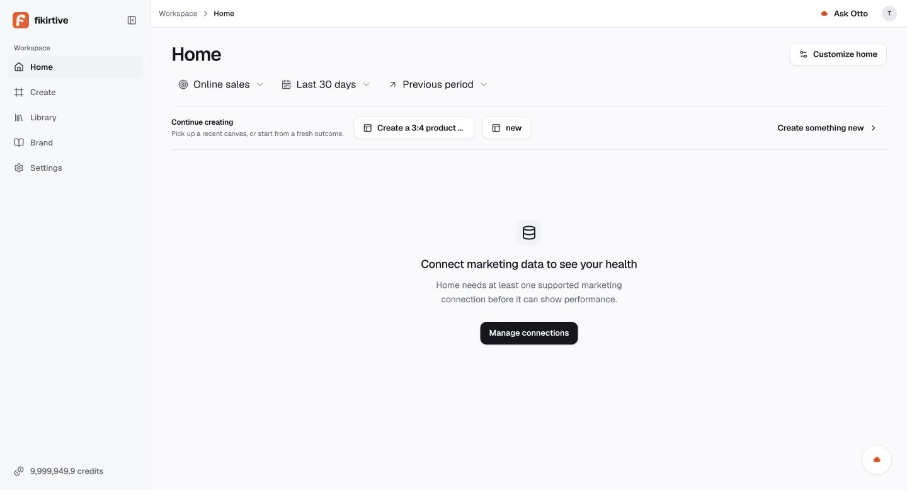

**Remarks:** no fake dashboard values are shown; the page clearly explains the missing source. This is correct. The remaining gap is whether the CTA can reach a supported beta connector.

### Figure 2 - Approved minimal Create entry

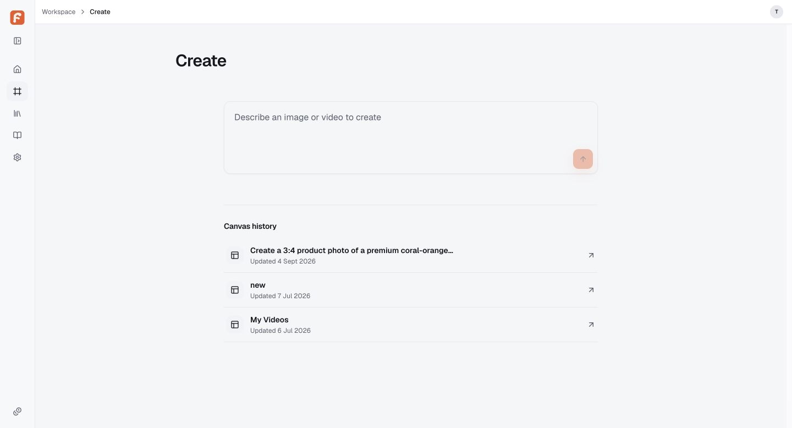

**Remarks:** the composition is correctly minimal: one Otto composer, then Canvas history. This is much closer to the approved Stitch-like entry than the earlier duplicate-home direction.

### Figure 3 - Paid image confirmation mismatch

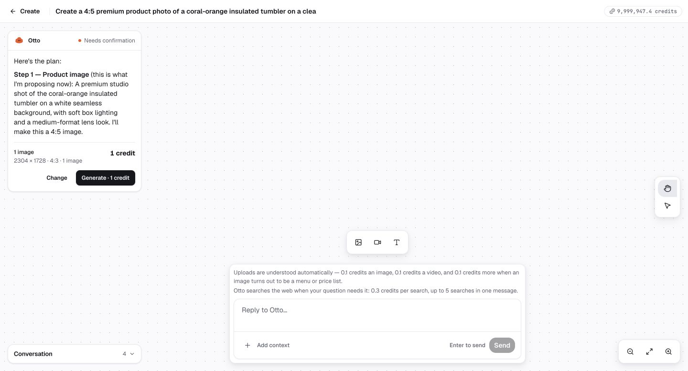

**Remarks:** the request and narrative say 4:5; the action card says 2304x1728 and 4:3. The card must not become payable until provider capability validation and all displayed values agree.

### Figure 4 - Generation survives refresh

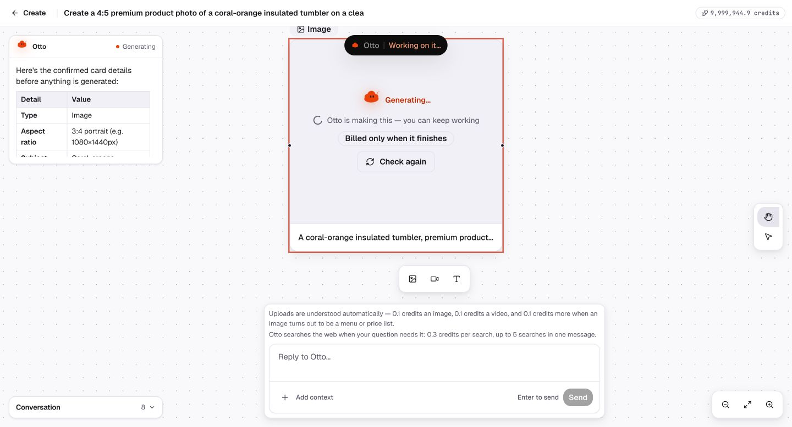

**Remarks:** status remains visible in the full-screen Canvas and the workspace is still usable. This is a strong recovery behavior.

### Figure 5 - Completed image and draggable node

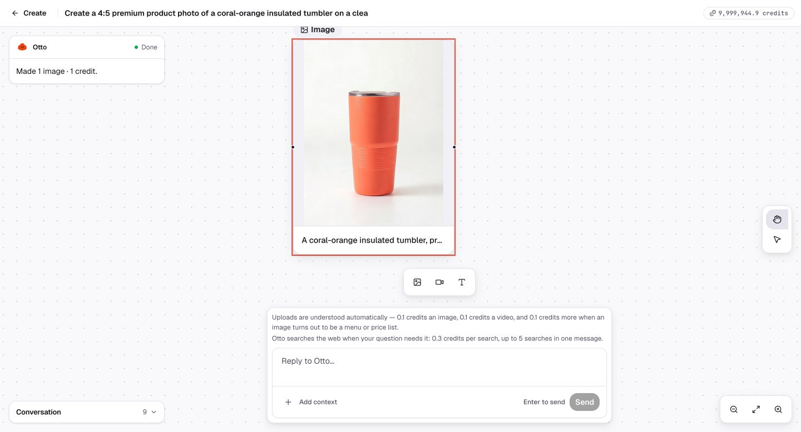

**Remarks:** the result completed once after refresh and became a movable node. Screenshots 06 and 07 separately prove movement and position persistence.

### Figure 6 - Missing `@` reference picker

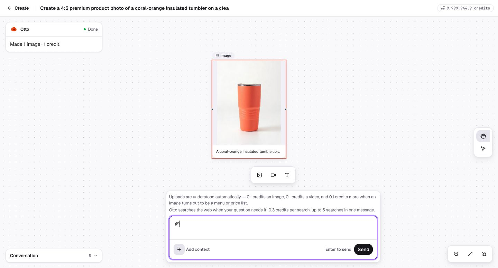

**Remarks:** `@` produces no menu. The only available context path is upload or the old media Library; the approved typed-reference architecture is not connected.

### Figure 7 - Production Library taxonomy drift

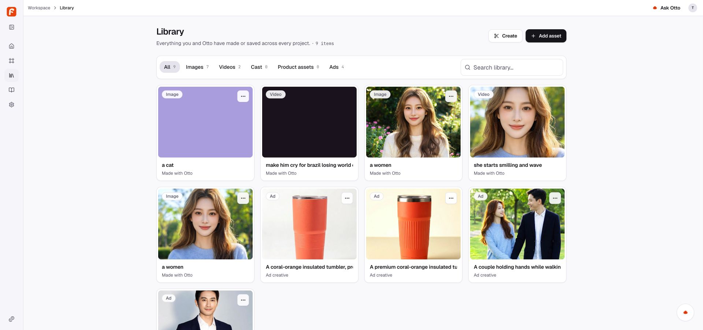

**Remarks:** All/Images/Videos/Cast/Product assets/Ads is a retired content filter, not the approved asset-management architecture. Raw prompt titles also make the grid hard to scan.

### Figure 8 - Asset detail lacks provenance

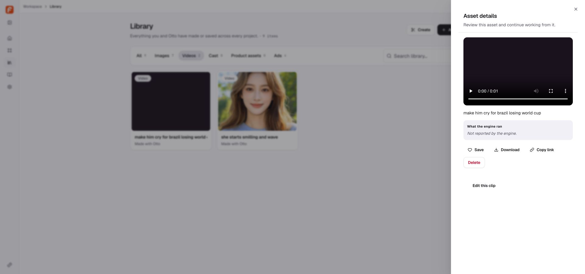

**Remarks:** the panel is action-heavy but does not answer the trust questions: origin Canvas, exact references, cost, usage, collection state and generation lineage.

### Figure 9 - Two references appear attached before the prompt

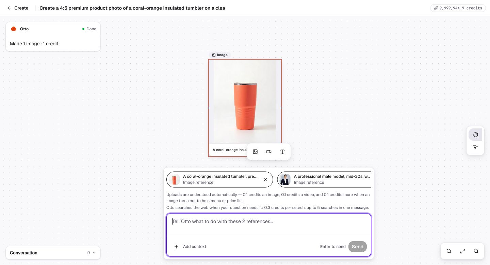

**Remarks:** the composer visually contains product and actor-like references. This makes the next screenshot's one-reference confirmation a concrete contract loss, not a user-selection mistake.

### Figure 10 - Paid video card drops one reference

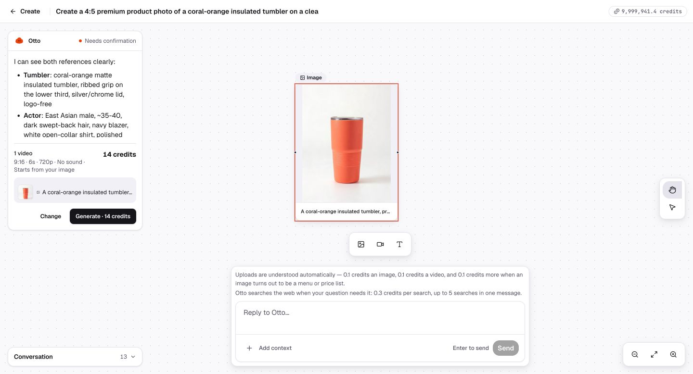

**Remarks:** Otto prose describes the actor, but the actionable reference list visibly shows only the product. Paid confirmation must show the exact provider payload.

### Figure 11 - Video started while Otto still asks which plan to use

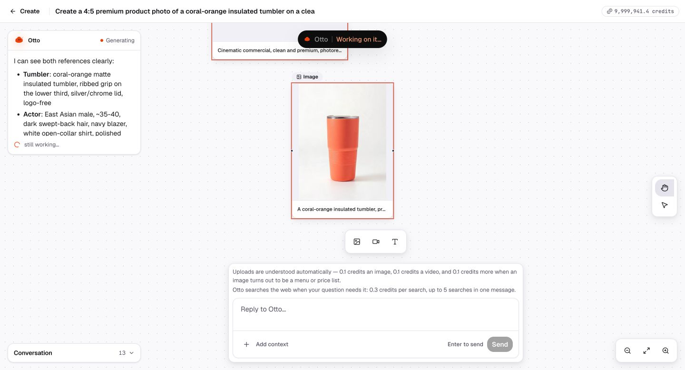

**Remarks:** the job is queued/running while the assistant still offers single-step versus safer two-step. This is the second P0 because it makes user consent temporally ambiguous.

### Figure 12 - Brand production drift

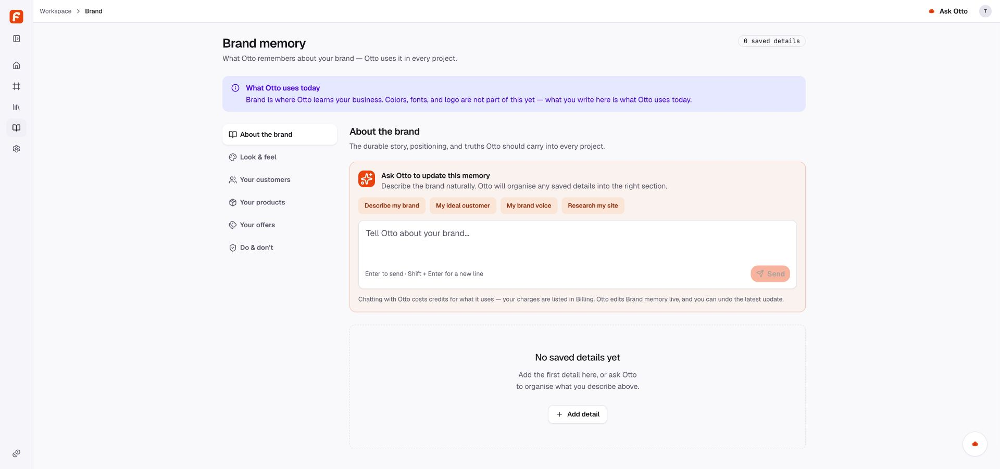

**Remarks:** this is the previous Brand memory implementation, not the approved Otto IQ information architecture or evidence-led review flow.

### Figure 13 - Billing and ledger truth

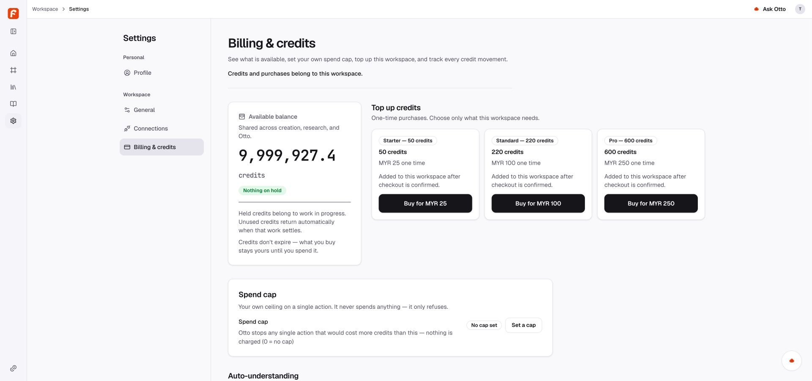

**Remarks:** exact balances, holds, top-ups, search pricing, spend caps and charge/refund history are unusually clear. This should remain the pricing source of truth.

### Figure 14 - Generated product/avatar-like video

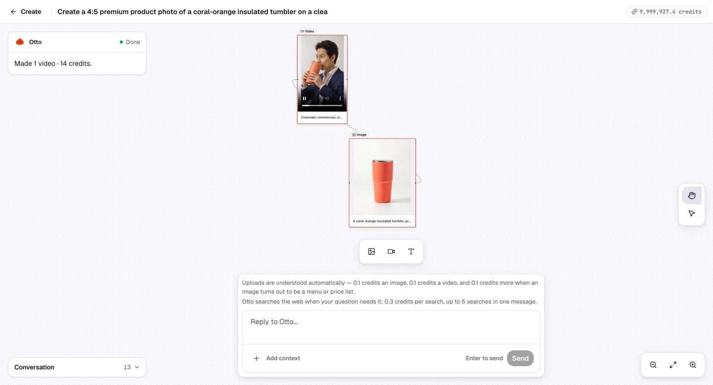

**Remarks:** the generation engine completed the requested 6-second 9:16 commercial. The subject, navy outfit and coral tumbler are visually present.

### Figure 15 - End frame continuity

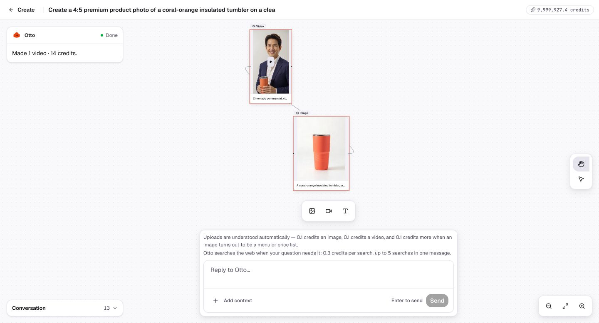

**Remarks:** the same-looking subject continues to hold the same coral tumbler and smiles at camera. No visible captions, logos or watermark were observed.

### Figure 16 - Conversation history loses the completed video turn

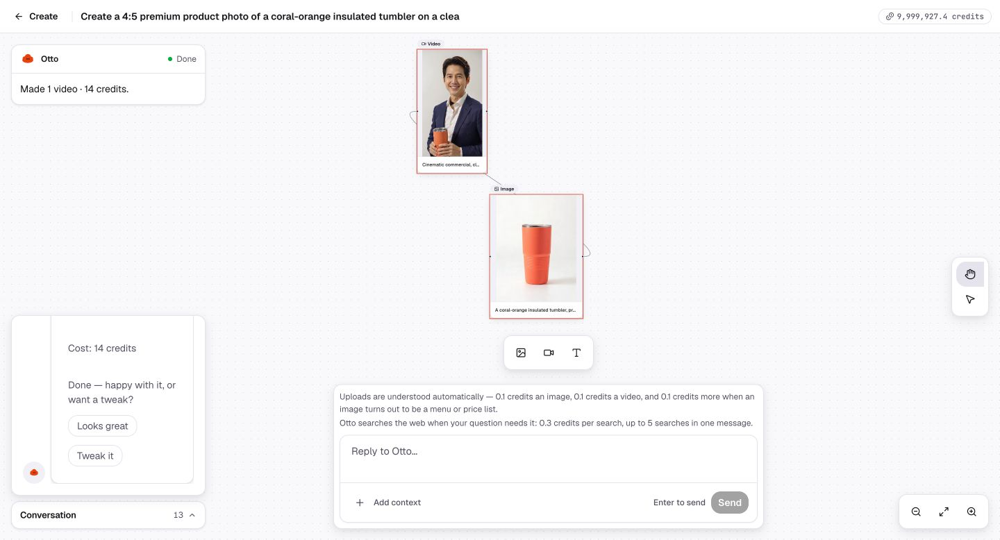

**Remarks:** the live Canvas contains the video node, but Conversation history ends at the image phase. The visual workspace and audit trail have diverged.

### Figure 17 - Login flow and broken mark

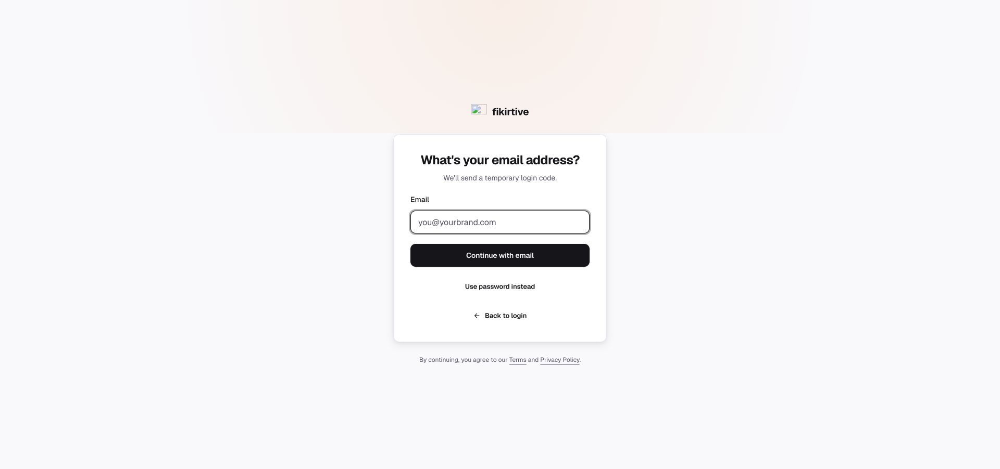

**Remarks:** the Linear-like centered flow is coherent, but the primary brand image is broken on the credential steps.

### Figure 18 - Invalid email feedback

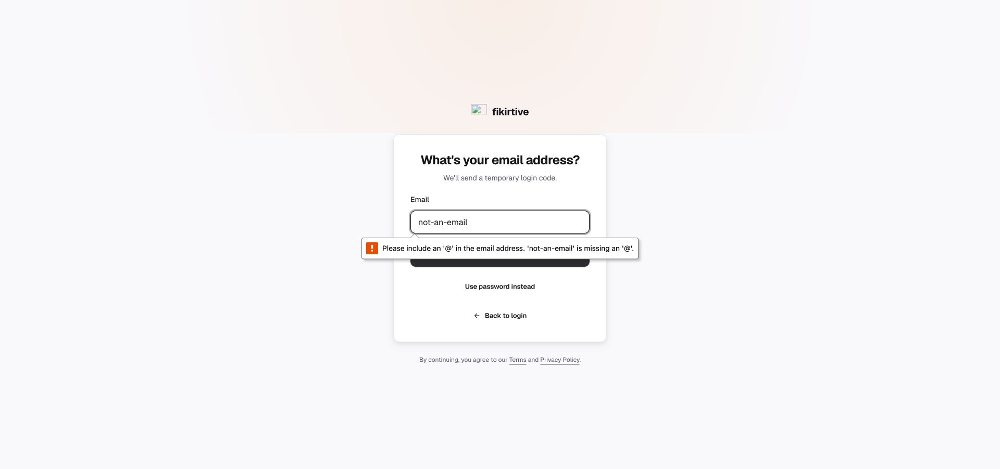

**Remarks:** input is blocked correctly. The native browser bubble and later application error duplicate the same message.

### Figure 19 - Successful protected-route return

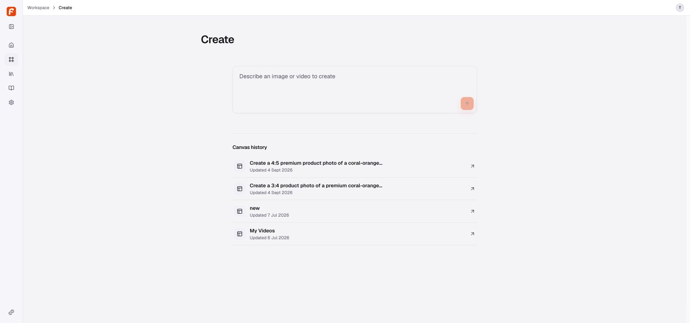

**Remarks:** after the one-time code, the user returns to `/create` and existing Canvas history remains available. The core auth recovery path passed.

---

## 9. Accessibility, keyboard, reliability and visual quality

### Accessibility tree

Positive evidence:

- Main navigation has an accessible “Global navigation” landmark and named links.
- Create composer, Canvas tools, zoom controls, Library filters, search, Settings navigation, account menu and Billing fields have accessible names.
- The Canvas video exposes a Play button and time slider.
- Login fields are labeled, and invalid email is programmatically announced.

Risks:

- Raw prompts become extremely long accessible names on Library cards.
- The official `@` reference flow is absent, so its keyboard/reader behavior cannot be verified.
- Asset action menus and destructive semantics need explicit labels tied to the selected resource.
- The broken auth image has no useful visible fallback beyond the adjacent wordmark.

### Keyboard

- Login can be completed by field and button controls with visible focus.
- Enter-to-send is accepted by the Founder and is not a defect.
- Full keyboard traversal of Canvas drag/positioning was not proven; pointer dragging passed.
- No native screen-reader session was run.

### Reliability and recovery

- Image and video jobs survived refresh.
- No duplicate generation charge appeared.
- Result assets landed in Library.
- Node position survived reload.
- Conversation history did not persist the full latest journey.
- Five primary authenticated tabs showed no console errors or warnings during inspection.

### Visual quality

- Create and Canvas are the strongest surfaces and broadly follow the approved minimal language.
- Library and Brand are internally coherent but belong to a retired product model.
- Auth layout is polished except for the broken mark.
- Billing has the clearest hierarchy and disclosure quality in the current build.

---

## 10. Recommended repair waves

### Wave 0 - paid truth and durable Creation state

**Goal:** make every paid Creation action unambiguous, recoverable and auditable.

Suggested scope:

- One server-validated immutable confirmation payload.
- No paid card for unsupported format.
- All reference IDs rendered from the actual job payload.
- All alternative-path questions resolved before approval.
- Explicit lifecycle states from clarification through settlement.
- Conversation event persistence for prompt, approval, job and result.
- Release identity surfaced.

**Exit gate:** close P0-001, P0-002, P1-004, P1-005 and P1-012; rerun image and product+avatar video on the same immutable build.

### Wave 1 - reference and asset architecture

**Goal:** make reusable Products, Characters, Official Avatars, Clothes and Locations first-class.

Suggested scope:

- Shared `@` / Add context picker.
- Frozen Library navigation and typed Elements.
- Read-only Official Avatars.
- Deep-linkable asset detail with provenance and collections/favorites.
- Concise titles plus full-prompt detail.

**Exit gate:** an official Avatar and a Product can be selected from Library, referenced in Canvas, verified in confirmation and traced back from the generated result.

### Wave 2 - Otto IQ / Brand convergence

**Goal:** connect the approved Brand frontend to the future Otto IQ engine without another redesign.

Suggested scope:

- Five approved sections and section-specific titles.
- Text/URL/File/connection sources.
- Extracted draft and evidence.
- Editable detail, Without/With preview, explicit Save.
- Product entity links to Library media.

**Exit gate:** create an Audience from a source, preview its effect, save it, then reference the saved Audience/Product from Otto without duplicating truth.

### Wave 3 - global context and beta polish

Suggested scope:

- Context-safe global Otto.
- Home supported-source setup path.
- Auth brand asset and single validation treatment.
- Destructive copy and Library action naming.
- Full keyboard/screen-reader and 200% zoom pass.

---

## 11. Engineer retest pack

The engineer should return one staging build identifier and evidence for these deterministic tests:

1. Request unsupported 4:5 -> no paid card -> choose 3:4 -> card and payload match.
2. Attach Product + Official Avatar -> confirmation shows two immutable references.
3. Choose single-step or two-step -> only then can Generate become available.
4. Double-click Generate and refresh -> one reservation, one provider job, one settlement.
5. Complete video -> hard refresh -> sign out/in -> reopen Canvas -> entire conversation and result persist.
6. Open Library result deep link -> origin Canvas, conversation, references, cost and usage all present.
7. Type `@` -> keyboard-search Products, Official Avatars, Locations and Clothes -> select/remove/reselect.
8. Attempt to edit/delete Official Avatar -> action unavailable; using it as reference still works.
9. Add audience from URL -> cancel draft -> saved state unchanged -> save after preview -> source evidence retained.
10. Open global Otto from Billing -> Billing/workspace context shown, unrelated Canvas not loaded.
11. Connect one supported marketing sandbox -> Home changes from empty to ready and exposes stale/error/recovery states.
12. Inspect `/build-info` -> exact web/worker/migration/artifact identity matches the release note.

---

## 12. Final recommendation

The frontend is **not fully complete**, but it is also **not a failed build**. The current staging has a credible Creation engine, durable paid jobs, a functioning Canvas and a trustworthy credit ledger. The correct strategy is convergence, not replacement.

Release should wait until the paid-confirmation state machine, typed references, durable conversation history, frozen Library IA and frozen Otto IQ/Brand IA are connected to production routes. Once those gates close, a focused retest can validate the full beta without repeating every non-affected surface.

The accompanying defect CSV is intended for direct import into the engineer's tracker, and the test-matrix CSV records every executed, blocked and excluded case.
