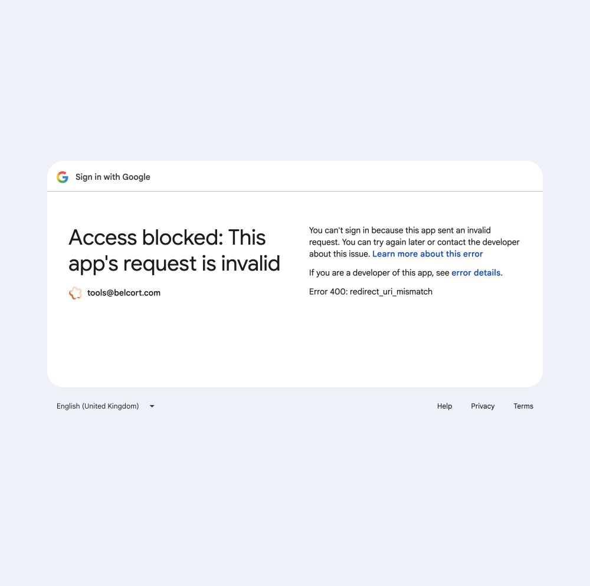
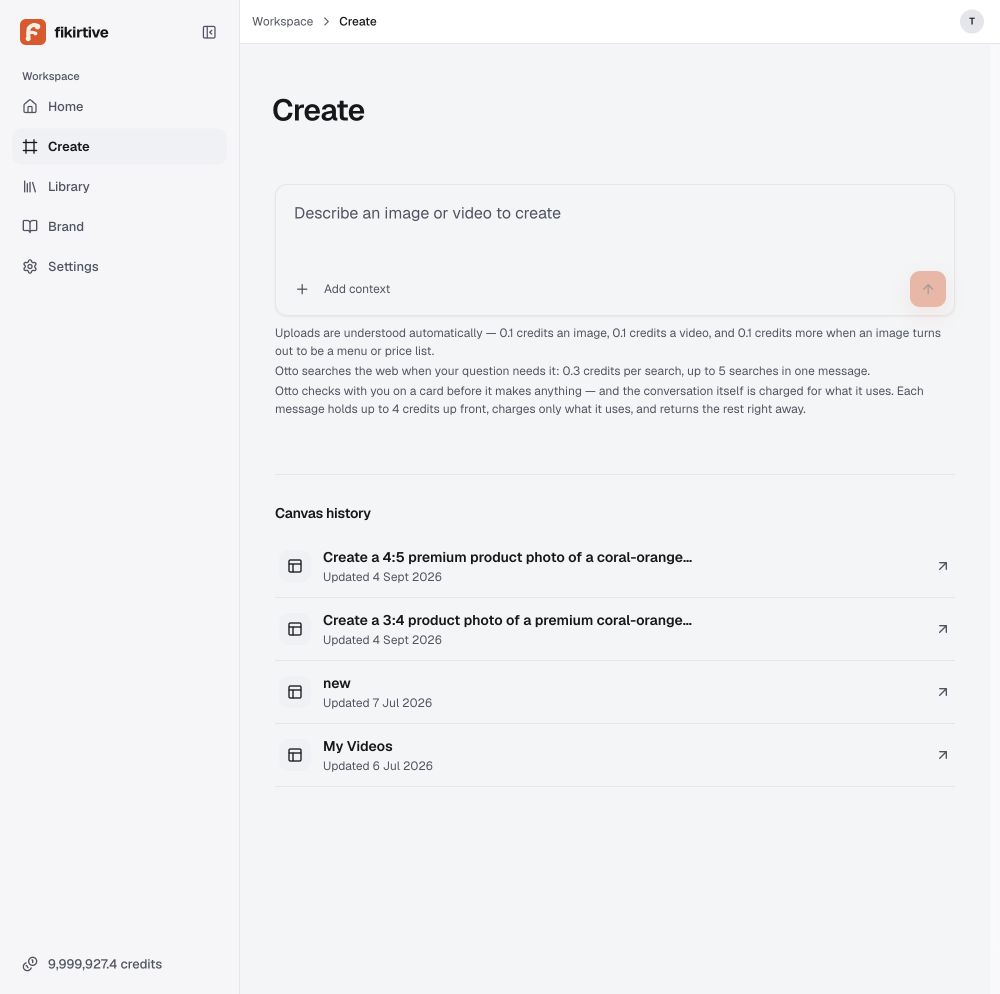

# Staging Full-stack E2E — 首次 Preflight 历史记录

日期：2026-09-08，约 05:01 UTC。以下是当时快照，**不是当前测试状态或完整 E2E 报告**。之后已按 Founder 裁决执行真实上传、生成、注册及其他验收；最新事实见 [执行记录](run-ledger.md)、[覆盖矩阵](coverage-matrix.md) 与 [后台回执](backend-evidence.md)。下文的零花费、未生成和阻塞措辞仅保留为历史，不应用于当前结论。

## Founder 后续裁决（消息标注 2026-09-07，本轮收到于 2026-09-08）

- 明确豁免本轮共享 artlio bucket 的上传与生成禁令；USD20 上限保留。独立 staging storage 待 Founder 建桶与钥匙后切换。此为本轮范围豁免，不证明隔离、不授权清理既有数据，也不改变长期安全规则。
- Founder 表示 web GENERATION_PROVIDER=mock 已删除，生成由 worker 真实供应商执行；继续现场核对，不按零成本测试。
- Google callback 由 Founder 配置中，完成前使用邮箱登录，之后再复测 Google。
- 三段费用说明是 Founder 2026-09-05 已决定的共同披露；UX-01 改记为已接受设计差异，不作为缺陷或擅自移除。
- Founder 指定测试版本仍为 0e1f2ab3，批准继续完整 E2E。下文保留首次 preflight 的历史观察，不再把 ENV-01 当作本轮上传／生成的未解决授权阻塞。

## 授权与实际执行

Founder 授权本轮生成预算 USD20。已通过真实邮箱验证码登录既有测试账号；未运行生成、上传、删除、购买、充值或修改产品代码／部署。当前由本轮发起的付费任务为 0，生成花费为 USD0。既有账户余额或旧任务不纳入本轮新增支出，也不能推定供应商成本为零。

## 版本

- 目标：https://web-staging-7901.up.railway.app
- Railway staging web 与 worker 均 SUCCESS，部署 commit：`0e1f2ab3f1b05fba6112ee9544d6de5930648f83`。
- web deployment：`a5e48c58-2201-4967-bf1d-7ddb97dc0827`。
- worker deployment：`fbc0e5fb-8359-40db-8b91-c703007a7bae`。
- `/api/ready`：ready=true、db=up、migrations=applied。
- `/api/health`：worker=up、workers.worker=up、backup=missing、build.sha=0e1f2ab3。
- 本地设计 checkout：`78b2160d19e735a1c41be1fcb9eb8a7699797b56`，不能当成部署代码。
- staging-live web 与 worker 当前 CRASHED，不能直接当替代测试环境。

## ENV-01 — 素材存储与 production 共享，阻断生成测试

只读 Railway 配置比较确认：staging 与 production web 的 R2 endpoint、bucket、access key、secret 相同；均 STORAGE_DRIVER=r2，bucket=artlio。仅比较一致性，没有输出密钥。staging web/worker 数据库目标相同，且与 production web 不同；分数据库不证明分 storage。

依据：[staging 安全手册](../../../docs/runbooks/staging.md) 要求 storage 未证明隔离时不得上传、生成或清理。因此停止这些写操作；USD20 预算不是修改生产素材边界的授权。

工程建议：先为测试环境建立独立且权限受限的素材存储，核对 web、worker 与回调使用同一测试目标。若设计采用其他隔离方式，应提供可验证的权限边界；不能只凭命名或代码约定称隔离。

复测条件：现场重新核对 storage 权限与目标、数据库、provider 和部署版本，再开始最小一条真实生成。

## ENV-02 — Provider 配置混合，不能称为 mock 零成本

staging web GENERATION_PROVIDER=mock；worker GENERATION_PROVIDER=byteplus；web COWORK_PROVIDER=fal，COWORK_PAID_PROVIDERS_ALLOWED=true。web Stripe=test，worker 未配置 Stripe key。

此配置证明环境不能仅凭 web 的 mock 标记认定零成本；尚未证明每条实际调用路径会选哪种 provider。建议工程师明确本轮真实测试的目标环境与权威路由，并提供逐任务成本记录。

本地 `packages/core/src/spend.ts:72–75` 的换算为 200 displayed credits 对应 USD20 计价，但不是供应商成本；需按部署代码核对，不能直接据本地旧代码消费全额。

## AUTH-01 — Google 登录不可用

步骤：打开 staging → Continue with Google。

实际：Google 返回 HTTP 400 页面 `redirect_uri_mismatch`。

备注：这是 Google 返回的配置错误，不是用户密码或验证码错误。请求中的 callback 为 `https://web-staging-7901.up.railway.app/api/better-auth/callback/google`。

预期：已配置的 Google 登录正常返回 staging 并建立会话。

工程建议：核对该 OAuth client 的 authorized redirect URI 与 staging 实际请求完全一致；不要通过关闭安全校验修复。由负责凭据的工程师修改，本轮只读。

替代路径：Continue with email → 请求验证码 → Founder 提供验证码 → 成功进入 Home。仅证明既有账号登录，不证明新用户注册、邮件送达 SLA、账号绑定或双租户隔离。

## UI 验收环境限制

当前 in-app 实际内容宽度 1000×994，Home 显示桌面引导。请求 viewport override 1440×900 后，DOM 仍测得 1000×994；因此属于测试控制限制，不能报成桌面产品故障。已 reset override。完整视觉验收需要实际达到批准的桌面尺寸后重测。

## 继续条件与未测试范围

## UX-01 — Create 输入框下仍有三段常驻费用／内部处理说明

登录后从 Home 点击 Create，实际可到达 composer 与四条既有 Canvas history。未提交 prompt。输入框下常驻图片／视频理解费用、web search 次数与费用、每条消息预留及返还解释。它与 2026-09-05 `content-disclosure.md` 的默认简洁方向存在待核对差异。

建议：先确认部署版收费合同及是否已有替代授权设计；再将必要披露放在相关决定点、非必要细节按需展开。不要直接删除仍承担收费前披露职责的文案。当前不把它判成未授权扣费，因为没有执行消息或核对该账户授权记录。

### 后续验收

需要工程师确认安全隔离的真实生成环境。之后继续 Creation 主流程、引用与修改、Library/Avatar、Brand、Home、Settings、费用、错误恢复、速度与两个自有测试租户隔离。当前这些均未标 Pass。

只读查询入口：Railway CLI 显式指定 project `b5d13d78-5d9b-4791-a6ae-7a7bc85f5d3d`、environment staging、service web/worker。未 link 本 worktree。日志可读，但未产生新 job，尚无可关联的新生成回执。

CodeGraph: not used — worker 在非持图 worktree 查询外部环境；本地只读取批准设计与安全规则。未修改、部署或推送。
