# Fikirtive Full-stack E2E Audit — Round 1 / 阶段报告

日期：2026-09-08

版本：`0e1f2ab3f1b05fba6112ee9544d6de5930648f83`

环境：Railway staging · web / worker 同版

**NO-GO · 核心旅程未闭合，不建议据本轮批准发布。**

本报告是覆盖全产品范围的阶段审计，不是“所有流程均已执行”的完成报告。部分基础生成、注册与账务样本通过；官方人物与商品视频、引用传递、失败恢复等关键环节仍阻塞。自动测试未运行，不能声称全量绿色、安全保证或产品已达到完美状态。

供 Founder、设计与工程团队共同分诊。报告不授权实施、部署、生产写入、充值、删除或扩大测试预算。

<!-- page -->
## 01. 执行结论与阅读导航

**建议：NO-GO。** 正常新用户可以注册并获得官方演员，但使用官方 Aisyah 与自己的商品合成首帧后，视频被供应商拒绝。用户已选的商品引用还会在报价材料中丢失；重试与修改入口不能稳定恢复完整意图。这直接影响 Creation 的可收费闭环。

已成立的有限样本：商品图真实生成；无人物视频实际播放；新用户验证、25 credits 与五位演员播种；一次快速双击只有一个任务；失败全额退款一次；新字节上传理解完成。退款正确并不等于创作成功。

### 优先修复的连续链

准确引用 -> 可核对报价 -> 官方演员可用输入 -> 视频结果 -> 终态同步 -> 带原材料重试。FSE-001 至 FSE-007 为本轮 P1 分诊建议；具体范围仍由 Founder 决定。

### 报告导航

- 第 3-5 页：方法、覆盖与问题索引。
- 第 6-18 页：带编号批注的截图证据与修复复测要求。
- 第 19-20 页：产品来源、辅助流程、费用口径。
- 第 21-23 页：花费上限补验、尚未关闭的发布关卡与证据索引。

严重度是工程分诊意见。P1 指受影响核心流程或付款确认可信度阻塞；P2 指可靠性、展示和辅助流程问题。未发现证据不能写成不存在风险。

<!-- page -->
## 02. 方法、版本与证据限度

目标为 `https://web-staging-7901.up.railway.app`。web 与 worker 对应完整版本 `0e1f2ab3f1b05fba6112ee9544d6de5930648f83`；本地设计工作树不能当作部署代码。源码定位使用该版本的 git show。06:38:35 UTC 终检两服务同版 SUCCESS、ready=true、worker=up；这是健康快照，不是全后台验收。

### 四种证据分开使用

- UI：实际浏览器操作、截图及播放观察；截图本身不能证明持久化、扣费或下载成功。
- DB / LOG：只读数据库、任务和供应商日志；未输出凭据或带签名媒体链接。
- SOURCE：对应部署版本的源码与冻结设计比较；根因假说与直接事实分别标记。
- CHECK：隔离测试预检。依赖指向旧工作树 dist，lockfile 不一致，因此没有运行测试，也没有自动通过数。

两个自有测试账号包括既有 founder 与新商家。新商家打开 founder Canvas 深链未见原资产，但系统回退到自己的新 Canvas；这是单一路径样本，不是完整双租户攻防测试。

Create / Canvas 的三段费用披露按 Founder 最新裁决视为已接受设计差异，不列缺陷，也不建议直接移除。

### 环境约束

staging 与 production 数据库不同，但素材存储共享。Founder 明确豁免本轮上传与生成，预算 USD20；不授权清理。健康检查显示 backup=missing，未做恢复演练。staging-live 服务 CRASHED，未作为替代环境使用。

Chrome 实际出现过 1920×958 / 1920×902；随后控制连接中断。截图 20-27 与 31 为 1000px 宽，29/30 为 1280×720。31 文件名虽含 desktop，实际 1000×994，不能当完整桌面对照。

<!-- page -->
## 03. 编号流程与覆盖结果

PASS 只表示已执行样本通过；PARTIAL 为步骤部分成立；FAIL 为已观察失败；BLOCKED / NOT RUN 均不是通过。不按按钮数量计算覆盖率。

| 流程 | 本轮结论 | 关键边界 |
| --- | --- | --- |
| FL-01 注册、验证、初始化 | PASS / PARTIAL | 单次新用户成功；密码重登、找回、会话过期未闭合。 |
| FL-02 商品图与无人物视频 | PASS | 图完成、视频约 5.04s 实际播放；仅本配置。 |
| FL-03 官方人物 + 商品 -> 视频 | FAIL | 合成首帧成功；后续视频被拒并退款。 |
| FL-04 编辑、variation、重试 | PARTIAL / FAIL | 编辑出图但比例解释错；variation 无产物；retry 丢 refs。 |
| FL-05 Canvas、历史、规划 | PARTIAL / FAIL | 拖动、便签、刷新保存成立；实时终态、节点显示不同步。 |
| FL-06 Library、上传、理解、导出 | PARTIAL / FAIL | 查询整理部分通过、理解完成；详情与成本有缺口；下载仅启动。 |
| FL-07 Brand、Home、Settings | PARTIAL | Audience Ready、显示名保存；Product 复用断链、邮箱空白、余额陈旧。 |
| FL-08 钱路与租户边界 | PARTIAL | 单次预扣/结算/退款及 Library cap 拒绝通过；完整并发、多入口与越权矩阵未运行。 |

Google 在 preflight 实际返回 redirect_uri_mismatch；Founder 配置后尚未复验，因此是未关闭的认证关卡。

纯规划回复完成约 67.5 秒是总完成时长，不是首字延迟；后续 trace 的 toolCalls 为空，已核对没有搜索。另一轮仅研究请求有错误比例推理；不能把有限语言样本写成多语言质量认证。

<!-- page -->
## 04. 问题目录与工程分诊

沿用 findings-catalog.md 的编号与严重度；详细复现、预期、实际、建议及复测分布在后续证据页。这里不是已批准的实施清单。

| 编号 | 级别 | 问题 |
| --- | --- | --- |
| FSE-001 | P1 | 官方演员合成后视频被拒，恢复建议失效。 |
| FSE-002 | P1 | 消息双引用保存，但确认卡丢商品图。 |
| FSE-003 | P1 | Send to Otto 只转交草稿，没有发送。 |
| FSE-004 | P1 | Edit and retry 仅恢复文字，遗漏引用。 |
| FSE-005 | P1 | 节点终态、Current turn 与 Conversation 不同步。 |
| FSE-006 | P1 | square-only 解释与 3:4 付款卡/产物冲突。 |
| FSE-007 | P1 | Brand Product 与 Library / @Products 断链。 |
| FSE-008 | P2 | 既有 founder 路径未播种官方演员。 |
| FSE-009 | P2 | 上传详情遗漏另收的自动理解费。 |
| FSE-010 | P2 | 跨标签页全局余额陈旧。 |
| FSE-011 | P2 | Profile 只读邮箱字段空白。 |
| FSE-012 | P2 | 重报价期间新数量与旧付款按钮并存。 |
| FSE-013 | P2 | 官方来源不可达后仍给确定规格，研究状态不符任务。 |
| DESIGN-001 | 待裁定 | Library 编辑职责存在已批准规格冲突。 |
| DESIGN-002 | P2 | 官方演员详情缺复用、收藏与完整预览。 |

另外记录：Google 回调未关闭；variation 真实交付失败；Conversation 为 Founder 新设计反馈。它们不擅自扩大为新已批准功能。

<!-- page -->
## 05. PASS 样本：商品图变成可播放视频

FL-02 · Screenshot 11 · Chrome 1920×958 · 本页显示原图局部放大。

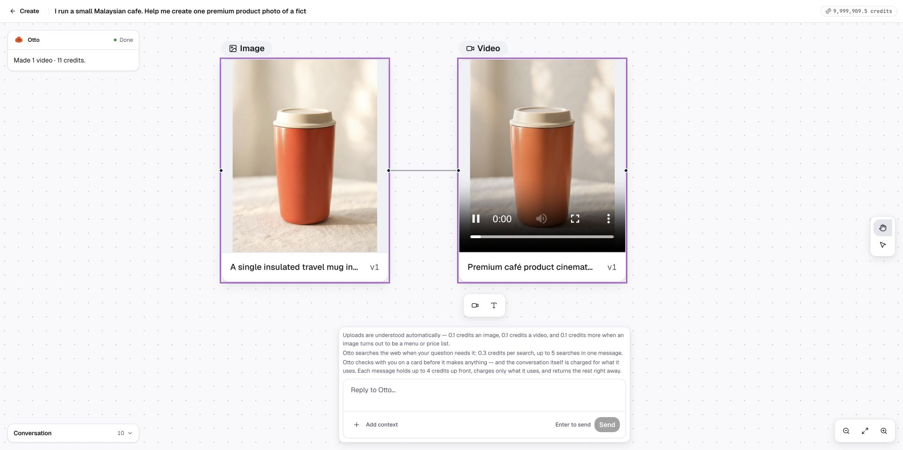

### 1 / 已执行结果

从本轮真实生成的商品图出发，请求 5 秒、720p、3:4、无人物、无声音的轻推镜头视频；报价 11 credits，确认后完成并实际播放约 5.04 秒。

### 2 / 后台关联

job `01M1ZQDMXJ0K7H9BXJ41F2ZE39` 为 DONE；sourceGenerationId 对应原图，约 100.44 秒完成，单次 reserve / settle。不能把播放器截图单独当作这些账务事实。

边界：只证明这一条无人物视频路径。官方人物、音频、其他长度/比例组合及最终下载文件未因此通过。复测应保留该成功基线，避免修人物路径时回归。

来源：run-ledger.md / CRE-02；backend-evidence.md / 本轮关联对象、费用与一次结算。

<!-- page -->
## 06. P1 / 双引用在确认材料中丢失

FSE-002 · Screenshot 23 · 1000×994 · 原图局部放大。

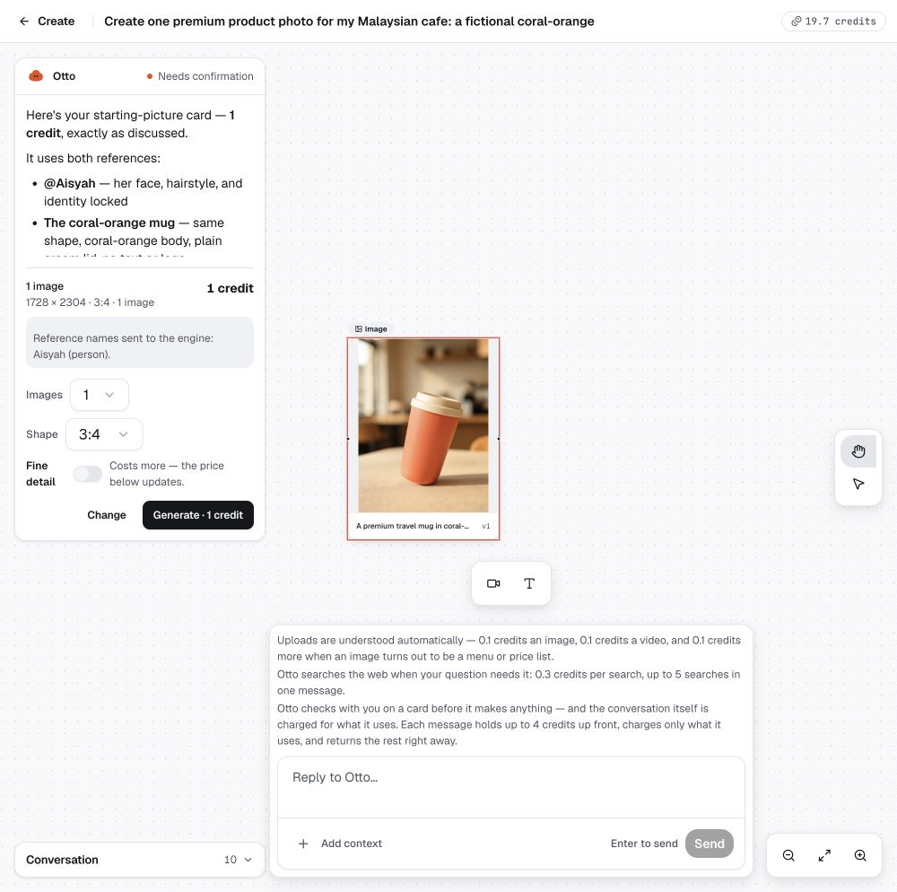

### 1 / 复现与实际

使用 @ 选择 Aisyah 和新商品图，再要求报价。文字称使用两者，但卡片只列 Aisyah。数据库用户消息保存两个 typed refs，确认卡却没有商品 sourceGenerationId；本轮没有批准这张错误卡。

### 2 / 预期、建议与复测

付款卡与任务应消费同一份按类型解析的材料；无法解析要明确指出，不能静默丢弃。复测 @ 双引用、跨轮“显示卡片”、错误类型 ID、删除/跨租户对象；无完整材料不得出现可付款卡。

USER `01M1ZSCD0KB45H3NC0GJD084B2`；缺图卡 `01M1ZSEKJ51KASJHDB9534D65Q`。具体 tool 参数丢失过程未完整观测，持久化差异已确认。

<!-- page -->
## 07. 绕行恢复不是原流程已修好

FSE-002 · Screenshot 24 · 1000×994 · 原图局部放大。

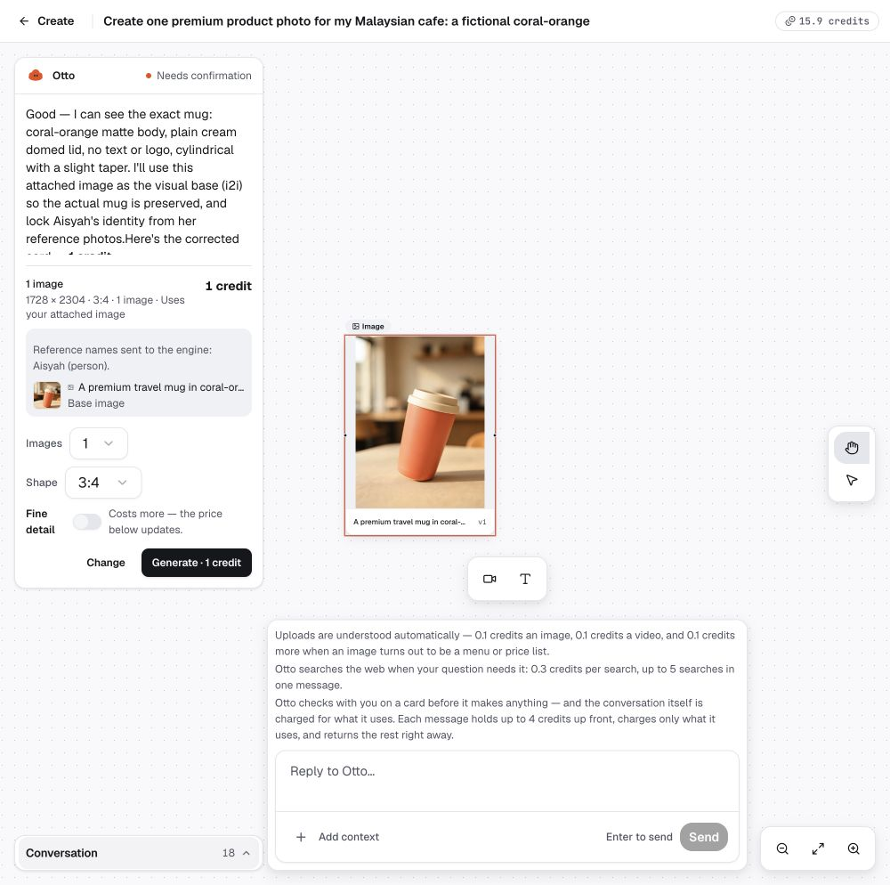

### 1 / 可对照的恢复样本

主输入框要求修正仍曾失败，Otto 把旧 GEN_CARD 消息 ID 当作商品 ID。改用 Choose from Library 显式附加真实商品图，才恢复 actor + product 双绑定。截图可见人物名与 Base image。

### 2 / 必须统一两条入口

恢复卡 `01M1ZSPV4ST83PC7M174YBWHZV` 同时保存正确 sourceGenerationId 与 Aisyah entityIds。@ 引用和 Library 附件应产生等价材料，不应要求用户猜哪种入口能把图真正交给引擎。

建议从 typed refs 构造确认与执行输入，禁止卡片 ID 混作 Generation / Entity；用来源类型验证替代无声过滤。此页是正反对照证据，不是修复提交或再验收记录。

<!-- page -->
## 08. 官方人物合成首帧成功

FL-03 中间步骤 · Screenshot 25 · 1000px 宽 · 非完整桌面验收。

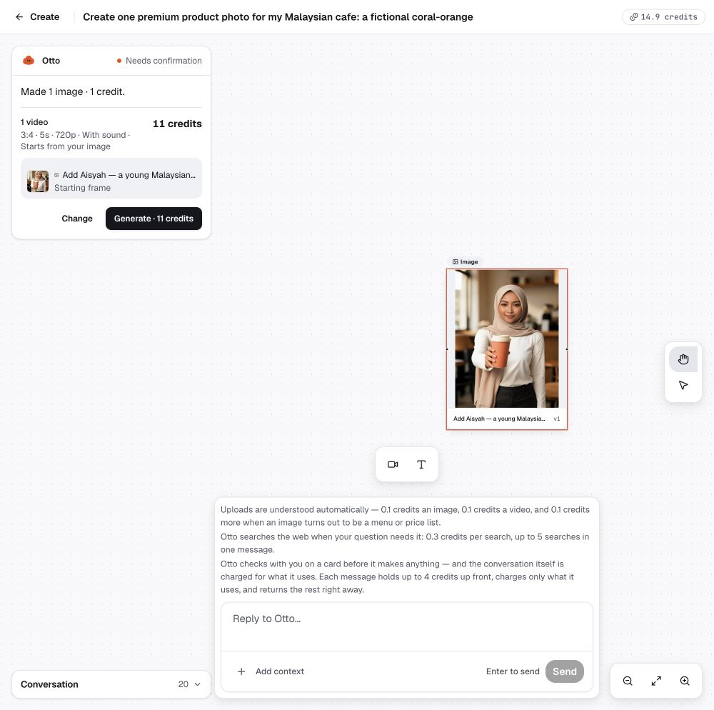

### 1 / 中间产物成立

修正材料后，Aisyah 持橙色杯子的合成图完成。job `01M1ZSRWZBJ5Q6RV95WV6ZZSYB` 为 DONE；原商品 Generation 与官方 actor 均在任务材料中；1 credit，单次 reserve / settle。

### 2 / 不能提前判整条旅程通过

系统随后提出 5s / 3:4 / 720p / 11 credits 视频卡。静态首帧成功不证明后续供应商接受该人物，也不证明多个场景下身份与商品连续性。

原商品曾暂时不在当前可见节点列表，数据库始终保留；刷新后恢复。该问题归 FSE-005 显示同步，不写成数据删除。

<!-- page -->
## 09. P1 / 官方人物视频核心路径仍阻塞

FSE-001 · Screenshot 26 · 1000×994 · 原图局部放大。

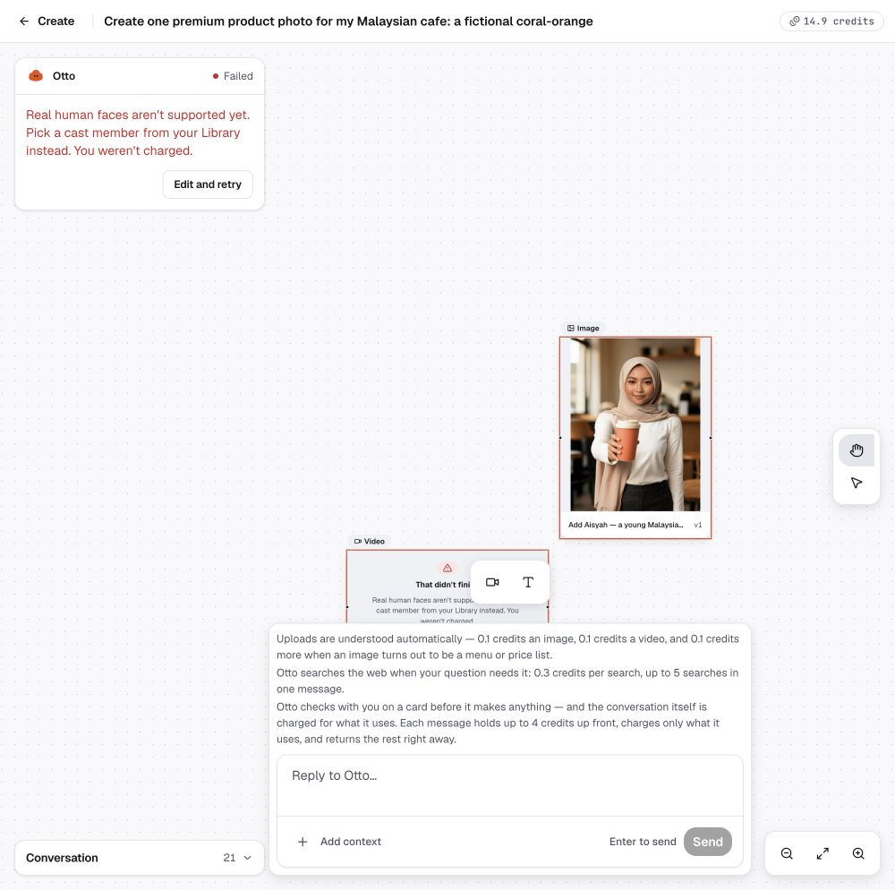

### 1 / 复现、预期与实际

批准上一页的视频后失败。用户已经选官方演员，提示却要求“Pick a cast member from your Library”。供应商实际 HTTP400，代码 InputImageSensitiveContentDetected.PrivacyInformation；恢复建议无法帮助当前用户。

### 2 / 资金正确，旅程失败

job `01M1ZSVK3CMWZ4754BY4J647MP` FAILED；11 credits 全额退款、无 hold。拒绝来源确认，为什么供应商不接受合成图尚未定位；不能只凭 entityIds 为空就断定根因。

建议核验正式支持的官方原件、合成图与视频输入边界，按真实来源给恢复选项。不得绕过供应商限制或无限自动重试。复测完整人物 + 商品视频、真实输入一致性及失败单次退款后，才能关闭本项。

<!-- page -->
## 10. P1 / 失败节点与 Done 状态同时出现

FSE-005；variation 交付失败 · Screenshot 19 · Chrome 1920×902 · 原图局部放大。

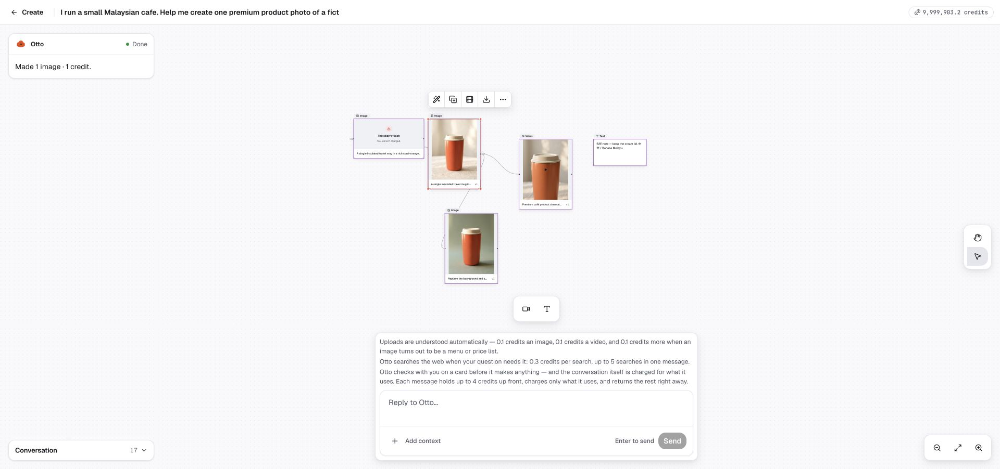

### 1 / 真实失败和账务样本

快速双击 1 credit variation 确认，只生成一个 job `01M1ZRF0D1JWSCZGHN8EX6YCNJ`。供应商返回 0/1 usable images，产物为空；恰好一条 RESERVE 与一条 REFUND，无 SETTLE，hold 清零。单一样本幂等与退款通过，variation 交付仍失败。

### 2 / 用户看到互相矛盾的状态

失败节点已出现，左上仍显示上一轮 Made 1 image / Done，Conversation 为 17；手动刷新后变 Failed / 19。应让节点、对话、余额由同一终态触发重读，而不是依赖入口局部状态。

轮询依赖是源码支持的假说，未用埋点完全定位。复测直接 variation / Otto 确认两入口，成功、失败、退款和断网恢复均无需整页刷新才一致。

<!-- page -->
## 11. P1 / 修改与重试未承接完整意图

### FSE-003 / Send to Otto 没有发送

复现：确认卡 Change -> 输入修改 -> Send to Otto。实际没有新的 USER 消息或回复；最后 USER 仍为 05:56:23.340 UTC。预期要么发送，要么明确称为“填入草稿”，不能让按钮说 Send 而只转交文字。

对应版本调用链：CardOptionControls.tsx:359 -> OttoTurnCard.tsx:321-323 -> OttoChatStream.tsx:1146 -> seedComposer:952-961。末端只设置 text，不调用 submit；未把额外表单空白现象猜成已定位根因。

建议复用同一提交动作并带原卡/引用。复测单击写入一个修改事件、刷新保留、无效输入可恢复；快速重复操作不重复提交或收费。

### FSE-004 / Edit and retry 丢失原材料

复现：带商品图的 variation 失败 -> 刷新 -> Edit and retry。实际仅恢复扩写长文本，没有引用 chip；测试没有继续付费。预期恢复可编辑意图、原图/人物、源任务标识，保持原话与扩写稿区别。

OttoChatStream.tsx:990 只取 latestUserText，:952-961 只 set text，源码与观察相符。建议将重试草稿作为文字 + typed refs + 原任务的完整状态；不可用对象需明确重新选择。

复测失败 -> 刷新 -> 重试，仍见同一材料；取消不收费，新确认建立新的明确授权，旧失败账本不再结算。完整源码目录与证据见 findings-catalog.md / FSE-003、004。

<!-- page -->
## 12. P1 / 付款前的能力解释相互矛盾

FSE-006 · Screenshot 16 · Chrome 1920px 宽 · 原图局部放大。

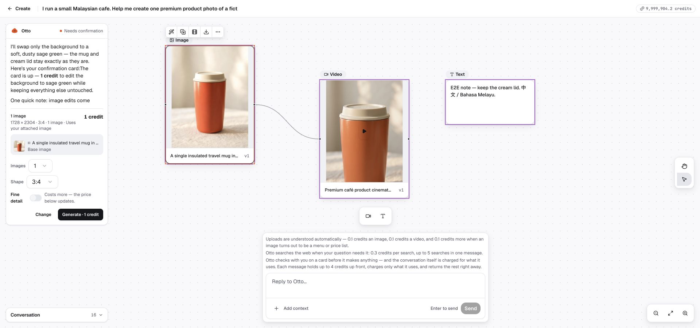

### 1 / 复现与证据

请求只把背景改为 sage green，保留商品与 3:4。Otto 称编辑只能 square / 1:1；卡片却为 1728×2304、3:4，job 参数及实际浏览器产物也为 3:4。完整 square-only 观察见执行记录，截图内说明被裁切。原稿保留，新稿成功不能抵消错误解释。

### 2 / 建议与复测

可售能力与限制从服务端权威提供给 Otto，不由自然语言再次发明。复测同源 3:4 / 1:1 编辑和不支持比例，确保文案、卡片、已确认 payload 与产物一致。

job `01M1ZR6AG91BZ5DGGTEPPFWP3F`；gen.ts:1490 传 aspectRatio，byteplus.ts:271,295,382 根据型号/比例发 size。adapter 未发现一律方形限制；错误知识来源未定位。

<!-- page -->
## 13. P2 / 素材详情漏掉理解费用

FSE-009 · Screenshot 29 · 1280×720 · 原图局部放大。

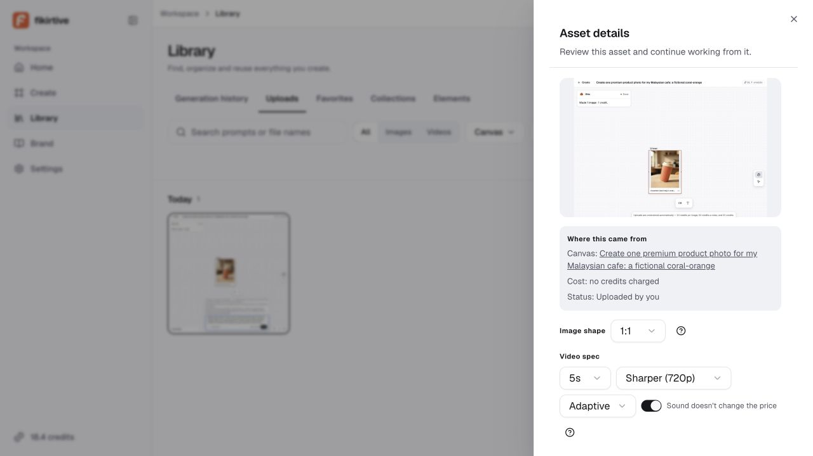

### 1 / 一项资产，两种费用语义

新字节截图上传后，详情写 Cost: no credits charged；实际自动理解 DONE，Billing 有 -0.1 credit，后台 reserve / settle 各一次。不是重复收费，问题是“上传本身免费”被读成“这项素材没有任何花费”。

### 2 / 建议与复测

明确 Upload cost 与 Understanding cost，或统一展示关联任务总额，所有金额读同一账本。素材 `01M1ZTC1RF2ZJ603HXAN02WQGJ`；理解 `01M1ZTDQ133ZYN713PWQ208CG0`，price snapshot=1 internal。

复测新上传、已理解重传、GENERATED 重复上传、理解失败退款。先前同字节生成图被来源过滤跳过，不能称缓存命中；本次输入描述为 PNG，实际存储 JPEG 1000×994，保持事实区分。

<!-- page -->
## 14. P2 / 同一账单页出现两种余额

FSE-010 · Screenshot 30 · 1280×720 · 原图全幅。

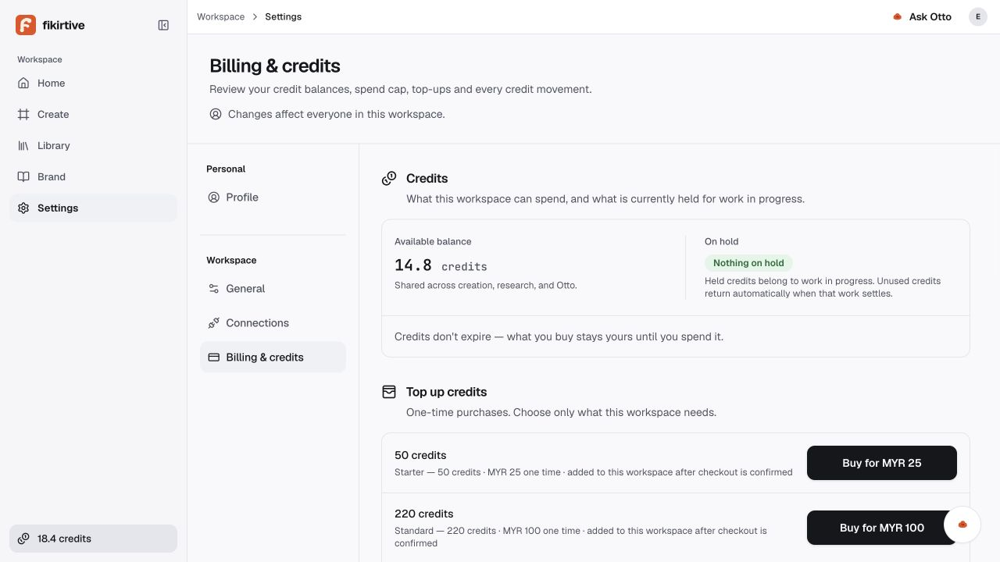

### 1 / 复现与实际

一个标签页发生消费后，另一个标签页打开 Billing。侧栏为 18.4 credits，正文为 14.8 credits；当时后台也是 14.8、hold=0。账本未丢钱，陈旧的是全局显示。

### 2 / 建议与复测

同一账户查询来源统一；消费、退款、异步理解结算后使相关余额失效，重新聚焦或跨标签页通知后读取权威状态。具体缓存缺口尚未定位。

两标签页分别执行消费和退款，前台数字应收敛；断网不能把旧余额默认为可花预算。本页是截图时点，不是报告出具时最新余额。

<!-- page -->
## 15. Library 详情：展示偏离与规格冲突分开

DESIGN-001 · Screenshot 12 · Chrome 1920px 宽 · 原图局部放大。

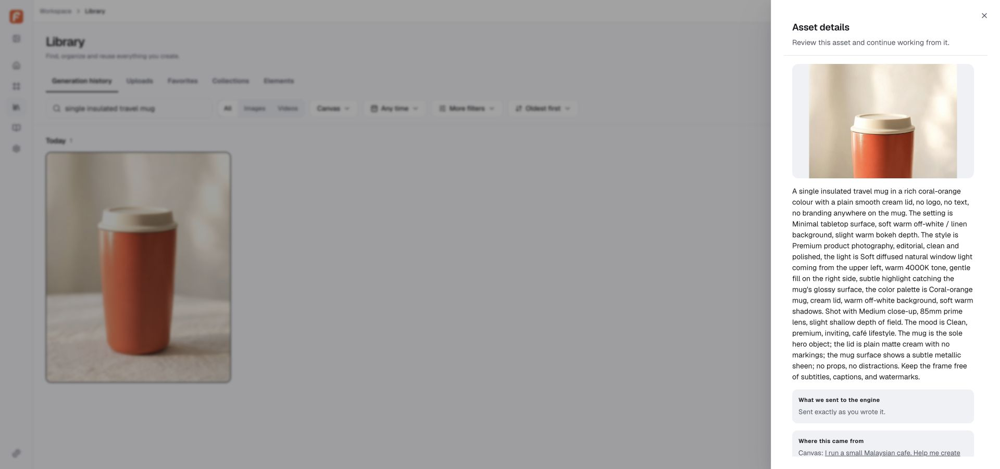

### 1 / 可以明确核对的偏离

批准顺序是大预览 -> Use in Canvas -> 次要动作 -> provenance -> 折叠的长 context。实际旧 DetailPanel 在动作前展开长 prompt / engine receipt，缺主要 Use in Canvas。Library README:71-79 对照 DetailPanel.tsx:890-950、1019。

### 2 / 不能静默删掉的已批准冲突

Library README:98,110 要求编辑进入 Canvas；冻结 creation-engine.md:65,76 又包含资产详情 Generate edit / Regenerate。先由 Founder 对齐动作归属，再复用业务动作和 typed handoff；不能把所有编辑按钮直接判成未批准。

复测大预览、复用、长文折叠、Library -> Canvas -> 返回上下文。用户原话、Otto 扩写稿和实际发送文本必须分清；现有字符串相等判定存在误称 verbatim 的风险，具体写入根因未完全定位。

<!-- page -->
## 16. P2 / 官方人物存在，但复用路径不完整

FSE-008 / DESIGN-002 · Screenshot 20 · 1000px 宽 · 非完整桌面验收。

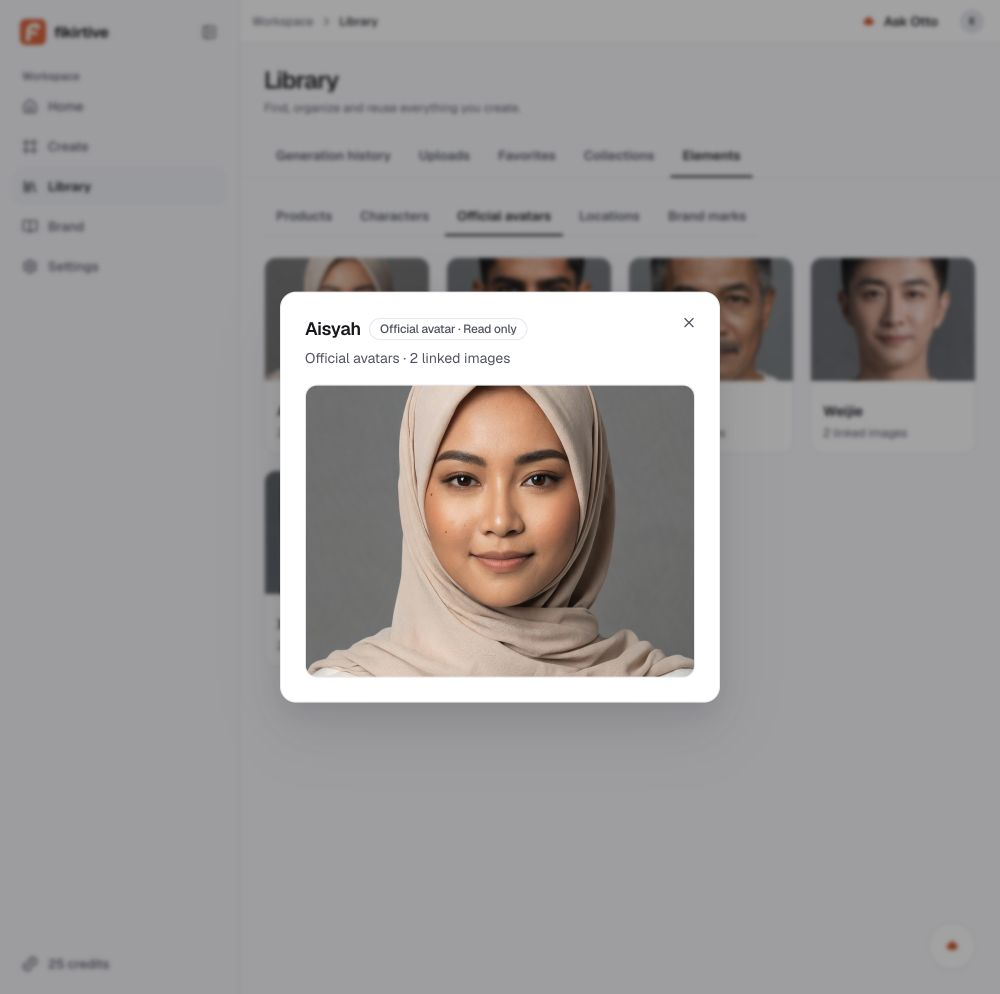

### 1 / 两个账号的结果不能混为一谈

新用户有五位官方人物，每位两张参考图；Aisyah 详情却只有首图与计数，缺 Use in Canvas / Favorite、route-backed detail 和完整预览。founder 则完全无演员，auth-guard.ts:79 等分支绕过播种。

### 2 / 修复与复测边界

补齐存量 founder 的幂等初始化；按真实 catalog 扩展 reader 与已批准入口，刷新后收藏保留、只读身份、Back/深链正确。五位生产演员不因 fixture 六位而违规，未批准固定 voice 播放器。

actor 具体 fixture 仍有最终视觉接受边界；不得复制假许可、样片或未经验证 wardrobe。LibraryView.tsx:396-543、library-elements.ts:22-65 与设计对照提供准确缺口。

<!-- page -->
## 17. Founder 新反馈：Conversation 需要优化

设计反馈，非已批准新方案 · Screenshot 31 · 实际 1000×994。

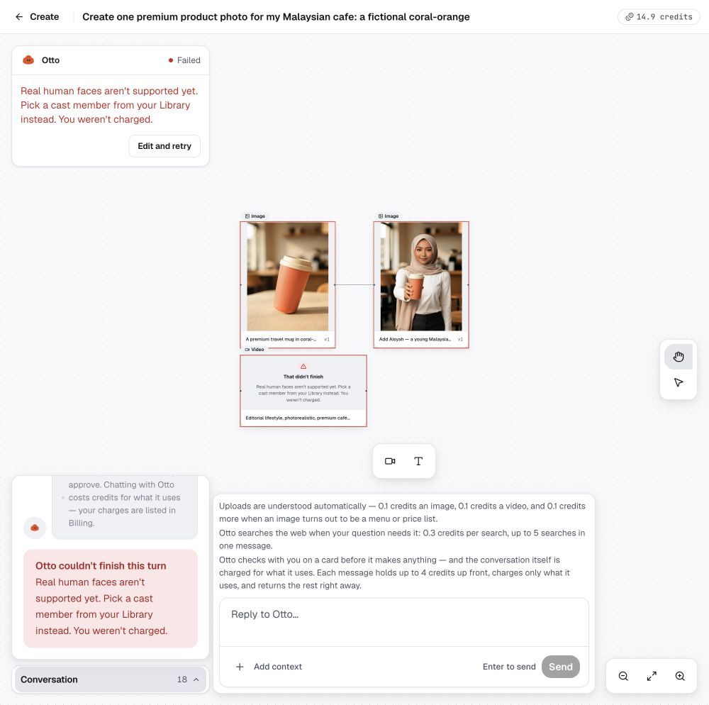

### 1 / 已记录的用户判断

Founder：“这个左下的 conversation history 也是很糟糕，我要优化设计。” 左下气泡压缩长文字，局部截图还有跳底按钮遮挡内容的观察。旧设计获批不能用来忽略本次反馈。

### 2 / 下一步先决策再设计

建议讨论展开后的阅读宽度、时间线层级、避免重复状态与多重滚动；具体尺寸、可调宽度和新布局尚未批准，本轮不实施。需覆盖长中英文本、表格、卡片、引用、失败重试和阅读位置保留。

本页不能作为 1920px 桌面质量结论。截图文件名含 desktop 是命名失准；本报告使用实际视口。详细 Founder 原话及边界见 founder-design-feedback.md。

<!-- page -->
## 18. 产品来源、报价窗口与辅助流程

### FSE-007 / P1 / Brand 产品无法复用

复现：Brand 建 E2E Coral travel mug，RM49，关联商品图并保存，再查 Library Products / @E2E。实际 Ready BrandRecord 存在，Entity PRODUCT 为 0；reference-search.ts:54 只读 Entity。预期是同一产品身份与媒体能复用，非靠用户换关键词。

建议先定 canonical 产品身份及 BrandRecord / Entity 关系，不建立可分叉副本；涉及 schema 另走批准。复测保存 -> Library -> @ -> 卡片 -> 结果谱系及跨租户拒绝。Knowledge base 的 Open the record editor 链接存在，不能报编辑器不可达。

### FSE-012 / P2 / 重报价等待窗口

数量 1 -> 2 时，选择先变 2，旧 1 credit 按钮仍短暂可点击；最终金额正确。没有在混合状态付款，不能称已错扣。CardOptionControls 子 pending 与 OttoTurnCard 父 busy 分离有源码依据。同步 pending 与确认禁用，并服务器校验报价版本；复测快速更改后拒绝旧报价且无预扣。

### FSE-011 / P2 / 邮箱展示空白

Profile 名称含中文保存并刷新保留；邮箱字段 disabled 且空白，但两张身份表邮箱都有值。沿 principal -> reader -> Input 查返回与受控值；根因未定位。复测新注册、不同登录路径及刷新，不用数据库回填掩盖展示问题。

### 已执行但仍有边界

Home 空态、Brand Audience Ready、Connections 弹窗 Escape 回焦点、Spend cap 无效值拒绝成立。Brand Style guide 的空白 Name + Source 使 Review draft 禁用，Cancel 可用。花费上限后续补验见第 21 页；尚无外部连接、全部键盘/读屏、删除恢复或完整文件落盘证据。

<!-- page -->
## 19. 费用口径与预算审计

Founder 上限 USD20 是本轮授权，不是账户余额。两账号原余额与新用户 GRANT 不抵消真实测试消费。下列金额属于不同证据类别，不能相加或互相替代。

| 口径 | 金额 / 状态 | 解释 |
| --- | --- | --- |
| 已核对客户净收费 | USD3.82 等值 | 包含末轮研究；38.2 displayed credits。 |
| 末轮研究回复 | 3.8 displayed credits | 后台净结算 38 internal；无新增 GenJob。 |
| 生成成本快照 | USD0.5553821875 | 含失败 variation 的 USD0.035；非供应商最终账单。 |
| 聊天 / 研究供应商成本 | 未完整恢复 | 所查持久记录/日志不足，不能用客户费用代替。 |
| 新上传理解 | 0.1 credit 客户费 | 单独动作；不并入上列生成成本快照。 |
| 06:38:35 UTC 终检 | 无运行任务、hold=0 | 两审计账号；新商家 11 credits、cap 已恢复 0。 |

换算依据为部署版 spend.ts:72-75：100 internal/USD、10 internal/显示 credit。客户净收费等值不是实际已付供应商 USD。

variation 失败：用户已全额退款，但平台成本快照仍有 USD0.035。官方人物视频 spent=false / spentUsd=null，不可写成已核对供应商零账单。队列 try2 重投也不等于又发起一次供应商生成。

本轮未充值、购买、进入正式支付或清理数据。自有测试组织 spend cap 曾设 1 并恢复 0，无新增费用。现有证据未证明完整供应商总账及 USD20 硬上限执行；后续生成前仍需用实际成本回执和有效授权控制。

<!-- page -->
## 20. PASS 补验：超出上限时拒绝建任务

FL-08 限定样本 · Screenshot 32 · 1280×720 · 原图局部放大。

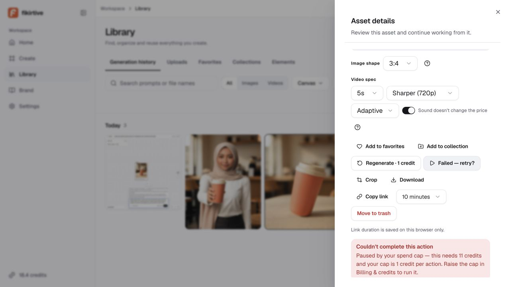

### 1 / 实际拒绝，不只是输入校验

新测试组织通过正常 UI 将每次上限设为 1 credit，从 Library 对自己的商品图执行 11 credits Animate。界面明确指出需要 11、上限 1，未生成。

### 2 / 后台与恢复

06:29 UTC 后该组织新增 GenJob=0、CreditLedger=0，余额/预留变化均为 0。完成 Remove cap 确认后，后台 spendCapCredits=0、余额 11、reserved=0；本次无额外费用。

只证明此入口与配置。所有入口、并发、损坏配置及授权范围的矩阵仍未完成，不能将本页扩成全局钱路保证。来源：backend-evidence.md / 实际花费上限拒绝及恢复。

<!-- page -->
## 21. 未关闭关卡与后续顺序

### 核心质量关卡

- 完整复测 FSE-001 至 007：正确商品/人物引用、确认材料、视频可接受输入、状态、修改、重试、Product 复用。
- variation 至少一次真实可用交付；成功无人物视频基线保持不回归。
- 付款前数量、规格、引用、能力解释一致；异步费用与余额可追踪。
- 完整下载文件、cap 多入口/并发、取消语义、刷新/Back/深链恢复仍须执行；Library 单次 cap 拒绝已补验。

### 安全与工程关卡

- 同 commit、隔离依赖与独立测试 DB；相关行为、钱路、tenant 测试及 required CI。自动测试本轮未运行。
- 双向租户读取、写入、关系关联与权限矩阵；单次无泄露深链不是全面安全证明。
- Google callback 配置后复验；密码/过期/找回/重复注册尚未闭合。
- 准确桌面尺寸、跨浏览器、键盘、IME、辅助技术和移动端支持边界。
- 独立 storage 与备份恢复证据；本轮共享存储豁免不是长期隔离方案。

### FSE-013 / P2 / 研究质量与状态文案

CRE-07 只请求当前 Instagram 尺寸与官方链接。预期结论有可读取证据、状态准确；实际坦言无法读取后仍把旧知识称当前限制，状态却是 Researching your brand / Otto is making it。另称 3:4 比 4:5 更宽，实际 0.75 < 0.8。测试方也遇 429，未独立证实最新规格，不能据不可达断定尺寸限制本身错误。

trace 记录 researchWeb 三次成功返回、无 GenJob；包装成功不证明文章抓取成功。建议区分找到链接、读到内容和证据支持结论，状态跟随真实任务。复测官方源 200/429/超时/冲突、几何推理、只研究不生成及单次结算。

### 决策顺序

先由 Founder grill 对齐审计发现、Library 职责冲突与 Conversation 目标；再做 UI/UX 方案与接受；最后交给 backend / frontend 明确合同和复测。当前报告不执行修复，也不以 staging 样本代替 Founder 发布批准。

<!-- page -->
## 22. 证据索引与工程回查

以下文件位于同一审计目录。PDF 中路径为可点击链接；Markdown 保留相对链接。完整 job、Generation、消息、账本和源码定位留在源记录，避免正文反复堆叠标识。

- [run-ledger.md](run-ledger.md)：按时序记录 UI 操作、截图、流程及最新补验；后段更新前段状态。
- [backend-evidence.md](backend-evidence.md)：部署身份、只读 DB、任务、账本、供应商拒绝与源码定位。
- [findings-catalog.md](findings-catalog.md)：FSE-001 至 013、DESIGN-001/002 的工程目录、根因置信度、建议与复测。
- [coverage-matrix.md](coverage-matrix.md)：覆盖快照；其后新日志优先更新本报告明确指出的时序差异。
- [design-parity-evidence.md](design-parity-evidence.md)：对应 0e1f2ab3 的 Library / Avatar 设计比较及冲突。
- [automated-checks.md](automated-checks.md)：纯测试候选和隔离依赖预检；未执行，不存在通过数。
- [preflight.md](preflight.md)：Google 初次失败、环境验证及 Founder 后续豁免；最初零花费状态已被后续执行取代。
- [founder-design-feedback.md](founder-design-feedback.md)：Conversation 原话、观察、待设计与不实施边界。

### 关键截图

[11 视频播放](11-video-playback-desktop.png) · [19 variation 失败](19-variation-failure.png) · [23 缺商品](23-combined-reference-card.png) · [24 双引用恢复](24-corrected-reference-card.png) · [26 人物视频失败](26-official-avatar-video-blocked.png) · [29 上传费用](29-upload-detail.png) · [30 余额差异](30-billing-balance-mismatch.png) · [31 Conversation](31-conversation-panel-desktop.png)。

截图批注仅框选原有内容并编号，未修改或补造产品画面。局部放大明确标注，原文件保留。公开/工程交接时继续避免共享认证链接、签名媒体 URL 与凭据。

**阶段结论仍为 NO-GO。** 修复后按对应复测逐项收证据；本报告不把建议当成修复完成、不把代码中有测试当成本轮通过，也不对未执行路径作安全保证。
