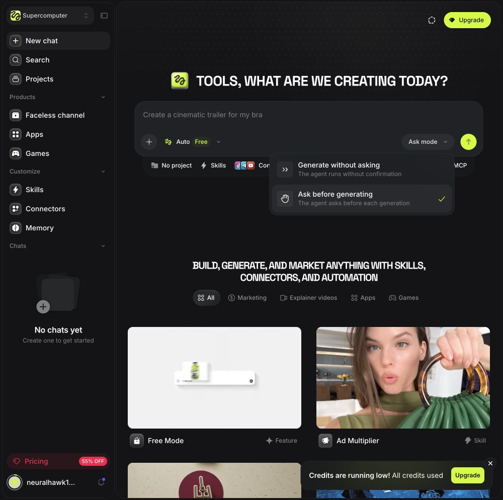
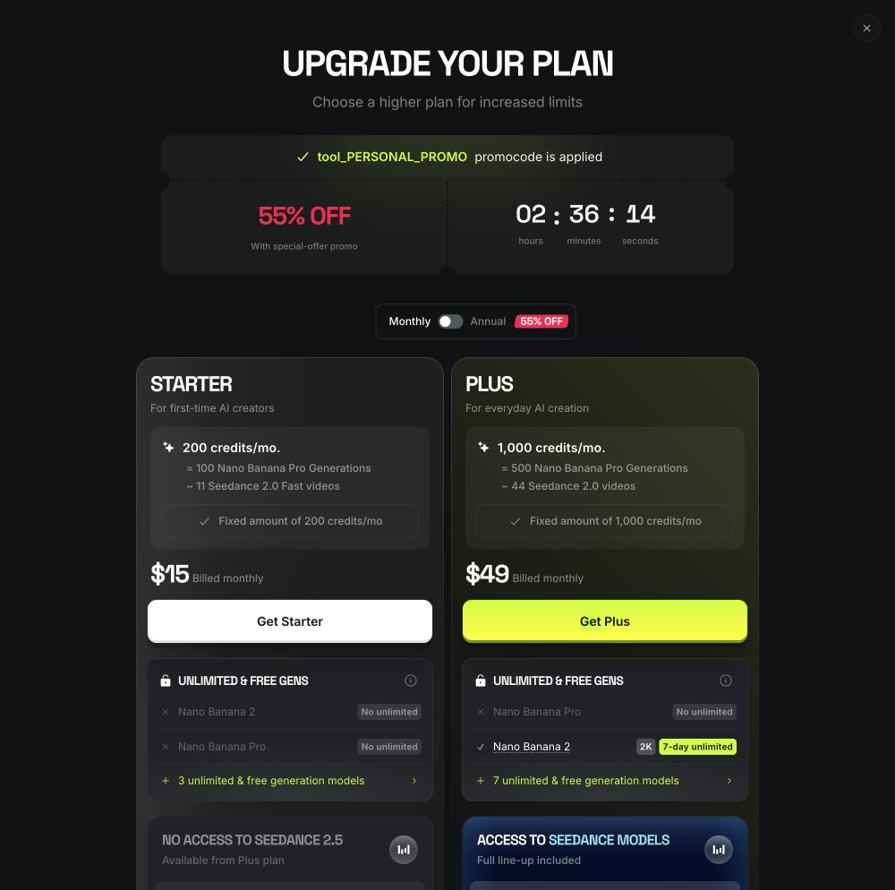
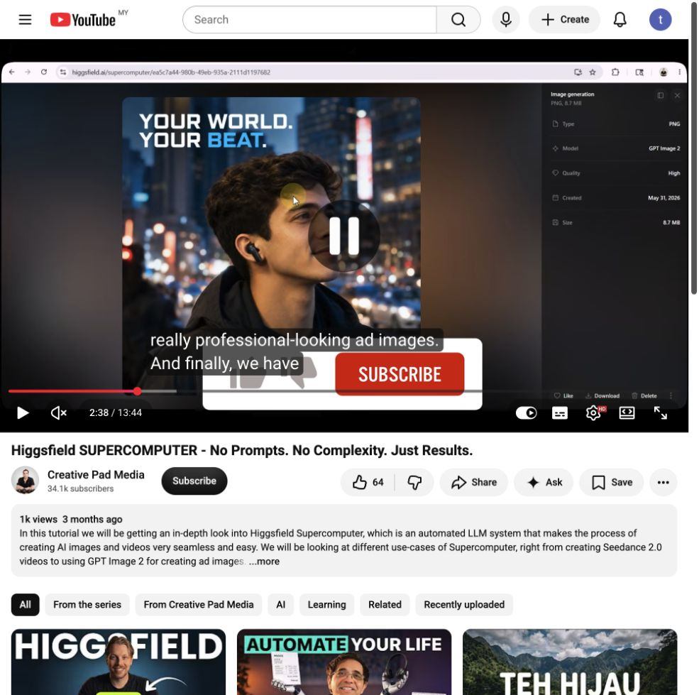
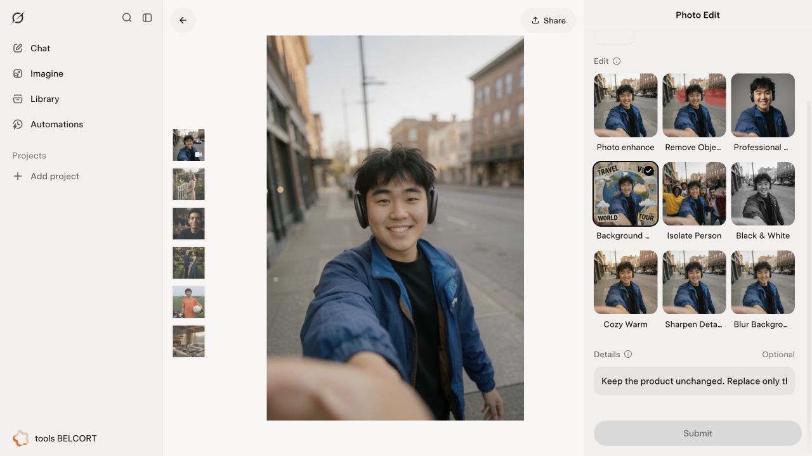
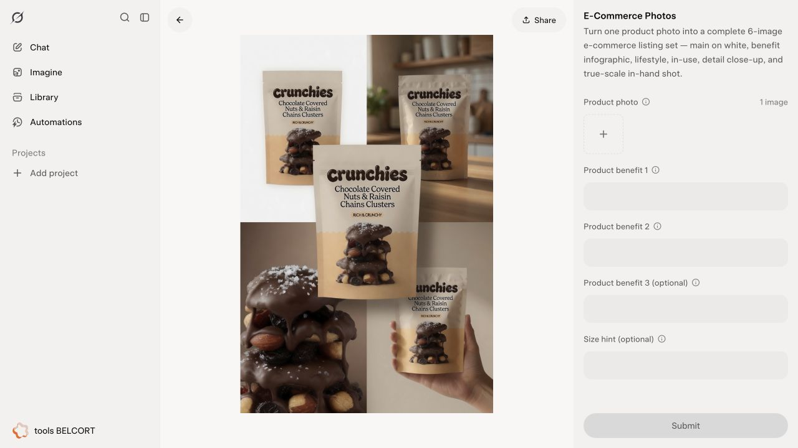
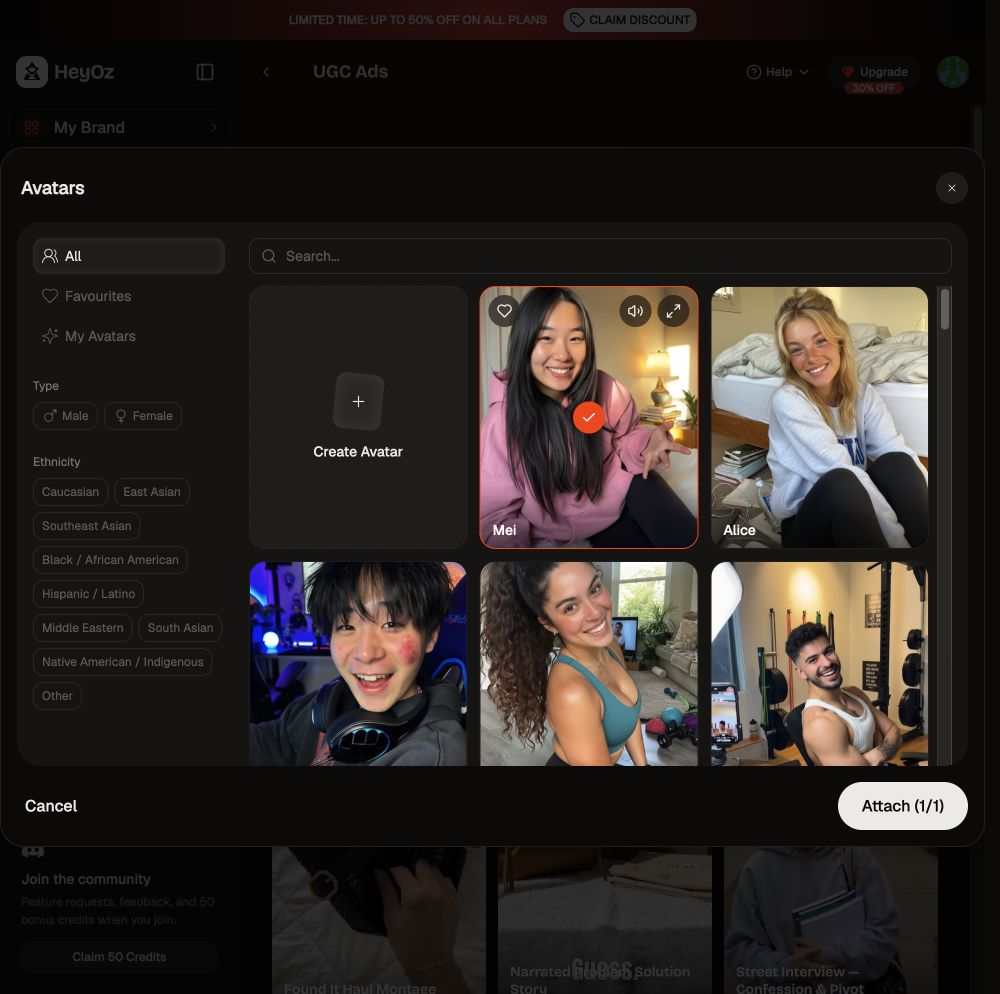
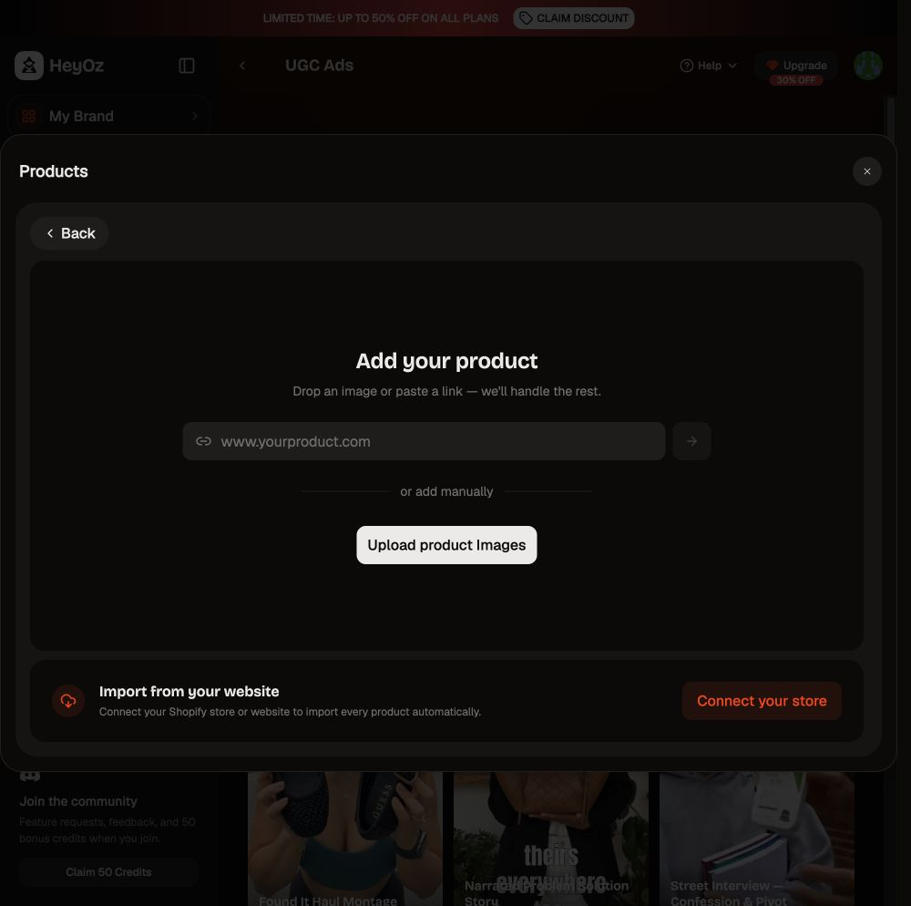
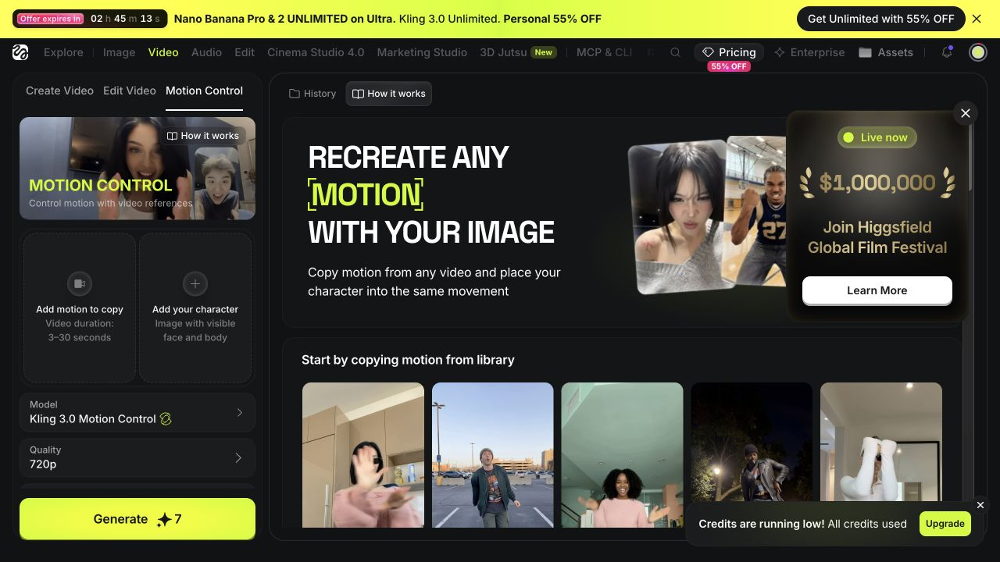
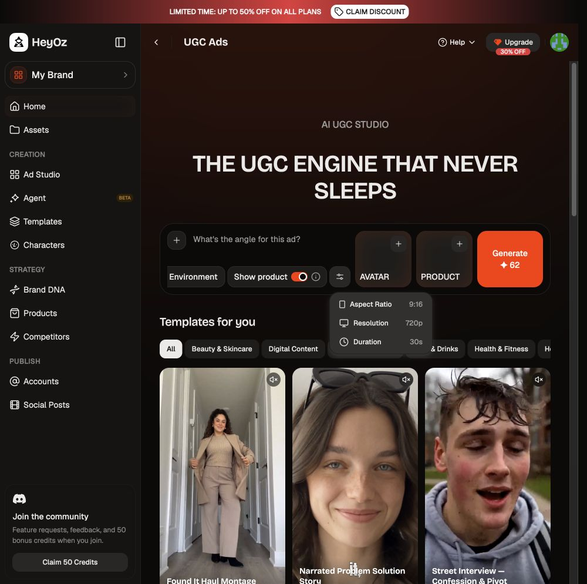
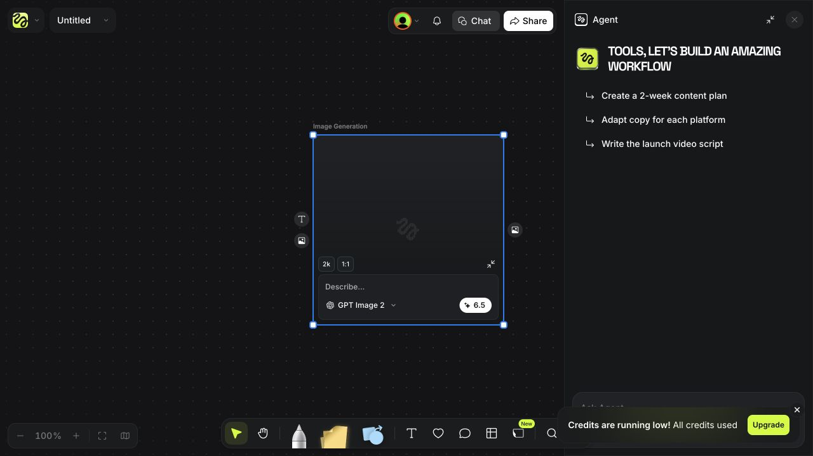

# Fikirtive Creation 与 Otto：竞品研究及验收建议

研究日期：2026-09-08 · 版本：Research 1.0 · 读者：Founder、前端与 Creation / Otto 工程师

## 结论先说

**最值得借鉴的是连贯完成一件工作，而不是把三个产品的功能菜单拼起来。**

建议以 Grok Imagine 的生成与修改体验、Stitch 的空间工作区、Higgsfield Supercomputer 的多步骤协作逻辑作为三个比较角度。所有界面和功能都可以提案、讨论；既有批准版本是比较基线，不是禁止探索的边界。任何建议均不自动成为实施批准。

具体例子：商家说“先做这个杯子的产品图，再让 Aiman 拿着它拍视频”。Otto 应当理解目标、找准参考、只问必要问题、帮助确定方向，然后沿同一条工作记录继续。商家不应当重新上传刚完成的图，也不应当自己研究模型名称。

**本轮完成的是可访问范围内的竞品研究，不是付费生成的完整实测，也不是 Fikirtive 上线验收。** 免费账户、升级弹窗及 Grok 出生年份要求阻断了部分路径。不能据此宣称多轮 agent、成片质量、扣费、恢复已通过。

## 1. 范围、证据与版本

- 浏览了 HeyOz、Grok Imagine、Higgsfield 的已登录页面；保留 21 张本地截图，包括一张教程画面。
- Higgsfield Supercomputer 补充官方帮助、官方操作指南及 Creative Pad Media 的 YouTube 教程。教程只抽查可播放片段；字幕面板持续加载，未获得完整逐字稿，不宣称完整观看。
- Stitch 使用 Mobbin MCP，实际查看入口与画布两张截图；本次 flow 搜索错配到 Grok、Gemini、Mixpanel 等，不当作 Stitch 完整 flow 证据。
- Fikirtive 比较基线：本地 `codex/uiux-frontend`，HEAD `78b2160d`，Phase 3 Create/Canvas spec 与信息展示规范。该提交不是最新 staging 构建的证明。
- 未修改产品代码、凭据、价格或设计 spec；未购买套餐，未确认付费生成。留下一个测试用 Untitled Canvas 和未执行的 image node，未删除既有数据。

证据分类：**现场观察**指这次实际操作或截图；**官方描述**指厂商文档；**教程演示**是他人展示；**建议**是研究推论；**未验证**不能记为 Pass。

## 2. Supercomputer：为什么和 Otto 相似

官方将它描述为在同一聊天内拆解任务、选择工具并串联结果的工作区。上下文、文件和可复用 Skills 帮助后续任务；回复修改时，官方称只重跑变化部分。这说明“任务连续性”是其主要产品构思，不只是一个模型选择器。[官方帮助，2026-08-01](https://higgsfield.ai/creator-hub/help-center/tools/how-do-i-use-supercomputer)

官方操作指南展示图片成为下一步视频参考，并描述生成前审批、结果复用、停止与充值后继续。这些是厂商描述，尚未在本账户验证。[官方指南，2026-07-03，页面显示近期更新](https://higgsfield.ai/blog/higgsfield-supercomputer-guide)

### 2.1 应拆开的四种“自动”

1. 自动选择推理模型：谁理解与规划。
2. 自动选择制作工具：哪个能力完成图片、视频等子任务。
3. 自动传递上下文：前一步结果成为后一步输入。
4. 自动执行付费动作：是否可以不再询问用户。

前三项不能推导出第四项。对 Fikirtive 而言，模型路由与付款授权需要分别验证。商家希望“帮我做完”，不等于授权无限重试或无限消费。

### 2.2 现场证据：确认模式与免费入口



**备注 A — 现场观察：** UI 可选择 Ask before generating，截图中为选中状态；存在更自动的执行选项。这个控件证明模式存在，不证明后台一定强制执行。



**备注 B — 现场观察：** 选择 Auto Free 后，只发送“仅规划，不生成、不花 credits”的虚构杯子营销请求，仍出现升级弹窗。没有取得 agent 回复，不能评价其澄清质量或响应速度。之前“找到免费规划路径”的推测至此被实测否定。

### 2.3 不应复制的含糊承诺

官方指南广泛描述可以停止、只计完成步骤；但生成帮助区分 Queued 可取消、Processing 可能不能取消、Generating 无取消入口，且退款有模型例外。合理解释是：停止后续 agent 工作，不必然撤回已提交给供应商的生成；这是推论，Supercomputer 特例仍待验证。[故障帮助，2026-08-01](https://higgsfield.ai/creator-hub/help-center/troubleshooting/generation-is-stuck-or-failed)

Credits 帮助明确将 Supercomputer 列为消耗额度的渠道，不能把网页中的 Free 或 Unlimited 推广理解成所有 agent 工作免费。[Credits 帮助，2026-08-03](https://higgsfield.ai/creator-hub/help-center/credits/how-credits-work)

**对我们：** 分别表达“停止后续步骤”“正在尝试取消”“生成仍在进行”“退款已确认”。不能用一个 Stop 按钮和一个成功 toast 抹掉这些差别。

### 2.4 视频证据和可回看索引

[Creative Pad Media — Higgsfield SUPERCOMPUTER，2026-05-31](https://www.youtube.com/watch?v=yEl5bbxDDK8)，13:44。作者披露 affiliate links；不将速度、节省成本或效果说法当成客观测量。

作者自己的[教程摘要](https://www.creativepadmedia.com/higgsfield-supercomputer-no-prompts-no-complexity-just-results/)提供以下回看点：00:05 产品图片输入；02:06 确认模式；02:42 视频；06:26 执行前纠正；08:44 视频分析；11:36 趋势研究。这些时间点来自作者摘要，不表示本研究逐秒验证了所有段落。



**备注 C — 教程演示：** 本次捕获约 02:38 成品详情，作品为视觉中心，文件信息和下载在旁边。它支持“结果优先、细节次级”的界面观察，不证明本账户生成、下载或资产恢复成功。

## 3. Canvas：Grok × Stitch 怎么借鉴

### Stitch：空间分工明确

Mobbin 的[入口截图](https://mobbin.com/screens/b92bd672-8d61-4dec-9277-7be1112ec7e9)展示主要输入区和历史；[画布截图](https://mobbin.com/screens/e792b516-be14-4bc6-bbbc-b94cf3bb33b7)展示并排作品、左侧当前对话、底部输入和独立工具区。截图不能证明实际拖拽、保存、恢复行为。

**建议：** 保留我们已验收的作品中心和自由拖动；当前任务与历史可以分层。值得讨论的增强是可展开的完整对话侧栏：复杂规划时方便阅读，默认不挤压画布。不是增加第二套聊天，而是同一记录的另一种展示。

### Grok：修改对象与修改目标清楚



**备注 D — 现场观察：** Photo Edit 中能选择修改类别，给出说明并添加图片；缺少图片时提交不可用。此处观察的是准备流程，不是修改质量。



**备注 E — 现场观察：** E-Commerce Photos 要求产品图和卖点。它说明任务可以由“要完成什么”组织，而不必以模型组织。但 Fikirtive 不应因此强制每个人填一套表单：已有上下文应直接复用。

Grok 的 Agent 入口要求升级；普通图片提交又出现出生年份要求，本次没有代填。图片转视频、下载、恢复和多轮修改未在该账户走通。

## 4. HeyOz 与 Higgsfield：参考素材和制作参数



**备注 F — 现场观察：** Avatar 卡片、筛选及已选数量使选择可辨认。一次筛选为空不能推断整个库没有人物。本次曾选中 Mei 并带回 composer。



**备注 G — 现场观察：** 产品选择过程可进入 URL、图片或商店来源，不必先离开创作。未执行网站导入或商店连接。对我们最有价值的是“在需要时补参考”，不是强制先搭完整产品档案。



**备注 H — 现场观察：** 动作视频与人物图片有不同槽位。这说明参考不仅是附件，还承担角色。Fikirtive 的 @Aiman、产品图、风格图应能区分用途，不能靠文件名猜。



**备注 I — 现场观察：** 规格可以收在按需打开的区域。对我们，常规输入保持简洁；执行前仍须清楚知道交付什么。该账户无 credits，未验证视频输出。



**备注 J — 现场观察：** Canvas 和展开的 Agent 可以共存；本次未执行的 node 在刷新后仍存在，见 [刷新后截图](05-higgsfield-canvas-after-reload.png)。这不证明付费任务恢复、完整历史或资产来源持久化。

## 5. 建议的商家主流程

这是供讨论及验收用的路线，不是新的固定向导或已经批准的新功能。

```text
Create：描述目标 + 可选参考
   ↓ 同一句话、同一组参考进入 Canvas
Otto：理解目标 → 只补必要问题 → 简短方向
   ↓ 下一次付费动作的可理解确认
产品图结果 → 选择这一版 → @官方人物 → 视频
   ↓ 只改变指定部分，保留原件与来源
比较 / 继续修改 / 下载
   ↓
Canvas 与 Library 可找回，Conversation 保留过程
```

例如“杯子不要变，只换咖啡店场景”：Otto 应明确保留杯子、指出将改变背景，并使用选中的那一版。无法确定“这个”是哪张时才问，不擅自选另一个结果。

专业排版可以先由 Otto 用短建议解释主体、标题位置、留白和比例，不必先新增排版编辑器。若要求逐字可编辑文字层、精确对齐或多镜头剪辑，这已超出普通生成，需要独立能力与范围决定。

## 6. 三组值得讨论的改进

### A. 优先：任务连续性与局部修改

把参考身份、选择版本、用户要求保留的内容、下一步目标串在同一工作记录内。验收关注“不重新解释、不误用图、不全套重做”。这是最贴近当前批准方向的一组；是否已实现须测最新版本，不能凭文档说缺失。

### B. 可选：渐进展开的规划与对话

渐进展开就是默认只给当前需要的信息，需要细节时再展开。简单做图不用计划表；复杂请求才显示两三步方向。可讨论把完整 Conversation 展开为侧栏，同时保留当前简洁状态与底部输入。代价是要验证展开、收起、选作品和焦点之间不会冲突。

### C. 后续：可复用创作配方

例如“每次新品做一张商品图，再做一段人物展示视频”。用户明确保存后复用步骤和风格，但每次替换产品、重新报价。不要立刻做社区 Skills 商城、自学习系统或自动发布。它们不能仅凭竞品有就进入 Beta。

## 7. 已批准、待讨论与不能直接判缺陷

权威：[Phase 3](../../../apps/web/design-system/information-architecture/frontend-convergence-phase-3-create-canvas-spec.md)、[信息展示规范](../../../apps/web/design-system/governance/content-disclosure.md)。

已批准设计涵盖：Create composer + history；全屏 Canvas；current turn / Conversation / omnibox 分工；typed references；edit / variations / animate 保留原稿；下一次付费动作准确报价；所有生成进入 Library；节点与对话持久化。

明确延后：精确恢复 pan/zoom、临时选择和跨装置草稿；重开 Fit to content 是当前批准行为。不能再把“没恢复同样缩放”当作现有版本违约。

新一轮 Founder 指示：Grok × Stitch 用于 Canvas，Supercomputer 用于 Otto 整体，同时允许任何界面替代建议。记录于本研究，不更改冻结 spec；若要实施，先登记批准的具体变化。

Campaign、Schedule 当前不进入 Beta。全新模板市场、可编程节点系统、时间轴、无上限自动执行和新计费授权均不自动纳入。历史文件若仍写同级 Campaign/Schedule，以最新批准范围核对，不直接照搬旧概述。

键盘规则曾有 Founder 现场例外：普通 Enter 发送不被认定为问题。下轮应核对最新规则和输入法行为，不能仅按旧文档把它重复报成缺陷。

## 8. 下一轮 Fikirtive E2E 的完整场景建议

本表是待执行清单，不是通过记录。所有案例都应记录部署版本、用户、时间、输入、操作、截图、请求/任务标识、结果及账务证据。

| 场景 | 可检查的结果 | 风险／证据 |
|---|---|---|
| 自注册→首次 Create | 无人工配置即可到可用状态；失败可恢复 | 账号邮件、重定向、会话、租户 |
| 无素材、模糊目标 | Otto 帮助形成可执行方向，只问真正必要的问题 | 对话、引用、未误启动付费动作 |
| 上传产品→产品图 | 上传状态清楚，输入不丢失，生成对象可找回 | 文件记录、任务、结果与来源 |
| 产品图→官方 avatar 使用该产品的视频 | 指定人物和指定产品版本同时进入生成 | typed IDs、解析结果、供应商实际请求 |
| 改背景、不改商品 | 新版本保留原件，修改范围清楚 | 视觉结果、lineage、所用参考 |
| Variations / Animate | 作用于选中版本，费用与交付准确 | quote、selection、输入输出关系 |
| 多参考歧义或引用失效 | 就地说明，要求必要选择，不静默换人换图 | 缺失/权限错误、UI 状态 |
| 中文/英文/Malay/混合输入 | 输入法不误发送，约束跨轮保留 | 字符、语言、对话连续性；不预设字幕能力 |
| 布局与营销建议 | 建议可操作，不能把未生成文案说成已排进成片 | 文案、实物输出对照 |
| 运行中改口、停止 | 区分下一步停止与供应商在途任务 | worker 状态、取消结果、费用 |
| 连点/刷新/断线/跨页恢复 | 同一动作不重复扣费；最终状态一致 | 幂等键、账本、任务和 UI |
| 供应商失败/超时/余额不足 | 不假成功、不假退款、不永久转圈 | 原因、重试路径、结算权威 |
| Library / history | 未收藏结果也可找回；排序、搜索、分页有效 | 当前 tenant、结果数量与排序 |
| 下载/分享 | 当前选中对象；真实格式、可播放、权限正确 | 文件编码、链接、独立会话权限 |
| 跨账号隔离 | 另一测试租户不能读到前者对象 | 两个自有测试账户，禁止探测第三方数据 |
| 桌面适配与可访问性 | 1440/1920 宽度、键盘、焦点、弹层不遮主任务 | 同视口截图与实际操作 |
| 手机入口 | 明确引导桌面，不误承诺手机 Canvas | 不同入口和回退路径 |

速度分别量：点击到反馈、首段可理解回复、排队、供应商生成、结果可用。不要把模型等待和页面卡死混为一谈；不拿一条样本声称 p95。建议初始目标为本地点击反馈约 100–200ms，长任务及时给真实阶段；这是建议阈值，需按环境与测量确认，不是已承诺 SLA。不可伪造百分比进度。

## 9. 工程报告应该怎样处理差异

每个问题分为：已批准设计偏差、功能故障、数据/安全/账务风险、体验建议、新范围提案、无法验证。把重现步骤、Expected/Actual、截图备注、版本、请求/任务标识与相关代码位置连起来。

已批准功能未工作：建议修复并按同案例复测。视觉偏差：同视口对比批准版，不凭记忆。新能力：说明商家收益、范围和复杂度，请 Founder 决定，不混进 blocker。供应商质量与接线问题分开：脸一致性由供应商影响，但送错 avatar ID 或漏传产品图仍是我们的缺陷。

退款、权限、重复扣费不能只看 UI：必须核对后台状态。后台不可访问时标 Blocked / Unverified，不标 Pass。完整 E2E 也不能证明“万无一失”；上线决定应基于明确覆盖、未解决风险和复测证据。

## 10. 访问限制、停止检索理由与证据目录

HeyOz：0 credits，部分路径升级弹窗。Grok：Agent 升级墙；图片提交要求真实出生年份，未代填。Higgsfield：零额度；Supercomputer 纯规划也被订阅墙挡住。故本轮不能测试实际 agent 多轮、生成失败与恢复、成片质量或账单。

YouTube：成功打开教程并抽查成品片段；逐字稿没有加载完成。未使用镜像站替代官方证据。Mobbin：Stitch screens 有效，flow 查询不匹配，故只作截图比较。不会将“找到入口”写成“走完流程”。

停止本轮检索的理由：入口、参考、规划、执行授权、结果、恢复边界已有现场或官方证据；剩余关键空白依赖付费访问或真实账号资料，重复搜索不能替代行为测试。研究可用于下一轮范围讨论，但不提供竞品全流程通过结论。

完整 PNG 目录在本文件同目录，01–21。其他截图包括 UGC、Lighting、Carousel、Elements、Library sorting、产品输入、年龄门槛和额度；均为现场界面，21 为教程演示。没有给截图补画虚构状态。

CodeGraph: not used — 此轮为外部研究与本地设计文件核对，未调查最新运行代码。保留其他会话的既有未提交文件。未创建或声称创建 GitHub idea ticket；模型路由提案的 ticket 状态仍需另核实。
